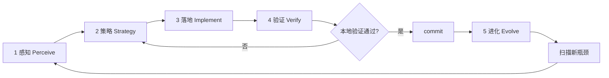

# AGENTS.MD — TrustClaw PTDS

TrustClaw 开发指南：**在 OpenClaw 基础上构建 PTDS Runtime**，最大化继承 Gateway / 频道 / 多平台 / Provider 能力。

## Product loop authority（唯一驱动）

**TrustClaw 产品 Loop 只读本文件。** Cloud Agent、Cursor Agent、人类协作者执行 V1 感知 → 策略 → 落地 → 验证 → 进化时：

1. **入口**：本节 [无限优化闭环](#trustclaw-无限优化闭环infinite-optimization-loop) + [Cloud Agent 单轮检查清单](#cloud-agent-单轮检查清单)
2. **任务 ID**：从 [Loop manifest](#v1-闭环烟雾清单loop-manifest) 与 [当前轮次笔记](#当前轮次笔记由-agent-持续追加) 取 ROADMAP 主攻项；不得从其他文档自行开新 loop
3. **闸门**：`DECISIONS.md`（`pending` 不得实现）、[合规审查](#合规审查与数据审计compliance-review)、[执行前价值闸门](#执行前闸门v1-框架目标与改动价值每轮必做)
4. **验证 / 写回**：本文件「进化」层 + colocated `*.test.ts`；轮次结论写入 [当前轮次笔记](#当前轮次笔记由-agent-持续追加)

**Supporting context only（不得单独驱动 loop）：**

| 文档                 | 用途                               |
| -------------------- | ---------------------------------- |
| `GETTING_STARTED.md` | 本地启动、端口、Console 布局       |
| `PLAN.md`            | 阶段背景、历史任务矩阵（只读参考） |
| `ROADMAP.md`         | 任务 ID 与依赖图（策略层引用）     |
| `DECISIONS.md`       | 人审闸门                           |
| `OPENCLAW_REUSE.md`  | Inherit / Extend / Build           |
| Root `AGENTS.md`     | 构建、测试、Git 政策               |

## Read order

**产品 Loop：** 读本文件全文 → 按需查上表 supporting 文档。  
**首次上手：** `GETTING_STARTED.md` → 本文件 Product snapshot → 无限优化闭环。

1. **本文件** — Product loop authority、合规 Must、无限优化闭环、Loop manifest、当前轮次笔记
2. `trustclaw/GETTING_STARTED.md` — dev 启动、端口、模型、PTDS Console 布局
3. `trustclaw/DECISIONS.md` — **逐条审核**；`pending` 项不得实现
4. `trustclaw/OPENCLAW_REUSE.md` — Inherit / Extend / Build 映射
5. `trustclaw/ROADMAP.md` — 任务 ID / 依赖（策略层只读）
6. Root `AGENTS.md` — 构建、测试、Git 政策

`PLAN.md` 仅作背景；**不得**用 PLAN 替代本文件启动 Loop。

---

## Product snapshot

**TrustClaw** = Personal Trusted Data Space Runtime (PTDS Runtime).

- 不是 GLP-1 单应用；GLP-1 是首个 **Business Agent** 演示
- 四大原则：不出域 · 必有据 · 必审计 · Agent 解耦
- **合规审查**：内部 PTDS 个人数据、外部 NRDL 标准包、模型推理边界 — 三类数据流均须 **显式同意 + 可回放审计**（见 [合规审查与数据审计](#合规审查与数据审计compliance-review)）
- V1 冻结闭环：`Init → Chat → Text2SQL → Rules → GLP-1 → Audit → Ledger → Dashboard`

---

## OpenClaw-first rule

**Default:** reuse OpenClaw; build only PTDS gaps.

| Do                                                   | Don't                                  |
| ---------------------------------------------------- | -------------------------------------- |
| Plugin HTTP routes for `/api/ptds/*`, `/api/agent/*` | Standalone Express gateway             |
| `src/llm/` for Text2SQL + GLP-1 LLM                  | Hardcoded fetch to one vendor          |
| `node:sqlite` + `src/infra/kysely-sync.ts` patterns  | Cloud DB or parallel JSON state stores |
| Enable plugin via `openclaw gateway run`             | Fork Gateway core in `src/`            |
| Phase 2: inherit channels in `extensions/*`          | Rebuild Telegram/WhatsApp adapters     |

Full map: `OPENCLAW_REUSE.md`.

---

## Human approval gates（逐条审核）

Before **Development** on any task:

1. Open `DECISIONS.md` — all items for the task must be `approved` or `deferred` (**done 2026-07-04**).
2. Schema/API changes that diverge from approved decisions need human review + `DECISIONS.md` entry.
3. Record any new decisions in `DECISIONS.md`.

---

## 合规审查与数据审计（Compliance Review）

TrustClaw 的合规目标不是「文档声明」，而是 **可测试、可回放、可阻断** 的实现。任何涉及个人健康数据、外部监管标准、或 LLM 推理的改动，必须先对照本节验收；**缺一环即不合规**。

### 合规目标（Must Meet）

| 目标                 | 标准                                                                       | 不达标表现                                               |
| -------------------- | -------------------------------------------------------------------------- | -------------------------------------------------------- |
| **不出域**           | PTDS SQLite、审计 JSONL、consent 文件均在本地 `state/`；无静默外发         | 模型 prompt 含未授权原始行、或未走 tool 直接猜 vitals    |
| **必有据**           | 用药/报销结论仅来自握手 JSON + SQLite 规则/AST；GLP-1 输出 `[Evidence #N]` | LLM 自造 HbA1c、规则 PASS/FAIL、或 NRDL 条款             |
| **必审计**           | 每次数据访问、标准导入、Chat 管线步骤写入 `state/ptds-audit/events.jsonl`  | 缺 `DATA_CONSENT` / `COMPLIANCE_IMPORT` / 五步 Chat 审计 |
| **显式同意**         | 内部数据与外部标准 **分别** 征得用户同意后才读写                           | import 无 `consentGranted`、tool 无 `requireApproval`    |
| **模型边界**         | Text2SQL 仅 SELECT + allowlist；规则由确定性引擎；模型只做 NL→SQL 与解释   | LLM 判规则、或非 SELECT 仍执行                           |
| **安全 fail-closed** | 守卫失败 → 阻断 + `BLOCKED`/`security_blocked` 审计                        | 静默降级、fallback 读旧标准、或跳过 consent              |

### 数据分类与责任边界

| 类别                       | 内容                                                                                                              | 存储                                                                 | 同意闸门                                                   | 审计 step / component                         |
| -------------------------- | ----------------------------------------------------------------------------------------------------------------- | -------------------------------------------------------------------- | ---------------------------------------------------------- | --------------------------------------------- |
| **A · 内部 PTDS 个人数据** | `user_profile`、`body_anthropometrics`、`lab_test_results`、`clinical_diagnoses`、`medication_history` 等 v1.1 表 | `state/local_ptds.db`                                                | Gateway `requireApproval`（`before_tool_call`）            | `DATA_CONSENT` / `PTDS.Consent`               |
| **B · 外部合规标准**       | NRDL AST handshake JSON（如 GLP-1 v2：`metadata` + `ast_rules`）                                                  | `medication_compliance_standards`、`medication_compliance_ast_rules` | Panel F checkbox + API `consentGranted` + `sessionId`      | `COMPLIANCE_IMPORT` / `PTDS.ComplianceImport` |
| **C · 模型可见载荷**       | Text2SQL 生成的 SQL、schema 摘要、握手矩阵、C3-PO 挂载 profile **摘要**（非全表 dump）                            | 仅当次 prompt / Runtime Context                                      | A 类经 tool consent；B 类经 import consent；禁止契约外字段 | `TEXT2SQL_GEN`、`AGENT_DECISION` 等           |

**禁止**：把 A 类原始行批量塞进 system prompt 绕过 tool；把 B 类标准包未经 zod + consent 写入 DB；让模型输出未在 `evaluation_matrix` 中出现的合规结论。

---

### 1. 内部个人数据 — 实现要求

**入口**：`extensions/trustclaw-ptds/src/data-consent-hook.ts`（`before_tool_call` → `trustclaw_ptds_query`）

**必须实现**：

1. PTDS 未挂载 → `block: true`，不发起 consent UI。
2. 已挂载且 session 无 grant → `requireApproval`，标题/描述列出 **将读取的私人字段**（`profile-summary.ts` → `formatPrivateDataFieldLabels`）。
3. 用户决策 → `recordPtdsConsentAudit`（`decision`: `allow-once` \| `allow-always` \| `deny` \| `timeout` \| `cancelled`）；`deny`/timeout → `status: BLOCKED`，工具不得执行。
4. `allow-always` → 写入 `state/ptds-audit/consent-grants.json`（`consent-store.ts`），可审计、可 Reset 清除。
5. C3-PO prompt（`c3po-ptds-system.v1.md` + `agent-guidance.ts`）声明：**不得** bypass approval、不得用记忆代替 tool 结果。

**验收**：

```bash
node scripts/run-vitest.mjs extensions/trustclaw-ptds/index.test.ts
# 手动：Panel A init → Chat 提问 → 出现 consent 卡片 → deny 则无 PTDS 数据回复
```

**审计记录最小字段**：`input.user_query`、`input.private_data_fields`、`output.decision`、`output.granted`。

---

### 2. 外部合规标准 — 实现要求

**Schema**：`trustclaw/ptds/schema/compliance-standards.v1.sql`  
**导入逻辑**：`trustclaw/ptds/compliance-import.ts`  
**HTTP**：`POST /api/ptds/compliance/preview` \| `import` \| `import/bundled-glp1-v2`；`GET /api/ptds/compliance/standards` \| `rules`  
**UI**：Panel F — `trustclaw/ui/src/panels/compliance.ts`（预览 → 勾选同意 → 导入）

**必须实现**：

1. **Preview**：`complianceStandardPackageSchema`（zod）校验；不写 DB。
2. **Import**：`consentGranted === true` 且非空 `sessionId`，否则 400 + 错误消息；**不得**服务端默认同意。
3. 写入 `medication_compliance_standards`（含 `source_file_hash`、`consent_session_id`、`ruleset_hash`）与 `medication_compliance_ast_rules`；**同时仅一条** `is_active = 1`。
4. 每次 import 调用 `recordComplianceImportAudit`（`granted: false` 时亦须 BLOCKED 记录，若未来扩展拒绝路径）。
5. 种子示例：`trustclaw/ptds/seeds/external/glp1-nrdl-ast-handshake-v2.json`；数据源登记 `NRDL_EXTERNAL`。

**验收**：

```bash
node scripts/run-vitest.mjs trustclaw/ptds/compliance-import.test.ts
# 手动：Panel F → 勾选同意 →「导入内置 GLP-1 v2」→ Panel B 可见 compliance 表
```

---

### 3. 规则引擎与用药合规判断 — 实现要求

**原则（D6）**：规则匹配 **确定性**；导入 AST 后 **禁止** TS 硬编码 GLP-1 条款替代 DB 规则。

| 模块       | 路径                                              | 职责                                                                                                            |
| ---------- | ------------------------------------------------- | --------------------------------------------------------------------------------------------------------------- |
| AST 上下文 | `trustclaw/runtime/rules/ast-context.ts`          | PTDS 行 → eval context（`user_profile.age`、`body_measurement.latest.bmi`、`clinical_diagnoses.icd10[...]` 等） |
| AST 求值   | `trustclaw/runtime/rules/evaluate-ast.ts`         | AND/OR/比较运算符；输出 `evaluation_matrix`                                                                     |
| 药品路由   | `trustclaw/runtime/rules/resolve-glp1-drug-id.ts` | 用户问题 → `drug_id` 27–30；有 active standard 时默认 29                                                        |
| 管线       | `trustclaw/runtime/pipeline/run-chat.ts`          | 有 active standard → AST；否则 `nrdl_payment_rules` 种子                                                        |

**必须实现**：

1. `getActiveComplianceStandard(db)` 为 null 时，走扁平种子 `GLP1_SEMA`，行为与 Task 202 一致。
2. active standard 存在时，按 `resolveGlp1EvalDrugId` 选 AST `drug_id`；AST 求值失败不得静默回退到 LLM 判断。
3. `prescription_context` 等 PTDS 未采集字段：仅允许 **具名 demo 默认值**（见 `ast-context.ts` 常量），须在 DECISIONS/SPEC 中可追溯；不得伪造为用户真实处方。
4. 规则结果进入握手 3 → `buildGlp1Decision`；回复仅引用 matrix 中条目。

**验收**：

```bash
node scripts/run-vitest.mjs trustclaw/runtime/rules/resolve-glp1-drug-id.test.ts
node scripts/run-vitest.mjs trustclaw/runtime/rules/evaluate.test.ts
node scripts/run-vitest.mjs trustclaw/runtime/pipeline/run-chat.test.ts
```

---

### 4. 模型数据使用 — 实现要求

| 阶段           | 允许进入模型的内容                                               | 禁止                                     |
| -------------- | ---------------------------------------------------------------- | ---------------------------------------- |
| **Text2SQL**   | 用户问题 + schema 摘要（`schema-context.ts`）；输出仅 SELECT     | INSERT/UPDATE/DELETE；非 allowlist 表    |
| **Tool 前**    | C3-PO 人设 + **挂载 profile 摘要**（age/BMI/风险标记等聚合字段） | 全表 JSON dump；未 consent 的查询路径    |
| **Tool 后**    | `trustclaw_ptds_query` 返回的 Runtime Context / 证据链           | 模型改写 rule status 或 invent citations |
| **GLP-1 决策** | `evaluation_matrix` + snapshot 结构化 JSON                       | 自由文本「应该可以报销」无 Evidence      |

**必须实现**：

1. `read_only_verification === false` 或 SQL 守卫失败 → `security_blocked` + 审计 `TEXT2SQL_GEN` `status: BLOCKED`（Task 301 完整化）。
2. `generateText2Sql` 审计记录含 `sql`、`allowed_tables`；**不得**在 audit `output` 写入完整 PHI 结果集（仅 row_count / columns 摘要）。
3. `DB_QUERY` 审计同理：大结果集只记维度，不记单元格值（见 `run-chat.ts`）。
4. 新增模型-facing 字段或 prompt 注入 → 更新本节 + colocated types/test。

---

### 5. 审计链 — 实现要求

**存储**：`state/ptds-audit/events.jsonl`（`trustclaw/audit/record.js`）  
**类型**：`trustclaw/audit/types.ts` — step / component / status 封闭枚举

**每 Chat 最少 5 步**（与下节 Audit steps 表一致）：

`TEXT2SQL_GEN` → `DB_QUERY` → `RULE_EVAL` → `AGENT_DECISION` → `LEDGER_COMMIT`

**Consent / Import 独立 trail**：

- `audit_trail_id` 前缀 `consent_*`（与 chat 的 `aud_*` 区分）
- Panel D 通过 Runtime Context `postMessage` 展示 chat 五步；consent/import 事件可在 JSONL 检索或后续 Panel 扩展

**必须实现**：

1. 每条 event 含 `session_id`、`timestamp`、`input`/`output` 对象（可 JSON 序列化）。
2. `BLOCKED` 与 `SUCCESS` 均须落盘；不得 swallow 错误。
3. Reset PTDS 时：文档化 consent-grants 与 compliance 表是否清除（当前：Reset 清个人 PTDS；compliance 标准 **保留**，须在 UI 说明）。

**验收**：

```bash
node scripts/run-vitest.mjs trustclaw/runtime/pipeline/run-chat.test.ts
# 断言 events.jsonl ≥5 条 / chat；import 后含 COMPLIANCE_IMPORT
```

---

### 6. 安全守卫清单

| 守卫              | 位置                                      | 触发                                                  |
| ----------------- | ----------------------------------------- | ----------------------------------------------------- |
| SELECT-only       | `trustclaw/ptds/query.ts`                 | 非 SELECT / 危险关键字                                |
| Table allowlist   | Text2SQL handshake + query                | 表不在 allowlist                                      |
| Import consent    | `compliance-import.ts` + routes           | `consentGranted !== true`                             |
| Tool consent      | `data-consent-hook.ts`                    | 无 grant 且非 approval 通过                           |
| PTDS mounted      | init / tool / chat                        | 未 `POST /api/ptds/init`                              |
| Package integrity | zod + `source_file_hash` / `ruleset_hash` | 非法 JSON 或 hash 不匹配（未来可扩展 publisher 验签） |

新增守卫须：**单元测试 + 审计 BLOCKED 记录 + 本表一行**。

---

### 7. 合规审查 PR / Loop 闸门

改动触及 consent、compliance import、AST、Text2SQL、audit 类型或 C3-PO prompt 时，PR / Loop 卡片 **额外** 勾选：

```
[ ] 数据分类：标明 A / B / C 哪一类受影响
[ ] 同意路径：内部 requireApproval 或 import consentGranted 仍有效且测试覆盖
[ ] 审计：新增/变更 step 已写入 types.ts + record 调用点 + test 断言
[ ] 模型边界：无 spec 外 PHI 进 prompt；规则仍确定性
[ ] fail-closed：失败路径有 BLOCKED/security_blocked，无静默 fallback
[ ] 文档：本节 +（若 API 变）`DECISIONS.md`
```

**推荐验证命令（合规相关）**：

```bash
node scripts/run-vitest.mjs trustclaw/ptds/compliance-import.test.ts
node scripts/run-vitest.mjs trustclaw/runtime/rules/resolve-glp1-drug-id.test.ts
node scripts/run-vitest.mjs trustclaw/runtime/pipeline/run-chat.test.ts
node scripts/run-vitest.mjs extensions/trustclaw-ptds/index.test.ts
```

---

## TrustClaw 无限优化闭环（Infinite Optimization Loop）

**本文件是 TrustClaw 产品 Loop 的唯一执行协议。** `PLAN.md` / `ROADMAP.md` 提供任务 ID 与背景；Loop 的感知、策略、落地、验证、进化 **只按本节与下方检查清单执行**。

本仓库 V1 交付**没有「做完就停」**。每一轮闭环的目标：**感知现状 → 选定 ROADMAP 瓶颈 → 最小落地 → 用证据验证 → 写回本文件 → commit → 进入下一轮**。

Cloud Agent 与人类协作者都应把本文件当作活文档；每轮验证通过后更新「当前轮次笔记」或 **Gotchas**。

**不要**为此闭环新增独立编排脚本（例如一键跑完全部阶段的 orchestrator），除非用户明确要求。闭环由 Agent 按层执行现有测试与 Gateway 路径，并把经验沉淀进文档。

### 核心原则

| 原则               | 含义                                                                                  |
| ------------------ | ------------------------------------------------------------------------------------- |
| **先测后改**       | 没有基准与正确性证据，不改握手 JSON、SELECT 守卫、规则矩阵语义                        |
| **OpenClaw-first** | 优先插件 HTTP、`src/llm/`、Kysely/SQLite 模式；不在 `src/` fork Gateway               |
| **瓶颈驱动**       | 优先修「契约缺口 / 静默错误 / 握手字段缺失 / DoD 未闭合」类问题，再追求 UI polish     |
| **最小改动**       | 每轮只解决本轮策略选定的 **1 个 ROADMAP 任务**（或其中 1～2 个阻塞子项）              |
| **验证通过再沉淀** | 相关 `*.test.ts` 绿 + 任务验收标准满足后，再更新本文件、必要时 `DECISIONS.md`         |
| **产品契约优先**   | 数据走 PTDS v1.1 + 冻结 API；规则走 SQLite 种子；**禁止** TS 硬编码 GLP-1 规则（D14） |
| **执行前价值闸门** | 进入「策略 → 落地」前，对照 V1 冻结闭环判断是否值得做（见下节）                       |

### 执行前闸门：V1 框架目标与改动价值（每轮必做）

**在勾选检查清单第 2 步「策略」、写代码之前**，Agent 必须先完成本闸门；若结论为「价值不足」，改选 backlog 中更高优先级项，**不得**为凑 Loop 做低价值改动。

#### TrustClaw V1 分层目标（对齐 OpenClaw 复用边界）

| 层级              | OpenClaw 参考                  | TrustClaw V1 对应                                                      | 典型路径                                       |
| ----------------- | ------------------------------ | ---------------------------------------------------------------------- | ---------------------------------------------- |
| **P0 数据契约**   | `src/state/` + Kysely/SQLite   | PTDS v1.1 schema、init 映射、SELECT 守卫、`v_glp1_nrdl_check_snapshot` | `trustclaw/ptds/`                              |
| **P1 运行时管线** | `src/llm/` + agent runner 模式 | Text2SQL → Query → RuleEval → GLP-1；握手 JSON 1/2/3                   | `trustclaw/runtime/`、`trustclaw/agents/glp1/` |
| **P2 可审计交付** | diagnostic-events 形状参考     | 每 Chat ≥5 步审计 + SHA-256 证据链                                     | `trustclaw/audit/`、`trustclaw/ledger/`        |
| **P3 平台融合**   | `extensions/*` + Gateway HTTP  | `extensions/trustclaw-ptds` 路由；Phase 2+ 频道/Control UI             | 插件层，不侵入 core                            |

**借鉴要点（非照搬 OpenClaw 全栈）：**

- **数据下沉、规则上浮**：个人指标与 NRDL 规则在 SQLite；TS 只做确定性匹配与 SELECT 守卫，不用 LLM 判规则（D6）。
- **同契约评判**：只在 plugin handler + colocated types 形状上验收；不引入契约外 API 字段或「临时 shortcut」。
- **安全先于体验**：`read_only_verification === false` 或非法 SQL → 阻断 + `SECURITY_BREACH_ATTEMPT`（未来 Task 301）。
- **正确性先于演示**：握手 1/2/3 字段齐全、规则矩阵可复现，再谈 Chat UI 动效。

#### 四轮自问（策略卡片必填）

在 PR 描述或本轮笔记中**用 1～2 句话**回答：

1. **层级**：本轮改的是 P0 数据 / P1 管线 / P2 审计账本 / P3 平台？若仅为 UI 样式而 P1 握手仍缺 → **降级或拒绝**。
2. **路径**：是否落在当前 ROADMAP 任务 ID 与依赖图内？`DECISIONS.md` 是否有 `pending` 阻塞项？
3. **收益**：预期收益类型 — 契约闭合、安全守卫、规则正确性、端到端 Chat，还是 Reset/DoD？
4. **机会成本**：同一轮是否还有更高优先级 backlog（失败测试、未实现的 `POST /api/agent/chat`、审计步数不足）？

### 五层结构



---

#### 第 1 层：感知（Perceive）— 我们在哪？

**目标**：弄清当前 ROADMAP 任务完成度、契约覆盖、测试红项，以及 V1 闭环（Init → Chat → … → Dashboard）在哪一段断裂。

**典型动作**：

- 读契约：`DECISIONS.md`、`ROADMAP.md` 当前任务验收标准
- 读复用映射：`OPENCLAW_REUSE.md` 对应行的 Inherit / Extend / Build
- 跑 TrustClaw 单元测试（按已落地模块）：

```bash
node scripts/run-vitest.mjs trustclaw/ptds/init.test.ts
node scripts/run-vitest.mjs trustclaw/runtime/text2sql/generate.test.ts
node scripts/run-vitest.mjs trustclaw/runtime/rules/evaluate.test.ts
```

- 对照 Owner map（下文）与任务状态：`101`/`102`/`201`/`202`/`203`/…
- 若插件已接线：手动或集成测 `POST /api/ptds/init`、`POST /api/ptds/reset`（Task 102+）

**产出**：简短「现状快照」— 失败测试列表、未实现 API、握手字段缺口、DoD §6 未勾选项。

---

#### 第 2 层：策略（Strategy）— 下一步改什么？

**目标**：根据感知结果排序，选定**单一** ROADMAP 主攻任务（例如：闭合 Task 203 的 `POST /api/agent/chat` 骨架）。

**前置条件**：已完成上文 [执行前闸门](#执行前闸门v1-框架目标与改动价值每轮必做) 的四轮自问；策略卡片须写明「层级 + 收益类型 + 为何优于 backlog 其他项」。

**决策参考**：

| 信号                                           | 优先策略                                                |
| ---------------------------------------------- | ------------------------------------------------------- |
| `*.test.ts` 失败 / 类型错误                    | 修回归；不叠加新功能                                    |
| 握手 JSON 缺字段或与 types/zod 不一致          | 先对齐 types + zod，再写 UI                             |
| Text2SQL 非 SELECT / 表不在 allowlist          | 修 `query.ts` 守卫与 audit 钩子（301 前可先 unit 断言） |
| 规则矩阵与 SQLite 种子不一致                   | 修 `evaluate.ts` + 种子 SQL；禁止 TS 硬编码规则         |
| Chat API 未通但 UI 已写                        | **拒绝**先 polish UI；先 Task 203 管线                  |
| scope creep（频道、多 Agent、Control UI 合并） | **拒绝**；D5/D15 为 deferred                            |

**产出**：本轮「策略卡片」— 1 句话目标、ROADMAP ID、触及文件、预期验证命令（写入 PR / handoff 即可）。

---

#### 第 3 层：落地（Implement）— 最小正确实现

**目标**：按策略做**最小**代码改动，遵循仓库既有风格与 OpenClaw-first 规则。

**常见落地点**（按 V1 历史）：

| 任务             | 路径                                                                           |
| ---------------- | ------------------------------------------------------------------------------ |
| PTDS 存储 / init | `trustclaw/ptds/`                                                              |
| 插件 HTTP        | `extensions/trustclaw-ptds/`                                                   |
| Text2SQL         | `trustclaw/runtime/text2sql/` + `trustclaw/agents/glp1/prompts/text2sql.v1.md` |
| 规则引擎         | `trustclaw/runtime/rules/`                                                     |
| 管线 / Chat API  | `trustclaw/runtime/pipeline/`（Task 203）                                      |
| 审计 / 账本      | `trustclaw/audit/`、`trustclaw/ledger/`                                        |
| V1 SPA           | `trustclaw/ui/`（Task 501+）                                                   |

**禁止**：

- 新建 `trustclaw_optimization_loop.py` 类编排器
- 在 prod TS 中硬编码 GLP-1 规则或 `demo_user` 类字段（用 `PTDS_LOCAL_USER_ID` 等产品常量）
- 无决策记录地偏离已落地 plugin API 形状

**Design ↔ Implement 衔接**（原 TDD 四阶段保留）：

| 阶段      | 要点                                                | 闸门                        |
| --------- | --------------------------------------------------- | --------------------------- |
| Design    | `DECISIONS` + `OPENCLAW_REUSE` 行；测试计划 bullets | schema/API 变更需人审       |
| Implement | 上表路径；代码英文；UI 文案 zh-CN                   | 符合 plugin handler + types |
| Test      | colocated `*.test.ts`                               | 见第 4 层                   |
| Verify    | DoD + ROADMAP 验收                                  | 见第 4 层                   |

---

#### 第 4 层：验证（Verify）— 证据链

**目标**：正确性先于演示；安全守卫先于 Chat 体验。

**按 ROADMAP 任务的最小验证集**：

| 任务                        | 最小命令 / 断言                                                                  |
| --------------------------- | -------------------------------------------------------------------------------- | ------------------------- |
| **101–102** PTDS + init API | `pnpm test trustclaw/ptds/init.test.ts`；init 写入 v1.1 表 + snapshot 可读       |
| **201** Text2SQL            | `pnpm test trustclaw/runtime/text2sql/generate.test.ts`；仅 SELECT；allowlist 表 |
| **202** Rule engine         | `pnpm test trustclaw/runtime/rules/evaluate.test.ts`；PASS/FAIL 矩阵 vs 种子规则 |
| **203** Chat API            | 上述 + pipeline 集成测；一次 chat 产出 Runtime Context 骨架                      |
| **301** Audit               | 每 chat ≥5 条；component 名与下表一致                                            |
| **401** Ledger              | 连续 receipt 的 `previous_evidence_hash` 可校验                                  |
| **501–503** UI + 联调       | Chrome 五区块 + Reset；本文件 [V1 DoD 闸门](#v1-dod-闸门verification-必勾) 全勾  |
| **合规**                    | consent + import + AST + 模型边界                                                | 本节 §1–§7 + 上表验证命令 |

**合并闸门（Merge / handoff gate）**：本节最小验证集在本机**全部通过**后，Agent 才可 commit、开 PR 或进入下一轮。**每次重要开发验证通过后必须 commit**（用户约定；见第 5 层）。

```bash
# 示例：Task 201–202 闭合后的本地证明
node scripts/run-vitest.mjs trustclaw/ptds/init.test.ts
node scripts/run-vitest.mjs trustclaw/runtime/text2sql/generate.test.ts
node scripts/run-vitest.mjs trustclaw/runtime/rules/evaluate.test.ts
```

---

#### 第 5 层：进化（Evolve）— 写回知识，开启下一轮

**目标**：把本轮结论变成下一 Agent 的默认上下文；**commit 后再扫描 backlog**。

**必须更新的位置（按影响面）**：

1. **`trustclaw/AGENTS.md`** — 「当前轮次笔记」或 **Gotchas**（**主写回目标**）
2. **`DECISIONS.md`** — 新决策项；不得静默改 approved 方案
3. **Colocated tests** — 新契约行为须有 `*.test.ts`
4. **`ROADMAP.md` / `PLAN.md`** — 可选：任务勾选状态；**不得**替代本文件成为 loop 入口

**Commit 约定**：

- 验证通过后：`scripts/committer "<conventional msg>" <files…>` 或等效 `git commit`
- 消息含 ROADMAP 任务 ID 与行为摘要（非仅「fix」）
- 不 commit 未验证的 WIP，除非用户明确要求

**本轮结束时在 commit / PR 中写清**：

- 感知到的瓶颈 → 策略选择 → 改动摘要 → 验证命令与结果 → **下一轮建议**（回到第 1 层）

---

### V1 DoD 闸门（Verification 必勾）

Loop **Verify / Evolve** 阶段对照以下五项；全部闭合前不得宣称 V1 完成：

- [ ] **Runnable** — `pnpm trustclaw:dev` 或 `openclaw gateway run` + trustclaw 插件；仅本地 SQLite
- [ ] **Demo Ready** — Chrome 稳定；Reset 清空 PTDS + audit + ledger
- [ ] **Auditable** — TEXT2SQL / QUERY / RULE / DECISION / LEDGER 五步 UI 可见
- [ ] **Evidence Generated** — 每次 Chat 产生带 `previous_evidence_hash` 的 receipt（Task 401）
- [ ] **No Blocking** — 无 V1 范围外功能；无阻断 Bug

### V1 闭环烟雾清单（Loop manifest）

权威任务顺序见 `ROADMAP.md` 依赖图（策略层只读）。下表为 Agent 每轮 **Verify** 或合并后 **Perceive** 用的产品路径（**不**替代单元测试）。

| id                    | 路径 / 命令                                          | 层级        | 说明                                                |
| --------------------- | ---------------------------------------------------- | ----------- | --------------------------------------------------- |
| `ptds_init`           | `POST /api/ptds/init`                                | 感知 / 验证 | init 映射 v1.1 表；非 demo 字段                     |
| `ptds_reset`          | `POST /api/ptds/reset`                               | 验证        | 清空个人 PTDS 行（Task 503）                        |
| `ptds_query_guard`    | `trustclaw/ptds/query.ts` SELECT 守卫                | 验证        | 非 SELECT → 拒绝                                    |
| `text2sql_handshake`  | Text2SQL → PTDS 握手 1                               | 验证        | `sanitized_sql` + `read_only_verification`          |
| `rule_eval_handshake` | PTDS → RuleEval 握手 2                               | 验证        | `biometric_snapshot` + `active_ruleset`             |
| `glp1_handshake`      | RuleEval → GLP-1 握手 3                              | 验证        | `evaluation_matrix` + `evidence_hash_chain`         |
| `agent_chat`          | `POST /api/agent/chat`                               | 验证        | Task 203 端到端                                     |
| `audit_five_steps`    | 每 Chat 5 审计步                                     | 验证        | Task 301 + DoD                                      |
| `compliance_import`   | `POST /api/ptds/compliance/import` + Panel F consent | 验证        | `COMPLIANCE_IMPORT` + active standard               |
| `data_consent`        | `trustclaw_ptds_query` requireApproval               | 验证        | `DATA_CONSENT` + deny 阻断                          |
| `ledger_chain`        | Evidence SHA-256 链                                  | 验证        | Task 401                                            |
| `ui_six_panels`       | Chrome A–F（Console）+ 中心 Chat                     | 进化        | Task 501–503 + Panel F                              |
| `dod_reset_demo`      | Reset + 完整演示 2 遍                                | 进化        | 本文件 [V1 DoD 闸门](#v1-dod-闸门verification-必勾) |

**禁止**：把 V2/V3 项（频道桥接、多 Agent 路由、Control UI 合并）标为 V1 Loop 必跑项（D5/D15 deferred）。

---

### Cloud Agent 单轮检查清单

复制此清单执行一轮；完成后勾选并更新「进化」项。

```
[ ] 0. 闸门：完成「V1 框架目标与改动价值」四轮自问
[ ] 1. 感知：读 DECISIONS/ROADMAP/PLAN；跑相关 trustclaw/*.test.ts；记录失败与缺口
[ ] 2. 策略：只选 1 个 ROADMAP 主攻任务；对照 P0→P3 分层与 OpenClaw-first
[ ] 3. 落地：最小 patch；代码在 trustclaw/** 与 extensions/trustclaw-ptds/**；无 orchestrator 新脚本
[ ] 4. 验证：任务最小验证集全绿；不引入无关 openclaw core 改动
[ ] 5. commit：验证通过后提交；消息含任务 ID
[ ] 6. 进化：更新本文件「当前轮次笔记」+ ROADMAP/PLAN 状态；必要时 DECISIONS
[ ] 7. 扫描 backlog：下一 ROADMAP 任务或 DoD 未闭合项
[ ] 8. 下一轮：从 main/当前分支继续 Loop R{n+1}，直至用户喊停或 V1 DoD 全绿
```

**连续迭代终止条件**：用户明确停止；本地验证无法通过且已合理修复仍失败；本轮仅为纯文档且用户未要求继续代码 Loop。

---

### 现有工具索引（按层）

| 层            | 工具 / 路径                                                                         |
| ------------- | ----------------------------------------------------------------------------------- |
| **Loop 驱动** | **本文件** — Product loop authority、无限优化闭环、检查清单、DoD 闸门、当前轮次笔记 |
| 感知          | `DECISIONS.md`、`ROADMAP.md`（只读）、`OPENCLAW_REUSE.md`                           |
| 策略          | `ROADMAP.md` 任务 ID、`DECISIONS.md` deferred 边界                                  |
| 落地          | `trustclaw/**`、`extensions/trustclaw-ptds/**`、`src/llm/`（Extend）                |
| 验证          | `node scripts/run-vitest.mjs trustclaw/...`、本文件 DoD 闸门                        |
| 进化          | **本文件** 当前轮次笔记、colocated `*.test.ts`                                      |

---

### 当前轮次笔记（由 Agent 持续追加）

> **维护说明**：每完成一轮验证 + commit，在此追加 3～5 行：日期、ROADMAP ID、瓶颈、验证命令、下一轮建议。不要删除历史条目。

- **基线（2026-07-04）**：`DECISIONS.md` D1–D14 approved；V1 冻结 Init → Chat → … → Dashboard；OpenClaw 底座 + `extensions/trustclaw-ptds`（D2）。
- **Loop R1（2026-07-04，Task 101–102）**：PTDS v1.1 schema、init/reset、`PTDS_LOCAL_USER_ID`、插件 HTTP 路由；移除 `demo_user` / fallback Text2SQL 等产品外 shortcut。验证：`pnpm test trustclaw/ptds/init.test.ts`。
- **Loop R2（2026-07-04，Task 201–202）**：LLM Text2SQL + SELECT 守卫握手；确定性 `evaluateGlp1Rules` vs `nrdl_payment_rules` + snapshot。验证：`generate.test.ts` + `evaluate.test.ts`。
- **Loop R3（2026-07-04，Task 203）**：`runTrustclawChat` + `POST /api/agent/chat` → Runtime Context。验证：`run-chat.test.ts` + plugin chat test。
- **Loop R4（2026-07-04，Task 301）**：`AuditRecorder` 五步 JSONL（`state/ptds-audit/events.jsonl`）；chat 路径每轮 ≥5 条。验证：`run-chat.test.ts`（5 events + trail id）。
- **Loop R5（2026-07-04，Task 501–503 部分）**：Control UI **PTDS Console** 标签（中心原生 Chat + 左右 iframe 侧栏）；`trustclaw/ui/` Vite SPA；`pnpm trustclaw:dev` / `trustclaw:setup`；Panel A 全量 init 字段（camelCase）；C3-PO `before_prompt_build` + `c3po-ptds-system.v1.md`；主题 `openclaw:theme` 同步。验证：`extensions/trustclaw-ptds/index.test.ts`、`trustclaw/ptds/init.test.ts`；手动 `:19001` PTDS 标签 init + chat。
- **Loop R6（2026-07-04，合规审查）**：外部 NRDL AST 标准表 + import API（consent 必选）；Panel F 导入 UI；`DATA_CONSENT` / `COMPLIANCE_IMPORT` 审计；AST 规则引擎 + 多药品 `drug_id` 路由；`AGENTS.md` 合规审查节。验证：`compliance-import.test.ts`、`resolve-glp1-drug-id.test.ts`、`run-chat.test.ts`。
- **Loop R7（2026-07-04，Task 401）**：`trustclaw/ledger/` SHA-256 链（`state/ptds-evidence/ledger.jsonl`）；`commitEvidenceReceipt` + `verifyEvidenceChain`；chat 路径 `previous_evidence_hash` 链接；`POST /api/ptds/reset` 清空 audit + ledger。验证：`extensions/trustclaw-ptds/src/evidence-ledger.test.ts`、`run-chat.test.ts`。
- **Loop R8（2026-07-04，Task 502 部分）**：`GET /api/ptds/ledger` 链校验 API；Panel E 校验徽标；Panel D 合规事件摘要时间线；`prescription_context` 表 + init 可选字段（D20）。验证：`ledger-routes` + `prescription-context` 测试、`pnpm test extensions/trustclaw-ptds`。
- **Loop R9（2026-07-04，Task 502 + DoD）**：Panel A 处方上下文字段（D20 UI）；Panel E ledger API 优先 + audit 回退且保留 `verify` 状态；`trustclaw:setup` 自动禁用缺失 dist manifest 的 `acpx`（修复 dev 启动阻塞）；`GETTING_STARTED` 双遍 V1 DoD 烟雾清单。验证：`pnpm test extensions/trustclaw-ptds`、`trustclaw/ui` audit-events 测试。
- **Loop R10（2026-07-04，Task 503）**：Panel D `[Evidence #N]` 引用卡片 + hover；Panel F 展示 `publisher_signature` 元数据；DECISIONS D15/D19 V1 子集对齐 + D21 验签 deferred。验证：`evidence-citations.test.ts`、`pnpm test extensions/trustclaw-ptds`。
- **Loop R11（2026-07-04，Task 503）**：`AGENT_DECISION` 审计 JSONL 持久化 `citations`；Panel D 刷新路径展示证据卡片；`dod-reset-demo.test.ts` 双遍 init/chat/reset 自动化。验证：`pnpm test extensions/trustclaw-ptds`（35 tests）、`run-chat.test.ts` citations 断言。
- **Loop R12（2026-07-04，Task 503）**：Control UI Chat 正文 `[Evidence #N]` 内联 hover（`decorateTrustclawEvidenceTags` + `trustclawRuntimeContext` 状态）；`requestUpdate` 于 tool 结果同步。验证：`ui/src/ui/trustclaw-ptds-bridge.test.ts`、`pnpm test extensions/trustclaw-ptds`。
- **Loop R13（2026-07-05，Task 503 / DoD）**：`missingChatPipelineSteps` 五步审计闸门 helper；`dod-reset-demo` + `run-chat` 断言每 trail 含 TEXT2SQL→LEDGER 全步；扩展/bridge/UI 测试全绿。DoD 自动化：Demo Ready + Evidence + Auditable（管线层）；Runnable 本地 `:19001` gateway 在线。待人工：Chrome 双遍 `dod_reset_demo` UI 六面板。验证：`pnpm test extensions/trustclaw-ptds`、`node scripts/run-vitest.mjs ui/src/ui/trustclaw-ptds-bridge.test.ts`、`node scripts/run-vitest.mjs trustclaw/audit/read-events.test.ts`。
- **Loop R14（2026-07-05，D22 领域 Agent 赋权）**：`agent-domain-grants.json` + `GET/PUT /api/ptds/agent-grants`；**Panel C** 赋权 UI；B/D/E/F 领域 Agent 选择器 + `agentPackId` API 闸门；`consent-store` 按 pack 隔离；`AGENT_DOMAIN_GRANT` 审计步；**Evidence 审计** JSONL 全步写入/读取 `input.agent_pack_id`（含 DATA_CONSENT / COMPLIANCE / LEDGER_COMMIT）。验证：`pnpm test extensions/trustclaw-ptds`、`node scripts/run-vitest.mjs trustclaw/audit/agent-pack-filter.test.ts`。
- **Loop R15（2026-07-05，Panel B 订阅 + 血缘）**：`table-catalog` / `table-lineage`；Panel B 分类筛选（个人/订阅）、血缘卡片与横向流向图；`GET /api/ptds/browse/subscriptions`（仅需 `panel.browse`，读 DB 快照，无需 `panel.compliance`）；订阅状态快捷跳转芯片。Panel C 领域赋权命名落地（原 A′）。验证：`pnpm test extensions/trustclaw-ptds`、`node scripts/run-vitest.mjs trustclaw/ui/src/panels/browser-lineage.test.ts`、`node scripts/run-vitest.mjs trustclaw/ptds/browse-subscriptions.test.ts`。
- **Loop R16（2026-07-05，构建修复 + 烟雾）**：`table-lineage.ts` 将 `resolvePtdsDbPath` 改从 `paths.js` 导入（修复 tsdown `MISSING_EXPORT`）；Panel B 无赋权时订阅栏显示 Panel C 提示；`pnpm build` + `pnpm trustclaw:dev` 绿；API 烟雾：`PUT agent-grants` → `browse/subscriptions` 返回 pharma active + quick_tables；UI 烟雾：订阅芯片、Lineage flow、⬇ 订阅表下拉。验证：`pnpm build`、`pnpm test extensions/trustclaw-ptds`、`:5174/trustclaw/` 手动 Panel C→B。
- **下一轮建议（R17）**：commit R7–R16；Chrome 双遍 DoD reset demo；Panel F NRDL sync 后 B 栏「已同步」+ 血缘 REFERENCE_SYNC 边；compliance-auditor vs glp1 表隔离人工验。

---

### Gotchas

- **Vitest 路径**：默认 `pnpm test trustclaw/...` 可能被 `vitest.unit.config.ts` exclude，**找不到测试文件**。窄范围证明用：
  ```bash
  node scripts/run-vitest.mjs trustclaw/<path>.test.ts
  # 或
  ./node_modules/vitest/vitest.mjs run trustclaw/ptds/init.test.ts
  ```
  全量 OpenClaw 测试过重，勿作为每轮默认。
- **Control UI 空白 / 503**：需要 `pnpm ui:build`（或 `pnpm trustclaw:ui:build`）生成 `dist/control-ui/`；dev 侧栏热更走 `:5174/trustclaw/`，Gateway 壳走 `:19001`。
- **Init 400 / Not mounted**：改 init zod 或插件路由后须 **重启** `pnpm trustclaw:dev`；浏览器硬刷新后再点 Initialize。
- **API base**：`trustclaw/ui/src/api.ts` 用同源相对路径，勿烘焙 `:18789`；dev Gateway 在 `:19001`。
- **Vite proxy ECONNREFUSED**：Gateway 冷启动需重建 dist（约 10–90s）；`pnpm trustclaw:dev` 现会 **等 Gateway 监听后再启 Vite**。若仍报错：确认 `:19001` 已 `ready` 后刷新页面，勿单独只跑 Vite 而无 Gateway。
- **Panel D 审计**：上半区从 `GET /api/ptds/audit/events?scope=compliance` 读 JSONL（`DATA_CONSENT` / `COMPLIANCE_IMPORT`）；下半区仍为 Chat Runtime Context。导入标准或 Chat 同意后点 **刷新审计**。
- **C3-PO 人设**：改 prompt 后 **新会话**（`/new`）；`pnpm trustclaw:setup` 同步 workspace + `avatars/c3po-ptds.png` → `~/.openclaw/workspace-dev/`。
- **Chat logo 裂图**：通常是 `dist/control-ui/favicon.svg` 或 `apple-touch-icon.png` 缺失，或 workspace 里 `avatars/c3po.png` 不存在；`pnpm trustclaw:setup` + 重启 `pnpm trustclaw:dev`（dev 脚本会自动补 Control UI 图标）。
- **acpx manifest missing**：TrustClaw dist 不含 `acpx` 时 Gateway 会因 `plugins.entries.acpx` 报错；`pnpm trustclaw:setup` 会写入 `enabled: false`，然后重启 dev。
- **i18n**：Control UI 语言在 **Overview → Access → Language**（非 Appearance）；存储键 `openclaw.i18n.locale`（`en` / `zh-CN`）。侧栏 bundle 在 `trustclaw/ui/src/i18n/locales/`；iframe `@load` 发 `openclaw:i18n:locale`；改语言后建议刷新或重载侧栏（尚无 theme 级 live locale broadcast）。
- **无 orchestrator**：不要新增「一键跑完 V1」脚本；按上表清单手工串联。
- **术语**：产品逻辑用「本地用户 / 个人 PTDS 数据 / 种子规则」；避免 `demo_*` 字段名进入 API 或持久化层。
- **Commit 时机**：重要验证通过后即 commit；避免大批未验证变更堆在同一 diff。

---

## Owner map

| Module               | Path                                                                   | Tasks             | OpenClaw seam                                                |
| -------------------- | ---------------------------------------------------------------------- | ----------------- | ------------------------------------------------------------ | ------ |
| PTDS store           | `trustclaw/ptds/`                                                      | 101 ✓, 102 ✓      | kysely-sync pattern                                          |
| Compliance standards | `trustclaw/ptds/compliance-*.ts`, `schema/compliance-standards.v1.sql` | R6 ✓              | 外部 AST + consent import                                    |
| Consent / audit      | `trustclaw/ptds/consent-*.ts`, `consent-audit.ts`                      | R6 ✓              | `DATA_CONSENT`, `COMPLIANCE_IMPORT`                          |
| Plugin API           | `extensions/trustclaw-ptds/`                                           | 102 ✓, 203, reset | plugins-http                                                 |
| Text2SQL             | `trustclaw/runtime/text2sql/`                                          | 201               | `src/llm/`                                                   |
| Rule engine          | `trustclaw/runtime/rules/`                                             | 202               | —                                                            |
| Pipeline             | `trustclaw/runtime/pipeline/`                                          | 203 ✓             | runner patterns                                              |
| GLP-1 prompts        | `trustclaw/agents/glp1/`                                               | 203               | skills-like prompts                                          |
| Audit                | `trustclaw/audit/`                                                     | 301 ✓             | diagnostic-events                                            |
| Ledger               | `trustclaw/ledger/`                                                    | 401               | —                                                            |
| PTDS Runtime Console | `trustclaw/ui/`                                                        | 501–503 △         | 独立审计看板 SPA；`/trustclaw/*` 静态资源 + `embed=left      | right` |
| PTDS Agent 工作台    | `ui/src/ui/views/trustclaw-ptds-workbench.ts`                          | 501–503 △         | Control UI 内 Chat + 侧栏 iframe；`trustclaw-ptds-bridge.ts` |
| C3-PO chat persona   | `extensions/trustclaw-ptds/src/agent-guidance.ts`                      | 203+              | `before_prompt_build` hook                                   |

---

## Schema v1.1（D1 approved）

- DDL: `trustclaw/ptds/schema/v1.1.sql`
- Template DB: `trustclaw/ptds/seeds/local_ptds.template.db`
- NRDL GLP-1 seed rules: `trustclaw/ptds/seeds/nrdl-glp1-seed.sql`
- Init: `trustclaw/ptds/init.ts` — maps frozen `POST /api/ptds/init` → v1.1 tables
- Query guard: `trustclaw/ptds/query.ts`
- Decision view: `v_glp1_nrdl_check_snapshot`

**Do not** add spec-book `user_biometrics` / `glp1_clinical_rules` tables.

### Init API → v1.1 mapping

冻结形状：`trustclaw/ptds/types.ts`（camelCase）。默认值：`PTDS_INIT_DEFAULTS`。

| Request field                                                                               | Target                                                 |
| ------------------------------------------------------------------------------------------- | ------------------------------------------------------ |
| `patientName`, `gender`, `age`                                                              | `user_profile`（`birth_date` 由 age 推算）             |
| `weight`, `height`                                                                          | `body_anthropometrics`（BMI 由 DB 生成列 / 视图）      |
| `hba1c`                                                                                     | `lab_test_results` (`HbA1c`)                           |
| `hasType2Diabetes`                                                                          | `clinical_diagnoses` `E11`                             |
| `thyroidHistory`                                                                            | `clinical_diagnoses` `C73`                             |
| `pancreatitisHistory`                                                                       | `clinical_diagnoses` `K85`                             |
| `isPregnantOrLactating`                                                                     | `clinical_diagnoses` `Z34`                             |
| `cardiovascularRisk`                                                                        | `clinical_diagnoses` `I51`                             |
| `gastrointestinalSensitivity`                                                               | `clinical_diagnoses` `K92`                             |
| `hasArteriosclerosis` / `hasCoronaryHeartDisease` / `hasMyocardialInfarction` / `hasStroke` | `I70` / `I25` / `I21` / `I63`                          |
| `usedMetforminBadControl` / `usedSulfonylureaBadControl` / `usedInsulinBadControl`          | `medication_history`，`termination_reason=INEFFECTIVE` |

Snapshot 读路径：`v_glp1_nrdl_check_snapshot`（含 `prior_oral_therapy_status` 等）。

---

## PTDS 双表面：Runtime Console vs Agent 工作台

TrustClaw **刻意拆分**两个产品面，不要混在一个页面里：

| 表面                     | URL（dev）                                                                                            | 职责                                                                                                                                                            | 面板                                                                                                             |
| ------------------------ | ----------------------------------------------------------------------------------------------------- | --------------------------------------------------------------------------------------------------------------------------------------------------------------- | ---------------------------------------------------------------------------------------------------------------- |
| **PTDS Runtime Console** | `http://127.0.0.1:5174/trustclaw/`（Vite 热更）或 `http://127.0.0.1:19001/trustclaw/`（Gateway 静态） | **独立运维/审计看板**：实时展示 PTDS 挂载态、数据浏览、运行时审计、证据账本、合规订阅。**不含 Chat**。                                                          | A · Init，**C · 领域 Agent 赋权（含 JSONL 授权历史）**，B · 数据浏览，D · 运行时审计，E · 证据账本，F · 合规订阅 |
| **PTDS Agent 工作台**    | `http://127.0.0.1:19001/` → Control UI **PTDS Console** 标签                                          | **Agent 实例交互**：中心原生 Chat（`trustclaw_ptds_query` 等工具）、C3-PO 等人设；左右 **iframe** 嵌入 Runtime Console 的 `?embed=left` / `?embed=right` 侧栏。 | 中心 Chat；侧栏复用 A/C/B 与 D/E/F                                                                               |

**设计原则**

- Runtime Console 是 **console**，不是 Demo；页面标题/包名用 **PTDS Runtime Console**，禁止在面向用户的命名里写 Demo。
- Chat、多 Agent 选择、会话工具调用 → **只在 OpenClaw Control UI / Agent 工作台**；Standalone Console 不嵌 iframe Chat、不复制 Chat UI。
- Runtime Console 主路径是 **纵向整页滚动**（`body` scroll），各面板自然高度；窄屏双栏折叠为单栏，避免 `overflow: hidden` 把表单裁成「死页」。
- Runtime Console 顶部展示 **Fail-closed 审计契约** 与 **数据平面 / 审计平面** 双栏地图；D 面板用 **五步管线闸门**（组件名 + 门禁文案 + SUCCESS/BLOCKED 状态色）表达严格审计逻辑；各面板 `subtitle` 说明其在审计链中的角色。
- Agent 侧 Chat 产生的 pipeline 审计经 `postMessage` / JSONL 回写到 D/E；Standalone Console 通过同一套 `/api/ptds/*` 与 audit API 保持同步。
- `embed=left|right` 仅服务于 Control UI 侧栏；完整 Console 用默认 `?embed` 省略（full 布局，无 Chat 列）。

Dev 一键：`pnpm trustclaw:setup && pnpm trustclaw:dev` → Gateway `:19001` + Vite Console `:5174/trustclaw/`。

| 集成点           | 行为                                                                                                        |
| ---------------- | ----------------------------------------------------------------------------------------------------------- |
| **主题**         | `notifyTrustclawPtdsTheme` → iframe `openclaw:theme`                                                        |
| **语言**         | 共享 `openclaw.i18n.locale`；bundle `en` + `zh-CN`（`trustclaw/ui/src/i18n/`）                              |
| **人设（Chat）** | `trustclaw/agents/glp1/prompts/c3po-ptds-system.v1.md` + dev workspace `SOUL`/`IDENTITY`（仅 Agent 工作台） |

Operator 细节见 `GETTING_STARTED.md`（端口、模型、auth token URL）。

---

## PTDS Console（Task 501–503，历史条目）

> 上节 **PTDS 双表面** 为当前权威设计；本节保留任务映射，Chat 列仅指 Agent 工作台，不指 Standalone Console。

Dev 一键：`pnpm trustclaw:setup && pnpm trustclaw:dev` → Gateway `:19001` + Vite `:5174/trustclaw/`。

| 区域                 | 路径 / 行为                                                                               |
| -------------------- | ----------------------------------------------------------------------------------------- |
| **Chat 工作台**      | 仅 **Agent 工作台**（Control UI PTDS Console 标签）中心原生 Chat                          |
| **A + C + B · 左栏** | Runtime Console 左列（Init + 领域 Agent 赋权 + 浏览），或 iframe `/trustclaw/?embed=left` |
| **D + E + F · 右栏** | Runtime Console 右列，或 iframe `/trustclaw/?embed=right` — 审计 + 账本 + 合规            |
| **主题**             | `notifyTrustclawPtdsTheme` → iframe `openclaw:theme`                                      |
| **语言**             | 共享 `openclaw.i18n.locale`；TrustClaw bundle `en` + `zh-CN`（`trustclaw/ui/src/i18n/`）  |
| **人设**             | `trustclaw/agents/glp1/prompts/c3po-ptds-system.v1.md` + dev workspace `SOUL`/`IDENTITY`  |

Operator 细节见 `GETTING_STARTED.md`（端口、模型、auth token URL）。

---

## Frozen handshake contracts

Typed interfaces + zod at runtime.

1. **Text2SQL → PTDS:** `sanitized_sql`, `read_only_verification`, `allowed_tables`
2. **PTDS → Rule Eval:** `biometric_snapshot`, `active_ruleset`
3. **Rule Eval → GLP-1:** `evaluation_matrix`, `original_query`, `evidence_hash_chain`

`read_only_verification === false` → block + `SECURITY_BREACH_ATTEMPT`.

---

## Audit steps（每 Chat 至少 5 条）

完整合规目标与 consent/import 审计见 [合规审查与数据审计](#合规审查与数据审计compliance-review)。

| Step           | `component`             | 说明                                         |
| -------------- | ----------------------- | -------------------------------------------- |
| Text2SQL       | `AgentRuntime.Text2SQL` | 仅记录 SQL 摘要；PHI 结果集不入 audit output |
| DB query       | `PTDS.Query`            | row_count / columns；非全行 dump             |
| Rule eval      | `AgentRuntime.ExecRule` | 含 AST 或种子 `active_ruleset`               |
| GLP-1 decision | `Agent.GLP1Decision`    | 绑定 `evaluation_matrix`                     |
| Ledger         | `EvidenceLedger.Commit` | SHA-256 proof                                |

**Consent / Import（独立 trail，非 Chat 五步替代）**：

| Step         | `component`                                   |
| ------------ | --------------------------------------------- |
| 个人数据同意 | `PTDS.Consent` — `DATA_CONSENT`               |
| 外部标准导入 | `PTDS.ComplianceImport` — `COMPLIANCE_IMPORT` |

Missing Chat step = DoD fail. Missing consent audit on tool/import = 合规审查 fail.

---

## Agent prompts policy

- Paths: `trustclaw/agents/glp1/prompts/` (`text2sql.v1.md`, `decision.v1.md`, `c3po-ptds-system.v1.md`)
- **PTDS Console chat（C3-PO）**：插件 `before_prompt_build` 注入 C3-PO preset；勿用 Claude Code / IDE 通用人设回答「你能做什么？」
- Dev workspace：`trustclaw/workspace/dev/{SOUL,IDENTITY,AGENTS}.md` → `pnpm trustclaw:setup` 同步
- GLP-1 output: `[Evidence #N]` citations only from input JSON
- Missing vitals → `glp1-decision.ts` Chinese fallback (`PTDS_MISSING_VITALS_MESSAGE`)
- Rule Eval (D6): prefer **deterministic matcher**, not LLM

---

## Platform inheritance（Phase 2+）

TrustClaw **does not** replace:

- `apps/*` companion apps
- `extensions/telegram`, `whatsapp`, `discord`, …
- `openclaw onboard` / gateway daemon
- Provider auth in `~/.openclaw/agents/*/agent/auth-profiles.json`

TrustClaw **adds**:

- Local PTDS SQLite (`state/local_ptds.db`)
- Audited GLP-1 pipeline with evidence chain
- Future: same pipeline invoked from channel inbound → reply with citations

---

## Commands

```bash
pnpm install
pnpm trustclaw:setup               # enable trustclaw-ptds + sync dev workspace
pnpm trustclaw:dev                 # gateway :19001 + Vite :5174
pnpm openclaw dashboard --dev      # tokenized Control UI URL
pnpm trustclaw:ui:build            # plugin static + dist/control-ui when needed
pnpm ui:build                      # Control UI assets only

# Narrow tests (prefer over pnpm test trustclaw/...)
node scripts/run-vitest.mjs trustclaw/ptds/init.test.ts
node scripts/run-vitest.mjs extensions/trustclaw-ptds/index.test.ts

pnpm openclaw gateway run          # :19001 after trustclaw:setup
```

---

## PR checklist

- [ ] ROADMAP task ID + Loop R{n} 策略卡片（四轮自问）
- [ ] 闭环层：感知 / 策略 / 落地 / 验证 / 进化 已声明
- [ ] `DECISIONS.md` IDs listed；无 unauthorized `pending` 阻塞
- [ ] OpenClaw reuse noted (Inherit/Extend/Build)
- [ ] 任务最小验证集已跑并记录命令
- [ ] 验证通过后已 **commit**（重要轮次）
- [ ] No scope outside V1 freeze（D5/D15 deferred）
- [ ] 合规：若触及 consent/import/AST/prompt/audit — [§7 合规审查闸门](#7-合规审查-pr--loop-闸门) 已勾选
- [ ] 本文件 [V1 DoD 闸门](#v1-dod-闸门verification-必勾) considered

---

## Phase routing

| Phase  | Scope                                            |
| ------ | ------------------------------------------------ |
| **V1** | Demo loop, plugin API, standalone SPA            |
| **V2** | Control UI merge, channel bridge, CLI alias      |
| **V3** | Multi-agent coordinator (Insurance, Medication…) |

Do not implement V2/V3 paths during V1 unless `DECISIONS.md` explicitly approves.
