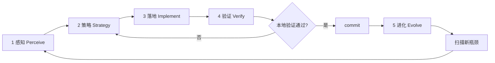

# AGENTS.MD — TrustClaw TRA

TrustClaw 开发指南：**在 OpenClaw 基础上构建 Trust Runtime for Agent (TRA)**，最大化继承 Gateway / 频道 / 多平台 / Provider 能力。

## Product loop authority（唯一驱动）

**TrustClaw 产品 Loop 只读本文件。** Cloud Agent、Cursor Agent、人类协作者执行 **感知 → 策略 → 落地 → 验证 → 进化** 时：

1. **入口**：本节 [无限优化闭环](#trustclaw-无限优化闭环infinite-optimization-loop) + [Cloud Agent 单轮检查清单](#cloud-agent-单轮检查清单)
2. **主攻项**：从 [平台能力清单](#平台能力清单platform-manifest)、`DECISIONS.md` 开放项与 [当前轮次笔记](#当前轮次笔记由-agent-持续追加) 选取；不得从其他文档自行开新 loop
3. **闸门**：`DECISIONS.md`（`pending` 不得实现）、[合规审查](#合规审查与数据审计compliance-review)、[执行前价值闸门](#执行前闸门平台分层与改动价值每轮必做)
4. **验证 / 写回**：本文件「进化」层 + colocated `*.test.ts`；轮次结论写入 [当前轮次笔记](#当前轮次笔记由-agent-持续追加)

**Supporting context only（不得单独驱动 loop）：**

| 文档                                  | 用途                                                     |
| ------------------------------------- | -------------------------------------------------------- |
| `VISION.md`（根目录）                 | 平台 north star、五平面架构                              |
| `GETTING_STARTED.md`                  | 本地启动、端口、Console 布局                             |
| `DECISIONS.md`                        | 人审闸门                                                 |
| `OPENCLAW_REUSE.md`                   | Inherit / Extend / Build                                 |
| `docs/TRA_GOVERNANCE_ARCHITECTURE.md` | MCA 治理架构（监控·把控·问责）                           |
| `docs/AGENT_PLATFORM.md`              | Agent 平台设计、三环 Loop、层操作模型（CRUD/API 唯一表） |
| Root `AGENTS.md`                      | 构建、测试、Git 政策                                     |

## Read order

**产品 Loop：** 读本文件全文 → 按需查上表 supporting 文档。  
**首次上手：** `GETTING_STARTED.md` → 本文件 Product snapshot → 无限优化闭环。

1. **本文件** — Product loop authority、合规 Must、无限优化闭环、平台能力清单、当前轮次笔记
2. `trustclaw/GETTING_STARTED.md` — dev 启动、端口、TRA Console 布局
3. `trustclaw/DECISIONS.md` — **逐条审核**；`pending` 项不得实现
4. `trustclaw/OPENCLAW_REUSE.md` — Inherit / Extend / Build 映射
5. `trustclaw/docs/TRA_GOVERNANCE_ARCHITECTURE.md` — 平台 MCA 治理（与合规 Must 配套）
6. `trustclaw/docs/AGENT_PLATFORM.md` — Business Agent 平台、三环 Loop、层操作模型
7. Root `AGENTS.md` — 构建、测试、Git 政策

---

## Product snapshot

**TrustClaw** = **Trust Runtime for Agent (TRA)**. 架构 north star 见根目录 `VISION.md`。

- **平台身份**：面向 Agent 的本地可信运行时 + 可审计 Pack；垂直场景以 **Agent Pack** 交付，不是平台硬编码管线
- **四大原则**：不出域 · 必有据 · 必审计 · Agent 解耦
- **五平面**（Data / Policy / Agent / Evidence / Operator）：见 `VISION.md`；MCA 治理环见 `docs/TRA_GOVERNANCE_ARCHITECTURE.md`
- **合规审查**：个人 TRA 数据、外部标准包、模型推理边界 — 三类数据流均须 **显式同意 + 可回放审计**（见 [合规审查与数据审计](#合规审查与数据审计compliance-review)）
- **术语**：产品称 **TRA**（Trust Runtime for Agent）；数据面路径 `/api/tra/*`、`local_tra.db`、`trustclaw/tra/`

---

## OpenClaw 解耦与最大化利用

**原则：并行解耦 + 接缝集成 + 最大化复用。** OpenClaw 是 **执行宿主**（Gateway、Agent runner、Provider、频道、Apps、skills）；TRA 是 **可信运行时**（数据、策略、Pack、审计）。二者 **不合并、不 fork、不互相替代**（D2）。

### 解耦（TrustClaw 自有）

| 层        | 路径                               | 规则                                          |
| --------- | ---------------------------------- | --------------------------------------------- |
| TRA 核心  | `trustclaw/**`                     | **无** `openclaw/plugin-sdk` 依赖；可单测     |
| 业务 Pack | `trustclaw/agents/*`               | 声明式 JSON + prompts；无 `src/agents` 硬编码 |
| 集成边界  | `extensions/trustclaw-tra/**`      | 唯一 OpenClaw 接线层：HTTP、hooks、tools      |
| 状态      | `state/local_tra.db`、`tra-audit/` | **不** 与 `openclaw.sqlite` 混表              |

**禁止：** 在 `src/` 写医保/GLP-1 规则；自建第二 Gateway；把 TRA 嵌进 `embedded-agent-runner`；绕过 `before_tool_call` 直读库。

### 最大化利用（OpenClaw 继承）

| 能力                  | 用法                                      | 禁止重复造轮子                 |
| --------------------- | ----------------------------------------- | ------------------------------ |
| Gateway + Plugin HTTP | `registerHttpRoute` → `/api/tra/*`        | 独立 Express 侧车              |
| Provider / 模型路由   | `api.runtime.llm.complete`（Text2SQL 等） | 插件内 raw `fetch` 绑死 OpenAI |
| Agent 循环            | WS chat、`agents.list`、workspace、skills | 在 Console 复制 Chat UI        |
| Hooks                 | `before_prompt_build`、`before_tool_call` | core 内嵌 TRA 逻辑             |
| 频道 / Apps           | `extensions/*`、`apps/*` 原样继承（D5）   | 重写 Telegram/WhatsApp         |
| Kysely/SQLite 模式    | 对齐 `src/infra/kysely-sync.ts`           | 云 DB / 并行 JSON 状态         |

**Text2SQL LLM 契约：** `trustclaw/runtime/text2sql/generate.ts` 只接受注入的 `Text2SqlLlmCaller`；插件用 `createPluginText2SqlLlm(api)` → `api.runtime.llm.complete`（purpose: `trustclaw.text2sql`）。`openai-llm.ts` 仅测试/离线 harness。

**G7 · WS Chat MCA 与 HTTP 对齐：** OpenClaw Gateway WS chat 经 `trustclaw_tra_query` / `trustclaw_tra_write` 调用 **同一** `runTrustclawChat` 管线；`POST /api/agent/chat` 为并行 HTTP 演示面。Control UI 经 `syncTrustclawRuntimeContext` → Panel D/E。验收：`extensions/trustclaw-tra/src/mca-parity.test.ts`。

### 策略卡片必答（叠加四轮自问）

1. **解耦：** 改动落在 `trustclaw/`、`extensions/trustclaw-tra/` 还是误触 `src/`？
2. **复用：** 能否用现有 Plugin SDK / runtime.llm / hooks / skills 接缝，而非新造适配器？
3. **并行：** OpenClaw Agent 与 TRA Pack 边界是否保持？见 `docs/AGENT_PLATFORM.md` § TRA Agent × OpenClaw Agent。
4. **验收：** `openclaw gateway run` + 插件启用即可；Companion/频道无需改 core。

完整映射：`OPENCLAW_REUSE.md`（Inherit / Extend / Build）。

---

## OpenClaw-first rule（执行摘要）

**Default:** 最大化 OpenClaw；只 Build TRA 缺口；**解耦优先于内嵌**。

| Do                                             | Don't                                 |
| ---------------------------------------------- | ------------------------------------- |
| Plugin HTTP + `api.runtime.llm` + hooks/tools  | Standalone Express gateway            |
| 注入 `Text2SqlLlmCaller`；插件侧 `runtime.llm` | `trustclaw/` 内 import OpenClaw SDK   |
| `node:sqlite` + Kysely 模式                    | Cloud DB 或并行 JSON 状态             |
| `openclaw gateway run` + trustclaw-tra         | Fork Gateway / 改 `src/agents` runner |
| Phase 2: inherit `extensions/*` 频道           | 重建 Telegram/WhatsApp adapters       |

---

## Human approval gates（逐条审核）

Before **Development** on any task:

1. Open `DECISIONS.md` — all items for the task must be `approved` or `deferred` (**done 2026-07-04**).
2. Schema/API changes that diverge from approved decisions need human review + `DECISIONS.md` entry.
3. Record any new decisions in `DECISIONS.md`.

---

## 合规审查与数据审计（Compliance Review）

TrustClaw 的合规目标不是「文档声明」，而是 **可测试、可回放、可阻断** 的实现。任何涉及个人健康数据、外部监管标准、或 LLM 推理的改动，必须先对照本节验收；**缺一环即不合规**。

### 合规目标（Must Meet）

| 目标                 | 标准                                                                                | 不达标表现                                               |
| -------------------- | ----------------------------------------------------------------------------------- | -------------------------------------------------------- |
| **不出域**           | TRA SQLite（`local_tra.db`）、审计 JSONL、consent 文件均在本地 `state/`；无静默外发 | 模型 prompt 含未授权原始行、或未走 tool 直接猜 vitals    |
| **必有据**           | 业务结论仅来自握手 JSON + SQLite 规则/AST；Pack 输出 `[Evidence #N]`                | LLM 自造指标、规则 PASS/FAIL、或标准条款                 |
| **必审计**           | 每次数据访问、标准导入、Chat 管线步骤写入 `state/tra-audit/events.jsonl`            | 缺 `DATA_CONSENT` / `COMPLIANCE_IMPORT` / 五步 Chat 审计 |
| **显式同意**         | 内部数据与外部标准 **分别** 征得用户同意后才读写                                    | import 无 `consentGranted`、tool 无 `requireApproval`    |
| **模型边界**         | Text2SQL 仅 SELECT + allowlist；规则由确定性引擎；模型只做 NL→SQL 与解释            | LLM 判规则、或非 SELECT 仍执行                           |
| **安全 fail-closed** | 守卫失败 → 阻断 + `BLOCKED`/`security_blocked` 审计                                 | 静默降级、fallback 读旧标准、或跳过 consent              |

### 数据分类与责任边界

| 类别                      | 内容                                                                                                              | 存储                                                                 | 同意闸门                                                   | 审计 step / component                        |
| ------------------------- | ----------------------------------------------------------------------------------------------------------------- | -------------------------------------------------------------------- | ---------------------------------------------------------- | -------------------------------------------- |
| **A · 内部 TRA 个人数据** | `user_profile`、`body_anthropometrics`、`lab_test_results`、`clinical_diagnoses`、`medication_history` 等 v1.1 表 | `state/local_tra.db`                                                 | Gateway `requireApproval`（`before_tool_call`）            | `DATA_CONSENT` / `TRA.Consent`               |
| **B · 外部合规标准**      | NRDL AST handshake JSON（如 GLP-1 v2：`metadata` + `ast_rules`）                                                  | `medication_compliance_standards`、`medication_compliance_ast_rules` | Panel F checkbox + API `consentGranted` + `sessionId`      | `COMPLIANCE_IMPORT` / `TRA.ComplianceImport` |
| **C · 模型可见载荷**      | Text2SQL 生成的 SQL、schema 摘要、握手矩阵、C3-PO 挂载 profile **摘要**（非全表 dump）                            | 仅当次 prompt / Runtime Context                                      | A 类经 tool consent；B 类经 import consent；禁止契约外字段 | `TEXT2SQL_GEN`、`AGENT_DECISION` 等          |

**禁止**：把 A 类原始行批量塞进 system prompt 绕过 tool；把 B 类标准包未经 zod + consent 写入 DB；让模型输出未在 `evaluation_matrix` 中出现的合规结论。

---

### 1. 内部个人数据 — 实现要求

**入口**：`extensions/trustclaw-tra/src/data-consent-hook.ts`（`before_tool_call` → `trustclaw_tra_query`）

**必须实现**：

1. TRA 未挂载 → `block: true`，不发起 consent UI。
2. 已挂载且 session 无 grant → `requireApproval`，标题/描述列出 **将读取的私人字段**（`profile-summary.ts` → `formatPrivateDataFieldLabels`）。
3. 用户决策 → `recordTraConsentAudit`（`decision`: `allow-once` \| `allow-always` \| `deny` \| `timeout` \| `cancelled`）；`deny`/timeout → `status: BLOCKED`，工具不得执行。
4. `allow-always` → 写入 `state/tra-audit/consent-grants.json`（`consent-store.ts`），可审计、可 Reset 清除。
5. C3-PO prompt（`c3po-tra-system.v1.md` + `agent-guidance.ts`）声明：**不得** bypass approval、不得用记忆代替 tool 结果。

**验收**：

```bash
node scripts/run-vitest.mjs extensions/trustclaw-tra/index.test.ts
# 手动：Panel A init → Chat 提问 → 出现 consent 卡片 → deny 则无 TRA 个人数据回复
```

**审计记录最小字段**：`input.user_query`、`input.private_data_fields`、`output.decision`、`output.granted`。

---

### 2. 外部合规标准 — 实现要求

**Schema**：`trustclaw/tra/schema/compliance-standards.v1.sql`  
**导入逻辑**：`trustclaw/tra/compliance-import.ts`  
**HTTP**：`POST /api/tra/compliance/preview` \| `import` \| `import/bundled-glp1-v2`；`GET /api/tra/compliance/standards` \| `rules`  
**UI**：Panel F — `trustclaw/ui/src/panels/compliance.ts`（预览 → 勾选同意 → 导入）

**必须实现**：

1. **Preview**：`complianceStandardPackageSchema`（zod）校验；不写 DB。
2. **Import**：`consentGranted === true` 且非空 `sessionId`，否则 400 + 错误消息；**不得**服务端默认同意。
3. 写入 `medication_compliance_standards`（含 `source_file_hash`、`consent_session_id`、`ruleset_hash`）与 `medication_compliance_ast_rules`；**同时仅一条** `is_active = 1`。
4. 每次 import 调用 `recordComplianceImportAudit`（`granted: false` 时亦须 BLOCKED 记录，若未来扩展拒绝路径）。
5. 种子示例：`trustclaw/tra/seeds/external/glp1-nrdl-ast-handshake-v2.json`；数据源登记 `NRDL_EXTERNAL`。

**验收**：

```bash
node scripts/run-vitest.mjs trustclaw/tra/compliance-import.test.ts
# 手动：Panel F → 勾选同意 →「导入内置 GLP-1 v2」→ Panel B 可见 compliance 表
```

---

### 3. 规则引擎与用药合规判断 — 实现要求

**原则（D6）**：规则匹配 **确定性**；导入 AST 后 **禁止** TS 硬编码 GLP-1 条款替代 DB 规则。

**G6 · RULE_EVAL 软结论（Monitor + Outcome Contract）：**

| 阶段             | `overall_status` | 审计 `status`             | 管线是否继续                                  |
| ---------------- | ---------------- | ------------------------- | --------------------------------------------- |
| `RULE_EVAL`      | `FAIL`           | `FAILURE`（非 `BLOCKED`） | 是 → `AGENT_DECISION`                         |
| `AGENT_DECISION` | —                | `SUCCESS`                 | `output.rule_outcome`: `soft_fail`            |
| `AGENT_DECISION` | —                | `SUCCESS`                 | `output.rule_outcome`: `pass` when rules pass |

GLP-1 Pack 用 **citations + 自然语言** 表达未满足项，**不**伪造 PASS。硬阻断仅用于 consent/SQL/未 init（`BLOCKED` / `security_blocked`）。

| 模块       | 路径                                              | 职责                                                                                                               |
| ---------- | ------------------------------------------------- | ------------------------------------------------------------------------------------------------------------------ |
| AST 上下文 | `trustclaw/runtime/rules/ast-context.ts`          | 个人数据行 → eval context（`user_profile.age`、`body_measurement.latest.bmi`、`clinical_diagnoses.icd10[...]` 等） |
| AST 求值   | `trustclaw/runtime/rules/evaluate-ast.ts`         | AND/OR/比较运算符；输出 `evaluation_matrix`                                                                        |
| 药品路由   | `trustclaw/runtime/rules/resolve-glp1-drug-id.ts` | 用户问题 → `drug_id` 27–30；有 active standard 时默认 29                                                           |
| 管线       | `trustclaw/runtime/pipeline/run-chat.ts`          | 有 active standard → AST；否则 `nrdl_payment_rules` 种子                                                           |

**必须实现**：

1. `getActiveComplianceStandard(db)` 为 null 时，走扁平种子 `GLP1_SEMA`，行为与 Task 202 一致。
2. active standard 存在时，按 `resolveGlp1EvalDrugId` 选 AST `drug_id`；AST 求值失败不得静默回退到 LLM 判断。
3. `prescription_context` 等 TRA 未采集字段：仅允许 **具名 demo 默认值**（见 `ast-context.ts` 常量），须在 DECISIONS/SPEC 中可追溯；不得伪造为用户真实处方。
4. 规则结果进入握手 3 → `buildGlp1Decision`；回复仅引用 matrix 中条目。

**验收**：

```bash
node scripts/run-vitest.mjs trustclaw/runtime/rules/resolve-glp1-drug-id.test.ts
node scripts/run-vitest.mjs trustclaw/runtime/rules/evaluate.test.ts
node scripts/run-vitest.mjs trustclaw/runtime/pipeline/run-chat.test.ts
```

---

### 4. 模型数据使用 — 实现要求

| 阶段           | 允许进入模型的内容                                               | 禁止                                     |
| -------------- | ---------------------------------------------------------------- | ---------------------------------------- |
| **Text2SQL**   | 用户问题 + schema 摘要（`schema-context.ts`）；输出仅 SELECT     | INSERT/UPDATE/DELETE；非 allowlist 表    |
| **Tool 前**    | C3-PO 人设 + **挂载 profile 摘要**（age/BMI/风险标记等聚合字段） | 全表 JSON dump；未 consent 的查询路径    |
| **Tool 后**    | `trustclaw_tra_query` 返回的 Runtime Context / 证据链            | 模型改写 rule status 或 invent citations |
| **GLP-1 决策** | `evaluation_matrix` + snapshot 结构化 JSON                       | 自由文本「应该可以报销」无 Evidence      |

**必须实现**：

1. `read_only_verification === false` 或 SQL 守卫失败 → `security_blocked` + 审计 `TEXT2SQL_GEN` `status: BLOCKED`（Task 301 完整化）。
2. `generateText2Sql` 审计记录含 `sql`、`allowed_tables`；**不得**在 audit `output` 写入完整 PHI 结果集（仅 row_count / columns 摘要）。
3. `DB_QUERY` 审计同理：大结果集只记维度，不记单元格值（见 `run-chat.ts`）。
4. 新增模型-facing 字段或 prompt 注入 → 更新本节 + colocated types/test。

---

### 5. 审计链 — 实现要求

**存储**：`state/tra-audit/events.jsonl`（`trustclaw/audit/record.js`）  
**类型**：`trustclaw/audit/types.ts` — step / component / status 封闭枚举

**每 Chat 最少 5 步**（与下节 Audit steps 表一致）：

`TEXT2SQL_GEN` → `DB_QUERY` → `RULE_EVAL` → `AGENT_DECISION` → `LEDGER_COMMIT`

**Consent / Import 独立 trail**：

- `audit_trail_id` 前缀 `consent_*`（与 chat 的 `aud_*` 区分）
- Panel D 通过 Runtime Context `postMessage` 展示 chat 五步；consent/import 事件可在 JSONL 检索或后续 Panel 扩展

**必须实现**：

1. 每条 event 含 `session_id`、`timestamp`、`input`/`output` 对象（可 JSON 序列化）。
2. `BLOCKED` 与 `SUCCESS` 均须落盘；不得 swallow 错误。
3. Reset TRA 时：文档化 consent-grants 与 compliance 表是否清除（当前：Reset 清个人 TRA 数据；compliance 标准 **保留**，须在 UI 说明）。

**验收**：

```bash
node scripts/run-vitest.mjs trustclaw/runtime/pipeline/run-chat.test.ts
# 断言 events.jsonl ≥5 条 / chat；import 后含 COMPLIANCE_IMPORT
```

---

### 6. 安全守卫清单

| 守卫              | 位置                                      | 触发                                                  |
| ----------------- | ----------------------------------------- | ----------------------------------------------------- |
| SELECT-only       | `trustclaw/tra/query.ts`                  | 非 SELECT / 危险关键字                                |
| Table allowlist   | Text2SQL handshake + query                | 表不在 allowlist                                      |
| Import consent    | `compliance-import.ts` + routes           | `consentGranted !== true`                             |
| Tool consent      | `data-consent-hook.ts`                    | 无 grant 且非 approval 通过                           |
| TRA mounted       | init / tool / chat                        | 未 `POST /api/tra/init`                               |
| Package integrity | zod + `source_file_hash` / `ruleset_hash` | 非法 JSON 或 hash 不匹配（未来可扩展 publisher 验签） |

新增守卫须：**单元测试 + 审计 BLOCKED 记录 + 本表一行**。

---

### 7. 合规审查 PR / Loop 闸门

改动触及 consent、compliance import、AST、Text2SQL、audit 类型或 C3-PO prompt 时，PR / Loop 卡片 **额外** 勾选：

```
[ ] 数据分类：标明 A / B / C 哪一类受影响
[ ] 同意路径：内部 requireApproval 或 import consentGranted 仍有效且测试覆盖
[ ] 审计：新增/变更 step 已写入 types.ts + record 调用点 + test 断言
[ ] 模型边界：无 spec 外 PHI 进 prompt；规则仍确定性
[ ] fail-closed：失败路径有 BLOCKED/security_blocked，无静默 fallback
[ ] 文档：本节 +（若 API 变）`DECISIONS.md`
```

**推荐验证命令（合规相关）**：

```bash
node scripts/run-vitest.mjs trustclaw/tra/compliance-import.test.ts
node scripts/run-vitest.mjs trustclaw/runtime/rules/resolve-glp1-drug-id.test.ts
node scripts/run-vitest.mjs trustclaw/runtime/pipeline/run-chat.test.ts
node scripts/run-vitest.mjs extensions/trustclaw-tra/index.test.ts
```

---

## TrustClaw 无限优化闭环（Infinite Optimization Loop）

**本文件是 TrustClaw 产品 Loop 的唯一执行协议。** Loop 的感知、策略、落地、验证、进化 **只按本节与下方检查清单执行**。

本仓库按 **生产级平台** 持续演进，不以单一垂直 demo 闭环为架构中心。每一轮闭环：**感知现状 → 选定瓶颈 → 最小落地 → 用证据验证 → 写回本文件 → commit → 进入下一轮**。

Cloud Agent 与人类协作者都应把本文件当作活文档；每轮验证通过后更新「当前轮次笔记」或 **Gotchas**。

**不要**为此闭环新增独立编排脚本（例如一键跑完全部阶段的 orchestrator），除非用户明确要求。闭环由 Agent 按层执行现有测试与 Gateway 路径，并把经验沉淀进文档。

### 核心原则

| 原则               | 含义                                                                                                       |
| ------------------ | ---------------------------------------------------------------------------------------------------------- |
| **先测后改**       | 没有基准与正确性证据，不改握手 JSON、SELECT 守卫、规则矩阵语义                                             |
| **OpenClaw-first** | 优先插件 HTTP、`src/llm/`、Kysely/SQLite 模式；不在 `src/` fork Gateway                                    |
| **瓶颈驱动**       | 优先修契约缺口、静默错误、策略守卫缺失、审计链断裂，再追求 UI polish                                       |
| **最小改动**       | 每轮只解决本轮策略选定的 **1 个主攻项**（或其中 1～2 个阻塞子项）                                          |
| **验证通过再沉淀** | 相关 `*.test.ts` 绿 + 验收标准满足后，再更新本文件、必要时 `DECISIONS.md`                                  |
| **产品契约优先**   | 数据走 TRA schema（`trustclaw/tra/`）+ 冻结 API；规则走 SQLite/导入标准；**禁止** TS 硬编码垂直规则（D14） |
| **执行前价值闸门** | 进入「策略 → 落地」前，对照平台分层与 `DECISIONS.md` 开放项判断是否值得做（见下节）                        |

### 执行前闸门：平台分层与改动价值（每轮必做）

**在勾选检查清单第 2 步「策略」、写代码之前**，Agent 必须先完成本闸门；若结论为「价值不足」，改选 backlog 中更高优先级项，**不得**为凑 Loop 做低价值改动。

#### 平台分层（对齐 `VISION.md` 与 OpenClaw 复用边界）

| 平面 / 层级  | OpenClaw 参考                | TrustClaw 对应                                         | 典型路径                                     |
| ------------ | ---------------------------- | ------------------------------------------------------ | -------------------------------------------- |
| **Data**     | `src/state/` + Kysely/SQLite | TRA schema、init、SELECT 守卫、参考同步、血缘          | `trustclaw/tra/`                             |
| **Policy**   | Gateway hooks / approval     | consent、domain grants、合规 import、fail-closed       | `trustclaw/tra/consent-*`、`compliance-*`    |
| **Agent**    | `src/llm/` + agent runner    | Agent Pack、Text2SQL、规则引擎、chat 管线、coordinator | `trustclaw/runtime/`、`trustclaw/agents/*`   |
| **Evidence** | diagnostic-events 形状参考   | 审计 JSONL、SHA-256 账本、可回放 trail                 | `trustclaw/audit/`、`trustclaw/ledger/`      |
| **Operator** | `extensions/*` + Control UI  | Runtime Console、Agent 工作台、插件 HTTP               | `trustclaw/ui/`、`extensions/trustclaw-tra/` |

**借鉴要点（非照搬 OpenClaw 全栈）：**

- **数据下沉、规则上浮**：个人数据与导入标准在 SQLite；TS 做守卫与确定性求值，不用 LLM 判规则（D6）。
- **同契约评判**：只在 plugin handler + colocated types 形状上验收；不引入契约外 API 字段或「临时 shortcut」。
- **安全先于体验**：非法 SQL 或策略失败 → 阻断 + 审计 `BLOCKED`。
- **正确性先于演示**：Pack 管线握手字段齐全、规则可复现，再谈 Console polish。

#### 四轮自问（策略卡片必填）

在 PR 描述或本轮笔记中**用 1～2 句话**回答：

1. **平面**：本轮改的是 Data / Policy / Agent / Evidence / Operator 哪一层？若仅为样式而 Policy 守卫或 Evidence 链仍缺 → **降级或拒绝**。
2. **路径**：是否落在 `DECISIONS.md` 开放项与本文件 [平台能力清单](#平台能力清单platform-manifest)？是否有未闭合 `pending` 阻塞项？
3. **收益**：预期收益类型 — 契约闭合、策略守卫、规则正确性、Pack 管线、运营面能力，还是回归修复？
4. **机会成本**：同一轮是否还有更高优先级 backlog（失败测试、开放 DECISION、审计链缺口、coordinator 边界）？

### 五层结构



---

#### 第 1 层：感知（Perceive）— 我们在哪？

**目标**：弄清 [平台能力清单](#平台能力清单platform-manifest) 完成度、契约覆盖、测试红项，以及五平面中哪一层存在生产缺口。

**典型动作**：

- 读契约：`DECISIONS.md` 开放项 + 本文件平台能力清单
- 读 north star：`VISION.md`（平台平面，非垂直 demo 脚本）
- 读复用映射：`OPENCLAW_REUSE.md` 对应行的 Inherit / Extend / Build
- 跑 TrustClaw 单元测试（按已落地模块）：

```bash
node scripts/run-vitest.mjs trustclaw/tra/init.test.ts
node scripts/run-vitest.mjs trustclaw/runtime/text2sql/generate.test.ts
node scripts/run-vitest.mjs trustclaw/runtime/rules/evaluate.test.ts
```

- 对照 Owner map（下文）与各平面模块状态
- 若插件已接线：集成测关键 `/api/tra/*` 与 pack chat 路径

**产出**：简短「现状快照」— 失败测试列表、未实现 API、守卫缺口、生产就绪闸门未闭合项。

---

#### 第 2 层：策略（Strategy）— 下一步改什么？

**目标**：根据感知结果排序，选定**单一**主攻项（例如：闭合某 DECISION 开放项或某平面守卫）。

**前置条件**：已完成上文 [执行前闸门](#执行前闸门平台分层与改动价值每轮必做) 的四轮自问；策略卡片须写明「平面 + 收益类型 + 为何优于 backlog 其他项」。

**决策参考**：

| 信号                                     | 优先策略                                                |
| ---------------------------------------- | ------------------------------------------------------- |
| `*.test.ts` 失败 / 类型错误              | 修回归；不叠加新功能                                    |
| 握手 JSON 缺字段或与 types/zod 不一致    | 先对齐 types + zod，再写 UI                             |
| Text2SQL 非 SELECT / 表不在 allowlist    | 修 `query.ts` 守卫与 audit 钩子（301 前可先 unit 断言） |
| 规则矩阵与 SQLite 种子不一致             | 修 `evaluate.ts` + 种子 SQL；禁止 TS 硬编码规则         |
| Chat API 未通但 UI 已写                  | **拒绝**先 polish UI；先闭合 Agent 平面 API/管线        |
| scope creep（频道、多 Agent 路由未决项） | **拒绝**；须 `DECISIONS.md` 明确 `approved`             |

**产出**：本轮「策略卡片」— 1 句话目标、任务 ID、触及文件、预期验证命令（写入 PR / handoff 即可）。

---

#### 第 3 层：落地（Implement）— 最小正确实现

**目标**：按策略做**最小**代码改动，遵循仓库既有风格与 OpenClaw-first 规则。

**常见落地点**（按平台平面）：

| 平面     | 路径                                                                    |
| -------- | ----------------------------------------------------------------------- |
| Data     | `trustclaw/tra/`                                                        |
| Policy   | `trustclaw/tra/consent-*`、`compliance-*`；插件 consent hooks           |
| Agent    | `extensions/trustclaw-tra/`、`trustclaw/runtime/`、`trustclaw/agents/*` |
| Evidence | `trustclaw/audit/`、`trustclaw/ledger/`                                 |
| Operator | `trustclaw/ui/`、`ui/src/ui/views/trustclaw-tra-workbench.ts`           |

**禁止**：

- 新建 `trustclaw_optimization_loop.py` 类编排器
- 在 prod TS 中硬编码垂直规则或 `demo_user` 类字段（用 `TRA_LOCAL_USER_ID` 等产品常量）
- 无决策记录地偏离已落地 plugin API 形状

**Design ↔ Implement 衔接**（原 TDD 四阶段保留）：

| 阶段      | 要点                                                | 闸门                        |
| --------- | --------------------------------------------------- | --------------------------- |
| Design    | `DECISIONS` + `OPENCLAW_REUSE` 行；测试计划 bullets | schema/API 变更需人审       |
| Implement | 上表路径；代码英文；UI 文案 zh-CN                   | 符合 plugin handler + types |
| Test      | colocated `*.test.ts`                               | 见第 4 层                   |
| Verify    | 平台能力清单 + 生产就绪闸门验收                     | 见第 4 层                   |

---

#### 第 4 层：验证（Verify）— 证据链

**目标**：正确性先于演示；策略守卫与审计链先于 Console 体验。

**按触及平面的最小验证集**（非全量；选与本轮相关的行）：

| 平面 / 能力      | 最小命令 / 断言                                                                 |
| ---------------- | ------------------------------------------------------------------------------- |
| **Data**         | `node scripts/run-vitest.mjs trustclaw/tra/init.test.ts`；SELECT 守卫拒绝写操作 |
| **Agent**        | Text2SQL / rules / pipeline 相关 `*.test.ts`；pack chat 产出 Runtime Context    |
| **Evidence**     | chat 路径 ≥5 审计步；ledger `previous_evidence_hash` 可校验                     |
| **Policy**       | consent + compliance import 测试；deny → `BLOCKED`                              |
| **Operator**     | Console 六面板可访问；Reset 清空个人 TRA 数据 + audit + ledger                  |
| **合规（横切）** | 本节 §1–§7 + 上表相关命令                                                       |

**合并闸门（Merge / handoff gate）**：本节最小验证集在本机**全部通过**后，Agent 才可 commit、开 PR 或进入下一轮。**每次重要开发验证通过后必须 commit**（用户约定；见第 5 层）。

```bash
# 示例：Task 201–202 闭合后的本地证明
node scripts/run-vitest.mjs trustclaw/tra/init.test.ts
node scripts/run-vitest.mjs trustclaw/runtime/text2sql/generate.test.ts
node scripts/run-vitest.mjs trustclaw/runtime/rules/evaluate.test.ts
```

---

#### 第 5 层：进化（Evolve）— 写回知识，开启下一轮

**目标**：把本轮结论变成下一 Agent 的默认上下文；**commit 后再扫描 backlog**。

**必须更新的位置（按影响面）**：

1. **`trustclaw/AGENTS.md`** — 「当前轮次笔记」或 **Gotchas**（**主写回目标**）
2. **`DECISIONS.md`** — 新决策项；不得静默改 approved 方案
3. **Colocated tests** — 新契约行为须有 `*.test.ts`
4. **本文件「当前轮次笔记」** — 记录任务进度；**不得**替代本文件成为 loop 入口

**Commit 约定**：

- 验证通过后：`scripts/committer "<conventional msg>" <files…>` 或等效 `git commit`
- 消息含任务 ID 与行为摘要（非仅「fix」）
- 不 commit 未验证的 WIP，除非用户明确要求

**本轮结束时在 commit / PR 中写清**：

- 感知到的瓶颈 → 策略选择 → 改动摘要 → 验证命令与结果 → **下一轮建议**（回到第 1 层）

---

### 生产就绪闸门（Production readiness）

平台 **baseline 已落地**（`DECISIONS.md` D1–D24）。新改动须保持以下不变量；回归时对照：

- [x] **Runnable** — `pnpm trustclaw:dev` 或 `openclaw gateway run` + trustclaw 插件；仅本地 SQLite
- [x] **Operator-ready** — Runtime Console + Agent 工作台可运维；Reset 清空个人 TRA 数据 + audit + ledger
- [x] **Auditable** — 数据访问与 pack 管线步骤在审计面可回放
- [x] **Evidence integrity** — Chat/pack 路径产生可校验哈希链 receipt
- [x] **Policy fail-closed** — consent/import/SQL 守卫失败必 `BLOCKED`，无静默 fallback

### 平台能力清单（Platform manifest）

下表为 Agent 每轮 **Verify** 或合并后 **Perceive** 用的**平台能力探针**（**不**替代单元测试；**不**等价于任何单一垂直 demo 脚本）。

| id                    | 路径 / 命令                                            | 平面     | 说明                                                                  |
| --------------------- | ------------------------------------------------------ | -------- | --------------------------------------------------------------------- |
| `tra_init`            | `POST /api/tra/init`                                   | Data     | init 映射 canonical 表                                                |
| `tra_reset`           | `POST /api/tra/reset`                                  | Operator | 清空个人 TRA 数据行 + audit/ledger                                    |
| `tra_query_guard`     | `trustclaw/tra/query.ts` SELECT 守卫                   | Data     | 非 SELECT → 拒绝                                                      |
| `text2sql_handshake`  | Text2SQL → TRA store 握手 1                            | Agent    | `sanitized_sql` + `read_only_verification`                            |
| `rule_eval_handshake` | TRA store → RuleEval 握手 2                            | Agent    | snapshot + `active_ruleset`                                           |
| `pack_decision`       | RuleEval → Pack 握手 3（如 glp1：`evaluation_matrix`） | Agent    | 垂直逻辑在 pack，不在平台 vision 层冻结                               |
| `agent_chat`          | `POST /api/agent/chat`                                 | Agent    | pack 端到端                                                           |
| `audit_five_steps`    | 每 Chat 5 审计步                                       | Evidence | 见 [Audit steps](#audit-steps每-chat-至少-5-条)                       |
| `compliance_import`   | `POST /api/tra/compliance/import` + Panel F consent    | Policy   | `COMPLIANCE_IMPORT` + active standard                                 |
| `data_consent`        | `trustclaw_tra_query` requireApproval                  | Policy   | `DATA_CONSENT` + deny 阻断                                            |
| `domain_grants`       | `GET/PUT /api/tra/agent-grants`                        | Policy   | 领域 scope fail-closed（D22）                                         |
| `ledger_chain`        | Evidence SHA-256 链                                    | Evidence | `verifyEvidenceChain`                                                 |
| `ui_six_panels`       | Console A–F + Agent 工作台 Chat                        | Operator | 双表面分工见 [TRA 双表面](#tra-双表面runtime-console-vs-agent-工作台) |
| `domain_agents_api`   | `GET /api/tra/domain-agents`                           | Operator | 逻辑 Agent 目录（D24 全量导入为运营动作）                             |
| `pack_extension_pts`  | `listAgentPackExtensionPoints()`                       | Agent    | 垂直引擎注册表；新 pack 作者必读                                      |
| `skill_loop_cmds`     | `listSkillLoopVerifyCommands()`                        | Agent    | OpenClaw skills + pack vitest                                         |
| `pack_scoped_audit`   | `missingChatPipelineSteps(..., { expectedSteps })`     | Evidence | 按 Pack `pipeline.stages` 探测缺口（G2）                              |
| `gap_backlog_g1_g5`   | §12 G1–G5                                              | Evidence | 差距闭环 baseline；新轮从 G6+ 选取                                    |
| `plugin_runtime_llm`  | `createPluginText2SqlLlm(api)`                         | Agent    | Text2SQL 复用 OpenClaw Provider 路由（G11）                           |

**禁止**：把 `DECISIONS.md` 标为 `deferred` 的项（D5/D21/D23 等）当作本轮必做，除非决策状态已更新。

---

### Cloud Agent 单轮检查清单

复制此清单执行一轮；完成后勾选并更新「进化」项。

```
[ ] 0. 闸门：完成「平台分层与改动价值」四轮自问
[ ] 1. 感知：读 VISION + DECISIONS + 平台能力清单；跑相关 trustclaw/*.test.ts
[ ] 2. 策略：只选 1 个主攻项；对照五平面与 OpenClaw-first
[ ] 3. 落地：最小 patch；代码在 trustclaw/** 与 extensions/trustclaw-tra/**
[ ] 4. 验证：触及平面的最小验证集全绿；不引入无关 openclaw core 改动
[ ] 5. commit：验证通过后提交；消息含平面/DECISION 摘要
[ ] 6. 进化：更新本文件「当前轮次笔记」；必要时 DECISIONS
[ ] 7. 扫描 backlog：`DECISIONS.md` 开放项 + 生产就绪回归项
[ ] 8. 下一轮：Loop R{n+1}，直至用户喊停或开放 DECISION 闭合
```

**连续迭代终止条件**：用户明确停止；本地验证无法通过且已合理修复仍失败；本轮仅为纯文档且用户未要求继续代码 Loop。

---

## Agent Platform 迭代目标（对齐 `docs/AGENT_PLATFORM.md`）

**North star：** TRA Business Agent **垂直开放**；OpenClaw Agent ∥ TRA Pack ∥ 领域目录 **三平面并行**；OpenClaw 通过 `_template` 三契约（Data / Mode / Workflow）**自主构建** Pack，不 fork Gateway core。

**设计权威（只读，不单独开 loop）：**

| 文档                                     | 用途                                                                 |
| ---------------------------------------- | -------------------------------------------------------------------- |
| `docs/AGENT_PLATFORM.md`                 | 并行集成、开放平台、三环 Loop、**层操作模型**（CRUD/API/验证唯一表） |
| `docs/TRA_GOVERNANCE_ARCHITECTURE.md`    | MCA、P0–P8 权限、§12 规范 vs 实现差距                                |
| `agents/_template/INTEGRATION.md`        | Pack 作者起步                                                        |
| `runtime/agent-pack/extension-points.ts` | 可注册 pipeline / rule / decision 接缝                               |

**三环嵌套（每轮只推进一环的一个主攻项）：**

| Loop         | 入口问题                              | 产物                              | 验证                                                           |
| ------------ | ------------------------------------- | --------------------------------- | -------------------------------------------------------------- |
| **Platform** | 五平面哪一层有生产缺口？              | 本文件笔记 + platform `*.test.ts` | [平台能力清单](#平台能力清单platform-manifest)；governance §11 |
| **Pack**     | 下一个可运行 `agent.pack.json` 切片？ | `trustclaw/agents/<id>/`          | `run-chat.test.ts`；grant + consent deny                       |
| **Skill**    | workspace 常驻流程是否错/缺/未测？    | `workspace/*/skills/**/SKILL.md`  | `listSkillLoopVerifyCommands()`                                |

层间 CRUD、API、守卫 — **以 `AGENT_PLATFORM.md` § Layer operations model 为准**；Loop 策略卡片须标明触及的抽象层（P3–P8 或平面）。

### 差距闭环 backlog（`TRA_GOVERNANCE_ARCHITECTURE.md` §12）

每轮 **Perceive** 扫描下表；**Strategy** 从 `open` 项选 **1** 条（或与其阻塞的子项）；闭合后改 `done` 并写「当前轮次笔记」。

| ID  | 规范                                                 | 状态     | 验收                                                                                   |
| --- | ---------------------------------------------------- | -------- | -------------------------------------------------------------------------------------- |
| G1  | `tra_not_initialized` 记 `BLOCKED` 审计              | **done** | `run-chat.test.ts` 未 init 路径                                                        |
| G2  | `missingChatPipelineSteps` 按 Pack `pipeline.stages` | **done** | `read-events.test.ts` + 调用方传 `expectedSteps`                                       |
| G3  | Pack 声明的 `audit.*Component` 可写入                | **done** | `AuditComponent` 接受 pack 字符串                                                      |
| G4  | `POST /api/tra/reset` 记 `TRA_RESET`                 | **done** | reset 后 `events.jsonl` 首条 `TRA.Reset`                                               |
| G5  | Grants 加载/写入 ⊆ `deriveAgentDomainScopes`         | **done** | `agent-domain-grants.test.ts`                                                          |
| G6  | `RULE_EVAL` FAIL 软结论路径                          | **done** | `RULE_EVAL` `FAILURE` + `AGENT_DECISION` `rule_outcome: soft_fail`；`run-chat.test.ts` |
| G7  | OpenClaw WS chat 与 HTTP 相同 MCA                    | **done** | `trustclaw_tra_query` → `runTrustclawChat`；`mca-parity.test.ts`                       |
| G8  | Logic Agent `tra_scopes` 路由接入                    | **open** | D23 deferred                                                                           |
| G9  | 合规包 `publisher_signature` 验签                    | **open** | D21 deferred                                                                           |
| G10 | Pack 可变阶段 Panel D 探测与 UI                      | **done** | `declared_pipeline_steps` + Panel D pack-scoped gates；`audit-pipeline.test.ts`        |
| G11 | Text2SQL 走 OpenClaw `runtime.llm`                   | **done** | `plugin-text2sql-llm.ts`；非 raw fetch                                                 |

**禁止：** 为闭合 G6–G10 而违反 `DECISIONS.md` `deferred`/`pending` 边界。

### 里程碑（缩小 repo ↔ 设计差距）

| 阶段            | 目标                                                                                          | 完成信号                                                                                                                        |
| --------------- | --------------------------------------------------------------------------------------------- | ------------------------------------------------------------------------------------------------------------------------------- |
| **2.5**         | Pack schema、注册表、三 bundled packs、层操作模型文档、§12 G1–G5                              | 上表 G1–G5 `done`；`GET /api/tra/agent-packs`                                                                                   |
| **3（已交付）** | Panel C 选择器、session pack、coordinator 归因、pack 级 Text2SQL、multi-workspace session key | `coordinator.test.ts` + `mca-parity.test.ts`；三 bundled pack `run-chat.test.ts`；RuntimeContext `agent_pack_source` / mismatch |
| **4**           | Pack 创作 API/UI、外部签名 Pack                                                               | D21 闭合后验签 import                                                                                                           |

### Pack / Skill 起步（每轮可选 1 项）

- 新垂直：复制 `agents/_template/` + `workspace/_template/` → 填三契约 → `rules.engine: none` starter path
- 医药严格路径：对照 `glp1-eligibility` / `nrdl-reimburse` / `compliance-auditor`
- Skill：dev / nrdl-reimburse / compliance-auditor workspace 均应有 `skills/tra-pack-operations/`（或 pack 专用 skill）

### 迭代选取规则（叠加「执行前闸门」）

1. **先** §12 `open` 中阻塞 MCA 或测试红的项（G6 除外若仅文档争议）
2. **再** `DECISIONS.md` 开放 approved 项（D13 品牌化）
3. **再** Phase 3 表项（Operator / Pack 体验）
4. **拒绝** 仅 UI polish 而 G7–G10 或合规 Must 未闭合

---

### 现有工具索引（按层）

| 层            | 工具 / 路径                                                                             |
| ------------- | --------------------------------------------------------------------------------------- |
| **Loop 驱动** | **本文件** — Product loop authority、无限优化闭环、检查清单、生产就绪闸门、当前轮次笔记 |
| 感知          | `VISION.md`、`DECISIONS.md`、`OPENCLAW_REUSE.md`                                        |
| 策略          | 平台能力清单、`DECISIONS.md` deferred 边界                                              |
| 落地          | `trustclaw/**`、`extensions/trustclaw-tra/**`、`src/llm/`（Extend）                     |
| 验证          | `node scripts/run-vitest.mjs trustclaw/...`、生产就绪闸门                               |
| 进化          | **本文件** 当前轮次笔记、colocated `*.test.ts`                                          |

---

### 当前轮次笔记（由 Agent 持续追加）

> **维护说明**：每完成一轮验证 + commit，在此追加 3～5 行：日期、任务 ID、瓶颈、验证命令、下一轮建议。不要删除历史条目。

- **平台基线（2026-07-05）**：`DECISIONS.md` D1–D24 已落地；`PLAN`/`PRODUCT`/`ROADMAP` 已退役；Loop 只读本文件 + `DECISIONS.md` + `VISION.md`。
- **R1–R17（2026-07-04→05）**：从 TRA schema 到双表面 Console、合规/consent、领域赋权、domain_agents API；详见 git 历史。
- **R18（2026-07-05，生产叙事）**：`VISION.md` 与 `AGENTS.md` 去 demo 闭环中心论；改为五平面架构；平台能力清单替代 V1 烟雾脚本；生产就绪闸门替代 Demo DoD。
- **R20（2026-07-06，OpenClaw 解耦）**：`AGENTS.md` 增 § OpenClaw 解耦与最大化利用；Text2SQL 改 `api.runtime.llm.complete`（G11）；`openai-llm.ts` 降级为测试 harness。
- **R21（2026-07-06，G6/G7）**：`RULE_EVAL` `FAILURE` + `AGENT_DECISION` `rule_outcome: soft_fail`；HTTP/WS `mca-parity.test.ts`；bridge 透传 `agent_pack_id`。
- **R22（2026-07-06，G10）**：`declared_pipeline_steps` on RuntimeContext；`GET /api/tra/agent-grants` 暴露 `pipeline.stages`；Panel D 按 Pack 子集渲染闸门与完成判定。
- **R23（2026-07-06，D24）**：`importBundledDomainAgentsRegistry` + `POST /api/tra/domain-agents/import/bundled-registry`；Panel C 运营导入按钮；修复 `seedDomainAgentsRegistryIfEmpty`。
- **R24（2026-07-06，Phase 3 + D13）**：RuntimeContext 携带 `agent_pack_source` / lock / mismatch；`tra-query-tool` 换 agent 锁包测试；Console 标题 TrustClaw 品牌化。
- **R25（2026-07-07，Phase 3）**：`compliance-auditor` chat 无 `RULE_EVAL` 管道测试；MCA parity 断言 HTTP `request` / WS `session` 协调器归因；Panel D 实时展示 `agent_pack_source`。
- **R26（2026-07-07，Phase 3 + D13）**：`nrdl-reimburse` 全阶段 chat 管道测试；Panel D `agent_pack_mismatch` + 建议 pack 提示；Control UI `tabs.tra` TrustClaw 品牌化。
- **R27（2026-07-07，Phase 3 + D13）**：`resolveCoordinatorSessionKey` 将 bare `session_id` + `openclaw_agent_id` 规范为 `agent:<id>:<session>`；HTTP chat 可选 `openclaw_agent_id`；TRA Console shell i18n TrustClaw 对话文案。
- **R28（2026-07-07，Phase 3 收口 + D13）**：里程碑 Phase 3 → **已交付**；`AGENT_PLATFORM.md` / `GETTING_STARTED.md` / governance 补 session key + RuntimeContext 协调器字段；Phase roadmap 对齐 R24–R27。
- **R29（2026-07-07，Phase 4）**：`GET /api/tra/agent-packs` 增 `extension_points`；`GET …/extension-points` 与 `GET …/<packId>` 只读创作 API；`describeAgentPackDetail`。
- **R30（2026-07-07，Phase 4）**：`inspectAgentPackDocument` + `POST /api/tra/agent-packs/validate`（结构化 zod issues，不落盘）。
- **R31（2026-07-07，Phase 4）**：`writeAgentPackDocument` + `PUT /api/tra/agent-packs/<packId>`（需 `agentPacksDir`，校验后 upsert，刷新 registry）。
- **R32（2026-07-07，Phase 4）**：`POST /api/tra/agent-packs` 创建 + `DELETE …/<id>` 删除（保护 default pack）；`deleteAgentPackDirectory`。
- **下一轮建议**：G8–G9（D23/D21 deferred）；D13 CLI 别名；Phase 4 Console 创作 UI；D5 deferred。

---

### Gotchas

- **Vitest 路径**：默认 `pnpm test trustclaw/...` 可能被 `vitest.unit.config.ts` exclude，**找不到测试文件**。窄范围证明用：
  ```bash
  node scripts/run-vitest.mjs trustclaw/<path>.test.ts
  # 或
  ./node_modules/vitest/vitest.mjs run trustclaw/tra/init.test.ts
  ```
  全量 OpenClaw 测试过重，勿作为每轮默认。
- **Control UI 空白 / 503**：需要 `pnpm ui:build`（或 `pnpm trustclaw:ui:build`）生成 `dist/control-ui/`；dev 侧栏热更走 `:5174/trustclaw/`，Gateway 壳走 `:19001`。
- **Init 400 / Not mounted**：改 init zod 或插件路由后须 **重启** `pnpm trustclaw:dev`；浏览器硬刷新后再点 Initialize。
- **API base**：`trustclaw/ui/src/api.ts` 用同源相对路径，勿烘焙 `:18789`；dev Gateway 在 `:19001`。
- **Vite proxy ECONNREFUSED**：Gateway 冷启动需重建 dist（约 10–90s）；`pnpm trustclaw:dev` 现会 **等 Gateway 监听后再启 Vite**。若仍报错：确认 `:19001` 已 `ready` 后刷新页面，勿单独只跑 Vite 而无 Gateway。
- **Panel D 审计**：上半区从 `GET /api/tra/audit/events?scope=compliance` 读 JSONL（`DATA_CONSENT` / `COMPLIANCE_IMPORT`）；下半区仍为 Chat Runtime Context。导入标准或 Chat 同意后点 **刷新审计**。
- **C3-PO 人设**：改 prompt 后 **新会话**（`/new`）；`pnpm trustclaw:setup` 同步 workspace + `avatars/c3po-tra.png` → `~/.openclaw/workspace-dev/`。
- **Chat logo 裂图**：通常是 `dist/control-ui/favicon.svg` 或 `apple-touch-icon.png` 缺失，或 workspace 里 `avatars/c3po.png` 不存在；`pnpm trustclaw:setup` + 重启 `pnpm trustclaw:dev`（dev 脚本会自动补 Control UI 图标）。
- **acpx manifest missing**：TrustClaw dist 不含 `acpx` 时 Gateway 会因 `plugins.entries.acpx` 报错；`pnpm trustclaw:setup` 会写入 `enabled: false`，然后重启 dev。
- **i18n**：Control UI 语言在 **Overview → Access → Language**（非 Appearance）；存储键 `openclaw.i18n.locale`（`en` / `zh-CN`）。侧栏 bundle 在 `trustclaw/ui/src/i18n/locales/`；iframe `@load` 发 `openclaw:i18n:locale`；改语言后建议刷新或重载侧栏（尚无 theme 级 live locale broadcast）。
- **无 orchestrator**：不要新增「一键跑完平台清单」脚本；按平台能力清单手工串联。
- **Session pack key**：Coordinator 存储键为 OpenClaw `sessionKey`（`agent:<agentId>:<conversationId>`）。HTTP `POST /api/agent/chat` 若只传 bare `session_id`，须同时传 `openclaw_agent_id` 才能与 WS 工具路径共享绑定；Control UI 已传完整 `sessionKey`。
- **Commit 时机**：重要验证通过后即 commit；避免大批未验证变更堆在同一 diff。

---

## Owner map

| Module               | Path                                                                  | Status | OpenClaw seam                       |
| -------------------- | --------------------------------------------------------------------- | ------ | ----------------------------------- |
| TRA store            | `trustclaw/tra/`                                                      | ✓      | kysely-sync pattern                 |
| Compliance standards | `trustclaw/tra/compliance-*.ts`, `schema/compliance-standards.v1.sql` | ✓      | 外部 AST + consent import           |
| Consent / audit      | `trustclaw/tra/consent-*.ts`, `consent-audit.ts`                      | ✓      | `DATA_CONSENT`, `COMPLIANCE_IMPORT` |
| Plugin API           | `extensions/trustclaw-tra/`                                           | ✓      | plugins-http                        |
| Text2SQL             | `trustclaw/runtime/text2sql/`                                         | ✓      | `src/llm/`                          |
| Rule engine          | `trustclaw/runtime/rules/`                                            | ✓      | —                                   |
| Pipeline             | `trustclaw/runtime/pipeline/`                                         | ✓      | runner patterns                     |
| Agent packs          | `trustclaw/agents/*`（如 `glp1/`）                                    | ✓      | `agent.pack.json` + prompts         |
| Audit                | `trustclaw/audit/`                                                    | ✓      | diagnostic-events                   |
| Ledger               | `trustclaw/ledger/`                                                   | ✓      | —                                   |
| TRA Runtime Console  | `trustclaw/ui/`                                                       | ✓      | `/trustclaw/*` + `embed=left/right` |
| TRA Agent 工作台     | `ui/src/ui/views/trustclaw-tra-workbench.ts`                          | ✓      | Control UI Chat + iframe 侧栏       |
| C3-PO chat persona   | `extensions/trustclaw-tra/src/agent-guidance.ts`                      | ✓      | `before_prompt_build` hook          |

---

## Schema v1.1（D1 approved）

- DDL: `trustclaw/tra/schema/v1.1.sql`
- Template DB: `trustclaw/tra/seeds/local_tra.template.db`
- NRDL GLP-1 seed rules: `trustclaw/tra/seeds/nrdl-glp1-seed.sql`
- Init: `trustclaw/tra/init.ts` — maps frozen `POST /api/tra/init` → v1.1 tables
- Query guard: `trustclaw/tra/query.ts`
- Decision view: `v_glp1_nrdl_check_snapshot`

**Do not** add spec-book `user_biometrics` / `glp1_clinical_rules` tables.

### Init API → v1.1 mapping

冻结形状：`trustclaw/tra/types.ts`（camelCase）。默认值：`TRA_INIT_DEFAULTS`。

| Request field                                                                               | Target                                                 |
| ------------------------------------------------------------------------------------------- | ------------------------------------------------------ |
| `patientName`, `gender`, `age`                                                              | `user_profile`（`birth_date` 由 age 推算）             |
| `weight`, `height`                                                                          | `body_anthropometrics`（BMI 由 DB 生成列 / 视图）      |
| `hba1c`                                                                                     | `lab_test_results` (`HbA1c`)                           |
| `hasType2Diabetes`                                                                          | `clinical_diagnoses` `E11`                             |
| `thyroidHistory`                                                                            | `clinical_diagnoses` `C73`                             |
| `pancreatitisHistory`                                                                       | `clinical_diagnoses` `K85`                             |
| `isPregnantOrLactating`                                                                     | `clinical_diagnoses` `Z34`                             |
| `cardiovascularRisk`                                                                        | `clinical_diagnoses` `I51`                             |
| `gastrointestinalSensitivity`                                                               | `clinical_diagnoses` `K92`                             |
| `hasArteriosclerosis` / `hasCoronaryHeartDisease` / `hasMyocardialInfarction` / `hasStroke` | `I70` / `I25` / `I21` / `I63`                          |
| `usedMetforminBadControl` / `usedSulfonylureaBadControl` / `usedInsulinBadControl`          | `medication_history`，`termination_reason=INEFFECTIVE` |

Snapshot 读路径：`v_glp1_nrdl_check_snapshot`（含 `prior_oral_therapy_status` 等）。

---

## TRA 双表面：Runtime Console vs Agent 工作台

TrustClaw **刻意拆分**两个产品面，不要混在一个页面里：

| 表面                    | URL（dev）                                                                                            | 职责                                                                                                                                                        | 面板                                                                                                             |
| ----------------------- | ----------------------------------------------------------------------------------------------------- | ----------------------------------------------------------------------------------------------------------------------------------------------------------- | ---------------------------------------------------------------------------------------------------------------- |
| **TRA Runtime Console** | `http://127.0.0.1:5174/trustclaw/`（Vite 热更）或 `http://127.0.0.1:19001/trustclaw/`（Gateway 静态） | **独立运维/审计看板**：实时展示 TRA 挂载态、数据浏览、运行时审计、证据账本、合规订阅。**不含 Chat**。                                                       | A · Init，**C · 领域 Agent 赋权（含 JSONL 授权历史）**，B · 数据浏览，D · 运行时审计，E · 证据账本，F · 合规订阅 |
| **TRA Agent 工作台**    | `http://127.0.0.1:19001/` → Control UI **TRA Console** 标签                                           | **Agent 实例交互**：中心原生 Chat（`trustclaw_tra_query` 等工具）、Pack 人设；左右 **iframe** 嵌入 Runtime Console 的 `?embed=left` / `?embed=right` 侧栏。 | 中心 Chat；侧栏复用 A/C/B 与 D/E/F                                                                               |

**设计原则**

- Chat、多 Agent 选择、会话工具调用 → **只在 OpenClaw Control UI / Agent 工作台**；Standalone Console 不嵌 iframe Chat、不复制 Chat UI。
- Runtime Console 主路径是 **纵向整页滚动**（`body` scroll），各面板自然高度；窄屏双栏折叠为单栏，避免 `overflow: hidden` 把表单裁成「死页」。
- Runtime Console 顶部展示 **Fail-closed 审计契约** 与 **数据平面 / 审计平面** 双栏地图；D 面板用 **五步管线闸门**（组件名 + 门禁文案 + SUCCESS/BLOCKED 状态色）表达严格审计逻辑；各面板 `subtitle` 说明其在审计链中的角色。
- Agent 侧 Chat 产生的 pipeline 审计经 `postMessage` / JSONL 回写到 D/E；Standalone Console 通过同一套 `/api/tra/*` 与 audit API 保持同步。
- `embed=left|right` 仅服务于 Control UI 侧栏；完整 Console 用默认 `?embed` 省略（full 布局，无 Chat 列）。

Dev 一键：`pnpm trustclaw:setup && pnpm trustclaw:dev` → Gateway `:19001` + Vite Console `:5174/trustclaw/`。

| 集成点           | 行为                                                                                                       |
| ---------------- | ---------------------------------------------------------------------------------------------------------- |
| **主题**         | `notifyTrustclawTraTheme` → iframe `openclaw:theme`                                                        |
| **语言**         | 共享 `openclaw.i18n.locale`；bundle `en` + `zh-CN`（`trustclaw/ui/src/i18n/`）                             |
| **人设（Chat）** | `trustclaw/agents/glp1/prompts/c3po-tra-system.v1.md` + dev workspace `SOUL`/`IDENTITY`（仅 Agent 工作台） |

Operator 细节见 `GETTING_STARTED.md`（端口、模型、auth token URL）。

---

## Frozen handshake contracts

Typed interfaces + zod at runtime.

1. **Text2SQL → TRA store:** `sanitized_sql`, `read_only_verification`, `allowed_tables`
2. **TRA store → Rule Eval:** `biometric_snapshot`, `active_ruleset`
3. **Rule Eval → Agent Pack:** `evaluation_matrix`（或 pack 等价物）、`original_query`、`evidence_hash_chain` — 具体形状由 pack 定义；`glp1` 为参考实现。

`read_only_verification === false` → block + `SECURITY_BREACH_ATTEMPT`.

---

## Audit steps（每 Chat 至少 5 条）

完整合规目标与 consent/import 审计见 [合规审查与数据审计](#合规审查与数据审计compliance-review)。

| Step          | `component`                                  | 说明                                           |
| ------------- | -------------------------------------------- | ---------------------------------------------- |
| Text2SQL      | `AgentRuntime.Text2SQL`                      | 仅记录 SQL 摘要；PHI 结果集不入 audit output   |
| DB query      | `TRA.Query`                                  | row_count / columns；非全行 dump               |
| Rule eval     | `AgentRuntime.ExecRule`                      | 含 AST 或种子 `active_ruleset`                 |
| Pack decision | `Agent.*Decision`（如 `Agent.GLP1Decision`） | 绑定 pack 结构化输出（如 `evaluation_matrix`） |
| Ledger        | `EvidenceLedger.Commit`                      | SHA-256 proof                                  |

**Consent / Import（独立 trail，非 Chat 五步替代）**：

| Step         | `component`                                  |
| ------------ | -------------------------------------------- |
| 个人数据同意 | `TRA.Consent` — `DATA_CONSENT`               |
| 外部标准导入 | `TRA.ComplianceImport` — `COMPLIANCE_IMPORT` |

Missing Chat step = 生产就绪回归失败。Missing consent audit on tool/import = 合规审查 fail。

---

## Agent prompts policy

- Pack prompts live under `trustclaw/agents/<pack>/prompts/`（如 `glp1/` 的 `text2sql.v1.md`、`c3po-tra-system.v1.md`）
- **Agent 工作台 Chat**：插件 `before_prompt_build` 按 session pack 注入人设；勿用 IDE 通用人设替代产品契约
- Dev workspace：`trustclaw/workspace/dev/{SOUL,IDENTITY,AGENTS}.md` → `pnpm trustclaw:setup` 同步
- Pack 输出：`[Evidence #N]` citations 仅来自输入 JSON / evaluation 矩阵
- Rule Eval (D6): **确定性匹配**，不用 LLM 判规则

---

## Platform inheritance（Phase 2+）

TrustClaw **does not** replace:

- `apps/*` companion apps
- `extensions/telegram`, `whatsapp`, `discord`, …
- `openclaw onboard` / gateway daemon
- Provider auth in `~/.openclaw/agents/*/agent/auth-profiles.json`

TrustClaw **adds**:

- Local TRA SQLite (`state/local_tra.db`)
- Audited Agent Pack 管线与证据链
- Future: channel inbound → pack 工具链 → 带 citation 回复（D5）

---

## Commands

```bash
pnpm install
pnpm trustclaw:setup               # enable trustclaw-tra + sync dev workspace
pnpm trustclaw:dev                 # gateway :19001 + Vite :5174
pnpm openclaw dashboard --dev      # tokenized Control UI URL
pnpm trustclaw:ui:build            # plugin static + dist/control-ui when needed
pnpm ui:build                      # Control UI assets only

# Narrow tests (prefer over pnpm test trustclaw/...)
node scripts/run-vitest.mjs trustclaw/tra/init.test.ts
node scripts/run-vitest.mjs extensions/trustclaw-tra/index.test.ts

pnpm openclaw gateway run          # :19001 after trustclaw:setup
```

---

## PR checklist

- [ ] Loop R{n} 策略卡片（四轮自问 + 平面）
- [ ] 闭环层：感知 / 策略 / 落地 / 验证 / 进化 已声明
- [ ] `DECISIONS.md` IDs listed；无 unauthorized `pending` 阻塞
- [ ] OpenClaw reuse noted (Inherit/Extend/Build)
- [ ] 触及平面的最小验证集已跑并记录命令
- [ ] 验证通过后已 **commit**（重要轮次）
- [ ] 无超出 `DECISIONS.md` approved/deferred 边界的 scope creep
- [ ] 合规：若触及 consent/import/AST/prompt/audit — [§7 合规审查闸门](#7-合规审查-pr--loop-闸门) 已勾选
- [ ] [生产就绪闸门](#生产就绪闸门production-readiness) 回归已考虑

---

## Phase routing

| Phase     | Scope                                                         |
| --------- | ------------------------------------------------------------- |
| **Now**   | Agent Platform 迭代：§12 G6–G10 + Phase 2.5→3（见上文里程碑） |
| **Next**  | D5 频道、D13 品牌化、D24 目录规模、D21 验签                   |
| **Later** | D23 多 Agent 意图路由；CLI/package 全量 rename                |

未在 `DECISIONS.md` 标为 `approved` 的项不得静默实现。
