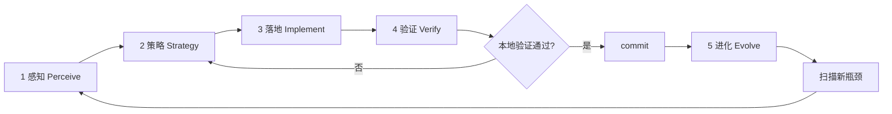

# AGENTS.MD — TrustClaw PTDS

TrustClaw 开发指南：**在 OpenClaw 基础上构建 PTDS Runtime**，最大化继承 Gateway / 频道 / 多平台 / Provider 能力。

## Read order

1. `trustclaw/PLAN.md` — 产品阶段与任务矩阵  
2. `trustclaw/DECISIONS.md` — **逐条审核**；`pending` 项不得实现  
3. `trustclaw/OPENCLAW_REUSE.md` — Inherit / Extend / Build 映射  
4. `trustclaw/PRODUCT_SPEC.md` — 冻结 API 与 JSON 合约  
5. `trustclaw/ROADMAP.md` — 5 天 Sprint  
6. Root `AGENTS.md` — 构建、测试、Git 政策  

规格书原文：`trustclaw/docs/SPEC-V1-source.md`

---

## Product snapshot

**TrustClaw** = Personal Trusted Data Space Runtime (PTDS Runtime).

- 不是 GLP-1 单应用；GLP-1 是首个 **Business Agent** 演示  
- 四大原则：不出域 · 必有据 · 必审计 · Agent 解耦  
- V1 冻结闭环：`Init → Chat → Text2SQL → Rules → GLP-1 → Audit → Ledger → Dashboard`

---

## OpenClaw-first rule

**Default:** reuse OpenClaw; build only PTDS gaps.

| Do | Don't |
| --- | --- |
| Plugin HTTP routes for `/api/ptds/*`, `/api/agent/*` | Standalone Express gateway |
| `src/llm/` for Text2SQL + GLP-1 LLM | Hardcoded fetch to one vendor |
| `node:sqlite` + `src/infra/kysely-sync.ts` patterns | Cloud DB or parallel JSON state stores |
| Enable plugin via `openclaw gateway run` | Fork Gateway core in `src/` |
| Phase 2: inherit channels in `extensions/*` | Rebuild Telegram/WhatsApp adapters |

Full map: `OPENCLAW_REUSE.md`.

---

## Human approval gates（逐条审核）

Before **Development** on any task:

1. Open `DECISIONS.md` — all items for the task must be `approved` or `deferred` (**done 2026-07-04**).  
2. Schema/API changes still need spec diff review if they diverge from approved decisions.  
3. Record any new decisions in `DECISIONS.md`.

---

## TrustClaw 无限优化闭环（Infinite Optimization Loop）

本仓库 V1 交付**没有「做完就停」**。每一轮闭环的目标：**感知现状 → 选定 ROADMAP 瓶颈 → 最小落地 → 用证据验证 → 写回文档与契约 → commit → 进入下一轮**。

Cloud Agent 与人类协作者都应把本文件当作活文档；每轮验证通过后更新「当前轮次笔记」或 **Gotchas**。

**不要**为此闭环新增独立编排脚本（例如一键跑完全部阶段的 orchestrator），除非用户明确要求。闭环由 Agent 按层执行现有测试与 Gateway 路径，并把经验沉淀进文档。

### 核心原则

| 原则 | 含义 |
| --- | --- |
| **先测后改** | 没有基准与正确性证据，不改握手 JSON、SELECT 守卫、规则矩阵语义 |
| **OpenClaw-first** | 优先插件 HTTP、`src/llm/`、Kysely/SQLite 模式；不在 `src/`  fork Gateway |
| **瓶颈驱动** | 优先修「契约缺口 / 静默错误 / 握手字段缺失 / DoD 未闭合」类问题，再追求 UI  polish |
| **最小改动** | 每轮只解决本轮策略选定的 **1 个 ROADMAP 任务**（或其中 1～2 个阻塞子项） |
| **验证通过再沉淀** | 相关 `*.test.ts` 绿 + 任务验收标准满足后，再更新 `PRODUCT_SPEC.md`、本文件、必要时 `DECISIONS.md` |
| **产品契约优先** | 数据走 PTDS v1.1 + 冻结 API；规则走 SQLite 种子；**禁止** TS 硬编码 GLP-1 规则（D14） |
| **执行前价值闸门** | 进入「策略 → 落地」前，对照 V1 冻结闭环判断是否值得做（见下节） |

### 执行前闸门：V1 框架目标与改动价值（每轮必做）

**在勾选检查清单第 2 步「策略」、写代码之前**，Agent 必须先完成本闸门；若结论为「价值不足」，改选 backlog 中更高优先级项，**不得**为凑 Loop 做低价值改动。

#### TrustClaw V1 分层目标（对齐 OpenClaw 复用边界）

| 层级 | OpenClaw 参考 | TrustClaw V1 对应 | 典型路径 |
| --- | --- | --- | --- |
| **P0 数据契约** | `src/state/` + Kysely/SQLite | PTDS v1.1 schema、init 映射、SELECT 守卫、`v_glp1_nrdl_check_snapshot` | `trustclaw/ptds/` |
| **P1 运行时管线** | `src/llm/` + agent runner 模式 | Text2SQL → Query → RuleEval → GLP-1；握手 JSON 1/2/3 | `trustclaw/runtime/`、`trustclaw/agents/glp1/` |
| **P2 可审计交付** | diagnostic-events 形状参考 | 每 Chat ≥5 步审计 + SHA-256 证据链 | `trustclaw/audit/`、`trustclaw/ledger/` |
| **P3 平台融合** | `extensions/*` + Gateway HTTP | `extensions/trustclaw-ptds` 路由；Phase 2+ 频道/Control UI | 插件层，不侵入 core |

**借鉴要点（非照搬 OpenClaw 全栈）：**

- **数据下沉、规则上浮**：个人指标与 NRDL 规则在 SQLite；TS 只做确定性匹配与 SELECT 守卫，不用 LLM 判规则（D6）。
- **同契约评判**：只在 `PRODUCT_SPEC.md` 冻结形状上验收；不引入 spec 外 API 字段或「临时 shortcut」。
- **安全先于体验**：`read_only_verification === false` 或非法 SQL → 阻断 + `SECURITY_BREACH_ATTEMPT`（未来 Task 301）。
- **正确性先于演示**：握手 1/2/3 字段齐全、规则矩阵可复现，再谈 Chat UI 动效。

#### 四轮自问（策略卡片必填）

在 PR 描述或本轮笔记中**用 1～2 句话**回答：

1. **层级**：本轮改的是 P0 数据 / P1 管线 / P2 审计账本 / P3 平台？若仅为 UI 样式而 P1 握手仍缺 → **降级或拒绝**。
2. **路径**：是否落在当前 ROADMAP 任务 ID 与依赖图内？`DECISIONS.md` 是否有 `pending` 阻塞项？
3. **收益**：预期收益类型 — 契约闭合、安全守卫、规则正确性、端到端 Chat，还是 Reset/DoD？
4. **机会成本**：同一轮是否还有更高优先级 backlog（失败测试、未实现的 `POST /api/agent/chat`、审计步数不足）？

### 五层结构



---

#### 第 1 层：感知（Perceive）— 我们在哪？

**目标**：弄清当前 ROADMAP 任务完成度、契约覆盖、测试红项，以及 V1 闭环（Init → Chat → … → Dashboard）在哪一段断裂。

**典型动作**：

- 读契约：`PRODUCT_SPEC.md`、`DECISIONS.md`、`ROADMAP.md` 当前任务验收标准  
- 读复用映射：`OPENCLAW_REUSE.md` 对应行的 Inherit / Extend / Build  
- 跑 TrustClaw 单元测试（按已落地模块）：

```bash
node scripts/run-vitest.mjs trustclaw/ptds/init.test.ts
node scripts/run-vitest.mjs trustclaw/runtime/text2sql/generate.test.ts
node scripts/run-vitest.mjs trustclaw/runtime/rules/evaluate.test.ts
```

- 对照 Owner map（下文）与任务状态：`101`/`102`/`201`/`202`/`203`/…  
- 若插件已接线：手动或集成测 `POST /api/ptds/init`、`POST /api/ptds/reset`（Task 102+）

**产出**：简短「现状快照」— 失败测试列表、未实现 API、握手字段缺口、DoD §6 未勾选项。

---

#### 第 2 层：策略（Strategy）— 下一步改什么？

**目标**：根据感知结果排序，选定**单一** ROADMAP 主攻任务（例如：闭合 Task 203 的 `POST /api/agent/chat` 骨架）。

**前置条件**：已完成上文 [执行前闸门](#执行前闸门v1-框架目标与改动价值每轮必做) 的四轮自问；策略卡片须写明「层级 + 收益类型 + 为何优于 backlog 其他项」。

**决策参考**：

| 信号 | 优先策略 |
| --- | --- |
| `*.test.ts` 失败 / 类型错误 | 修回归；不叠加新功能 |
| 握手 JSON 缺字段或与 `PRODUCT_SPEC.md` 不一致 | 先对齐 types + zod，再写 UI |
| Text2SQL 非 SELECT / 表不在 allowlist | 修 `query.ts` 守卫与 audit 钩子（301 前可先 unit 断言） |
| 规则矩阵与 SQLite 种子不一致 | 修 `evaluate.ts` + 种子 SQL；禁止 TS 硬编码规则 |
| Chat API 未通但 UI 已写 | **拒绝**先 polish UI；先 Task 203 管线 |
|  scope  creep（频道、多 Agent、Control UI 合并） | **拒绝**；D5/D15 为 deferred |

**产出**：本轮「策略卡片」— 1 句话目标、ROADMAP ID、触及文件、预期验证命令（写入 PR / handoff 即可）。

---

#### 第 3 层：落地（Implement）— 最小正确实现

**目标**：按策略做**最小**代码改动，遵循仓库既有风格与 OpenClaw-first 规则。

**常见落地点**（按 V1 历史）：

| 任务 | 路径 |
| --- | --- |
| PTDS 存储 / init | `trustclaw/ptds/` |
| 插件 HTTP | `extensions/trustclaw-ptds/` |
| Text2SQL | `trustclaw/runtime/text2sql/` + `trustclaw/agents/glp1/prompts/text2sql.v1.md` |
| 规则引擎 | `trustclaw/runtime/rules/` |
| 管线 / Chat API | `trustclaw/runtime/pipeline/`（Task 203） |
| 审计 / 账本 | `trustclaw/audit/`、`trustclaw/ledger/` |
| V1 SPA | `trustclaw/ui/`（Task 501+） |

**禁止**：

- 新建 `trustclaw_optimization_loop.py` 类编排器  
- 在 prod TS 中硬编码 GLP-1 规则或 `demo_user` 类字段（用 `PTDS_LOCAL_USER_ID` 等产品常量）  
- 无决策记录地偏离 `PRODUCT_SPEC.md` API 形状  

**Design ↔ Implement 衔接**（原 TDD 四阶段保留）：

| 阶段 | 要点 | 闸门 |
| --- | --- | --- |
| Design | spec 节 + `DECISIONS` + `OPENCLAW_REUSE` 行；测试计划 bullets | schema/API 变更需人审 |
| Implement | 上表路径；代码英文；UI 文案 zh-CN | 符合 `PRODUCT_SPEC.md` |
| Test | colocated `*.test.ts` | 见第 4 层 |
| Verify | DoD + ROADMAP 验收 | 见第 4 层 |

---

#### 第 4 层：验证（Verify）— 证据链

**目标**：正确性先于演示；安全守卫先于 Chat 体验。

**按 ROADMAP 任务的最小验证集**：

| 任务 | 最小命令 / 断言 |
| --- | --- |
| **101–102** PTDS + init API | `pnpm test trustclaw/ptds/init.test.ts`；init 写入 v1.1 表 + snapshot 可读 |
| **201** Text2SQL | `pnpm test trustclaw/runtime/text2sql/generate.test.ts`；仅 SELECT；allowlist 表 |
| **202** Rule engine | `pnpm test trustclaw/runtime/rules/evaluate.test.ts`；PASS/FAIL 矩阵 vs 种子规则 |
| **203** Chat API | 上述 + pipeline 集成测；一次 chat 产出 Runtime Context 骨架 |
| **301** Audit | 每 chat ≥5 条；component 名与下表一致 |
| **401** Ledger | 连续 receipt 的 `previous_evidence_hash` 可校验 |
| **501–503** UI + 联调 | Chrome 五区块 + Reset；`PLAN.md` §6 DoD 全勾 |

**合并闸门（Merge / handoff gate）**：本节最小验证集在本机**全部通过**后，Agent 才可 commit、开 PR 或进入下一轮。**每次重要开发验证通过后必须 commit**（用户约定；见第 5 层）。

```bash
# 示例：Task 201–202 闭合后的本地证明
node scripts/run-vitest.mjs trustclaw/ptds/init.test.ts
node scripts/run-vitest.mjs trustclaw/runtime/text2sql/generate.test.ts
node scripts/run-vitest.mjs trustclaw/runtime/rules/evaluate.test.ts
```

---

#### 第 5 层：进化（Evolve）— 写回知识，开启下一轮

**目标**：把本轮结论变成下一 Agent 的默认上下文；**commit 后再扫描 backlog**。

**必须更新的位置（按影响面）**：

1. **`trustclaw/AGENTS.md`** — 「当前轮次笔记」或 **Gotchas**  
2. **`ROADMAP.md` / `PLAN.md`** — 任务状态、验收勾选项  
3. **`PRODUCT_SPEC.md`** — 仅当冻结 API/握手有 intentional 变更（需决策记录）  
4. **`DECISIONS.md`** — 新决策项；不得静默改 approved 方案  
5. **Colocated tests** — 新契约行为须有 `*.test.ts`  

**Commit 约定**：

- 验证通过后：`scripts/committer "<conventional msg>" <files…>` 或等效 `git commit`  
- 消息含 ROADMAP 任务 ID 与行为摘要（非仅「fix」）  
- 不 commit 未验证的 WIP，除非用户明确要求  

**本轮结束时在 commit / PR 中写清**：

- 感知到的瓶颈 → 策略选择 → 改动摘要 → 验证命令与结果 → **下一轮建议**（回到第 1 层）

---

### V1 闭环烟雾清单（Loop manifest）

权威任务顺序见 `ROADMAP.md` 依赖图。下表为 Agent 每轮 **Verify** 或合并后 **Perceive** 用的产品路径（**不**替代单元测试）。

| id | 路径 / 命令 | 层级 | 说明 |
| --- | --- | --- | --- |
| `ptds_init` | `POST /api/ptds/init` | 感知 / 验证 | init 映射 v1.1 表；非 demo 字段 |
| `ptds_reset` | `POST /api/ptds/reset` | 验证 | 清空个人 PTDS 行（Task 503） |
| `ptds_query_guard` | `trustclaw/ptds/query.ts` SELECT 守卫 | 验证 | 非 SELECT → 拒绝 |
| `text2sql_handshake` | Text2SQL → PTDS 握手 1 | 验证 | `sanitized_sql` + `read_only_verification` |
| `rule_eval_handshake` | PTDS → RuleEval 握手 2 | 验证 | `biometric_snapshot` + `active_ruleset` |
| `glp1_handshake` | RuleEval → GLP-1 握手 3 | 验证 | `evaluation_matrix` + `evidence_hash_chain` |
| `agent_chat` | `POST /api/agent/chat` | 验证 | Task 203 端到端 |
| `audit_five_steps` | 每 Chat 5 审计步 | 验证 | Task 301 + DoD |
| `ledger_chain` | Evidence SHA-256 链 | 验证 | Task 401 |
| `ui_five_panels` | Chrome 五区块 | 进化 | Task 501–503 |
| `dod_reset_demo` | Reset + 完整演示 2 遍 | 进化 | `PLAN.md` §6 |

**禁止**：把 V2/V3 项（频道桥接、多 Agent 路由、Control UI 合并）标为 V1 Loop 必跑项（D5/D15 deferred）。

---

### Cloud Agent 单轮检查清单

复制此清单执行一轮；完成后勾选并更新「进化」项。

```
[ ] 0. 闸门：完成「V1 框架目标与改动价值」四轮自问
[ ] 1. 感知：读 SPEC/DECISIONS/ROADMAP；跑相关 trustclaw/*.test.ts；记录失败与缺口
[ ] 2. 策略：只选 1 个 ROADMAP 主攻任务；对照 P0→P3 分层与 OpenClaw-first
[ ] 3. 落地：最小 patch；代码在 trustclaw/** 与 extensions/trustclaw-ptds/**；无 orchestrator 新脚本
[ ] 4. 验证：任务最小验证集全绿；不引入无关 openclaw core 改动
[ ] 5. commit：验证通过后提交；消息含任务 ID
[ ] 6. 进化：更新本文件「当前轮次笔记」+ ROADMAP/PLAN 状态；必要时 DECISIONS
[ ] 7. 扫描 backlog：下一 ROADMAP 任务或 DoD 未闭合项
[ ] 8. 下一轮：从 main/当前分支继续 Loop R{n+1}，直至用户喊停或 V1 DoD 全绿
```

**连续迭代终止条件**：用户明确停止；本地验证无法通过且已合理修复仍失败；本轮仅为纯文档且用户未要求继续代码 Loop。

---

### 现有工具索引（按层）

| 层 | 工具 / 路径 |
| --- | --- |
| 感知 | `PRODUCT_SPEC.md`、`DECISIONS.md`、`ROADMAP.md`、`OPENCLAW_REUSE.md` |
| 策略 | `PLAN.md` §3 任务矩阵、`DECISIONS.md` deferred 边界 |
| 落地 | `trustclaw/**`、`extensions/trustclaw-ptds/**`、`src/llm/`（Extend） |
| 验证 | `node scripts/run-vitest.mjs trustclaw/...`、`PLAN.md` §6 DoD |
| 进化 | **本文件**、`ROADMAP.md`、`PLAN.md`、colocated `*.test.ts` |

---

### 当前轮次笔记（由 Agent 持续追加）

> **维护说明**：每完成一轮验证 + commit，在此追加 3～5 行：日期、ROADMAP ID、瓶颈、验证命令、下一轮建议。不要删除历史条目。

- **基线（2026-07-04）**：`DECISIONS.md` D1–D14 approved；V1 冻结 Init → Chat → … → Dashboard；OpenClaw 底座 + `extensions/trustclaw-ptds`（D2）。
- **Loop R1（2026-07-04，Task 101–102）**：PTDS v1.1 schema、init/reset、`PTDS_LOCAL_USER_ID`、插件 HTTP 路由；移除 `demo_user` / fallback Text2SQL 等产品外 shortcut。验证：`pnpm test trustclaw/ptds/init.test.ts`。
- **Loop R2（2026-07-04，Task 201–202）**：LLM Text2SQL + SELECT 守卫握手；确定性 `evaluateGlp1Rules` vs `nrdl_payment_rules` + snapshot。验证：`generate.test.ts` + `evaluate.test.ts`。
- **Loop R3（2026-07-04，Task 203）**：`runTrustclawChat` + `POST /api/agent/chat` → Runtime Context。验证：`run-chat.test.ts` + plugin chat test。
- **Loop R4（2026-07-04，Task 301）**：`AuditRecorder` 五步 JSONL（`state/ptds-audit/events.jsonl`）；chat 路径每轮 ≥5 条。验证：`run-chat.test.ts`（5 events + trail id）。
- **下一轮建议（R5）**：Task **401** evidence ledger 真链；Task **501** UI 骨架。

---

### Gotchas

- **Vitest 路径**：默认 `pnpm test trustclaw/...` 可能被 `vitest.unit.config.ts` exclude，**找不到测试文件**。窄范围证明用：
  ```bash
  node scripts/run-vitest.mjs trustclaw/<path>.test.ts
  # 或
  ./node_modules/vitest/vitest.mjs run trustclaw/ptds/init.test.ts
  ```
  全量 OpenClaw 测试过重，勿作为每轮默认。
- **无 orchestrator**：不要新增「一键跑完 V1」脚本；按上表清单手工串联。
- **术语**：产品逻辑用「本地用户 / 个人 PTDS 数据 / 种子规则」；避免 `demo_*` 字段名进入 API 或持久化层。
- **Commit 时机**：重要验证通过后即 commit；避免大批未验证变更堆在同一 diff。

---

## Owner map

| Module | Path | Tasks | OpenClaw seam |
| --- | --- | --- | --- |
| PTDS store | `trustclaw/ptds/` | 101 ✓, 102 ✓ | kysely-sync pattern |
| Plugin API | `extensions/trustclaw-ptds/` | 102 ✓, 203, reset | plugins-http |
| Text2SQL | `trustclaw/runtime/text2sql/` | 201 | `src/llm/` |
| Rule engine | `trustclaw/runtime/rules/` | 202 | — |
| Pipeline | `trustclaw/runtime/pipeline/` | 203 ✓ | runner patterns |
| GLP-1 prompts | `trustclaw/agents/glp1/` | 203 | skills-like prompts |
| Audit | `trustclaw/audit/` | 301 ✓ | diagnostic-events |
| Ledger | `trustclaw/ledger/` | 401 | — |
| Demo UI | `trustclaw/ui/` | 501–503 | Phase 2: `ui/` |

---

## Schema v1.1（D1 approved）

- DDL: `trustclaw/ptds/schema/v1.1.sql`  
- Template DB: `trustclaw/ptds/seeds/local_ptds.template.db`  
- NRDL GLP-1 seed rules: `trustclaw/ptds/seeds/nrdl-glp1-seed.sql`  
- Init: `trustclaw/ptds/init.ts` — maps frozen `POST /api/ptds/init` → v1.1 tables  
- Query guard: `trustclaw/ptds/query.ts`  
- Decision view: `v_glp1_nrdl_check_snapshot`  

**Do not** add spec-book `user_biometrics` / `glp1_clinical_rules` tables.

### Init API → v1.1 mapping

| Request field | Target |
| --- | --- |
| `weight`, `height` | `body_anthropometrics` |
| `hba1c` | `lab_test_results` (`HbA1c`) |
| `thyroid_cancer_history` | `clinical_diagnoses` `C73` |
| `pancreatitis_history` | `clinical_diagnoses` `K85` |
| `include_t2dm_diagnosis` | `clinical_diagnoses` `E11` (D11 pending) |

---

## Frozen handshake contracts

Typed interfaces + zod at runtime.

1. **Text2SQL → PTDS:** `sanitized_sql`, `read_only_verification`, `allowed_tables`  
2. **PTDS → Rule Eval:** `biometric_snapshot`, `active_ruleset`  
3. **Rule Eval → GLP-1:** `evaluation_matrix`, `original_query`, `evidence_hash_chain`  

`read_only_verification === false` → block + `SECURITY_BREACH_ATTEMPT`.

---

## Audit steps（每 Chat 至少 5 条）

| Step | `component` |
| --- | --- |
| Text2SQL | `AgentRuntime.Text2SQL` |
| DB query | `PTDS.Query` |
| Rule eval | `AgentRuntime.ExecRule` |
| GLP-1 decision | `Agent.GLP1Decision` |
| Ledger | `EvidenceLedger.Commit` |

Missing step = DoD fail.

---

## Agent prompts policy

- Paths: `trustclaw/agents/glp1/prompts/` (`text2sql.v1.md`, `decision.v1.md`)  
- GLP-1 output: `[Evidence #N]` citations only from input JSON  
- Missing vitals → spec Chinese fallback (see `PRODUCT_SPEC.md`)  
- Rule Eval (D6): prefer **deterministic matcher**, not LLM

---

## Platform inheritance（Phase 2+）

TrustClaw **does not** replace:

- `apps/*` companion apps  
- `extensions/telegram`, `whatsapp`, `discord`, …  
- `openclaw onboard` / gateway daemon  
- Provider auth in `~/.openclaw/agents/*/agent/auth-profiles.json`

TrustClaw **adds**:

- Local PTDS SQLite (`state/local_ptds.db`)  
- Audited GLP-1 pipeline with evidence chain  
- Future: same pipeline invoked from channel inbound → reply with citations

---

## Commands

```bash
pnpm install
pnpm openclaw gateway run          # + trustclaw-ptds plugin
node scripts/run-vitest.mjs trustclaw/ptds/init.test.ts
# Target: pnpm trustclaw:dev       # gateway + UI (Task 503)
```

---

## PR checklist

- [ ] ROADMAP task ID + Loop R{n} 策略卡片（四轮自问）  
- [ ] 闭环层：感知 / 策略 / 落地 / 验证 / 进化 已声明  
- [ ] `DECISIONS.md` IDs listed；无 unauthorized `pending` 阻塞  
- [ ] OpenClaw reuse noted (Inherit/Extend/Build)  
- [ ] 任务最小验证集已跑并记录命令  
- [ ] 验证通过后已 **commit**（重要轮次）  
- [ ] No scope outside V1 freeze（D5/D15 deferred）  
- [ ] `PLAN.md` §6 DoD considered

---

## Phase routing

| Phase | Scope |
| --- | --- |
| **V1** | Demo loop, plugin API, standalone SPA |
| **V2** | Control UI merge, channel bridge, CLI alias |
| **V3** | Multi-agent coordinator (Insurance, Medication…) |

Do not implement V2/V3 paths during V1 unless `DECISIONS.md` explicitly approves.
