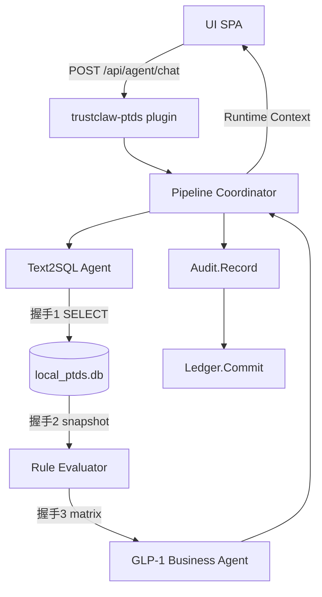

# TrustClaw 产品开发规划

> **Supporting context only.** TrustClaw 产品 Loop 的唯一驱动协议是 [`AGENTS.md`](./AGENTS.md)（Product loop authority + 无限优化闭环）。本文件提供阶段背景与历史任务矩阵；**不得**用本文件替代 `AGENTS.md` 启动 Loop。

基于 PTDS v1.1 数据模型 + OpenClaw fork 最大化复用策略。

**审核门禁：** `DECISIONS.md` 已于 2026-07-04 全部确认（D5/D15 为 deferred）。

---

## 1. 产品目标（来自规格书）

| 原则             | 交付含义                                         |
| ---------------- | ------------------------------------------------ |
| 个人数据不出域   | PTDS 仅本地 SQLite；Agent 仅 SELECT + 脱敏结果   |
| 凡答必有据       | Runtime Context 含 `citations` + Evidence 哈希链 |
| 凡行必审计       | 5 步审计事件 + UI 时间轴                         |
| Agent 与平台解耦 | GLP-1 为首个 Business Agent；Runtime 通用        |

**V1 演示闭环（冻结）：**  
Init → Chat → Text2SQL → Query → RuleEval → GLP-1 Decision → Audit → Ledger → Dashboard

---

## 2. 阶段规划

### Phase V1 — 5 天 Demo（当前）

| 天  | 目标               | 任务                | OpenClaw 复用      |
| --- | ------------------ | ------------------- | ------------------ |
| D1  | PTDS 可挂载        | 101✓, 102, 501 骨架 | Kysely/SQLite 模式 |
| D2  | 管线核心           | 201, 202, 203 骨架  | `src/llm/`         |
| D3  | Chat 端到端        | 203, 301, 501 对话  | Plugin HTTP        |
| D4  | 审计 + 存证 UI     | 401, 502            | 无                 |
| D5  | 联调 + Reset + DoD | 503, reset API      | Gateway 单进程启动 |

**V1 不做：** 频道集成、CLI 改名、多 Agent 路由、Control UI 合并。

### Phase V2 — 平台融合（Post-Demo）

- `trustclaw/ui` 面板迁入 Control UI（继承 `app-gateway.ts`）
- GLP-1 Pipeline 作为 **Plugin Tool** 或 **专用 agent profile**
- 审计/账本只读视图进入 Operator UI
- `trustclaw` CLI alias（可选）

### Phase V3 — 多 Agent + 全渠道（示意，冻结）

- Pipeline Coordinator 意图路由（Insurance、Medication…）
- 同一 PTDS 上挂载多规则表
- 经 Telegram/WhatsApp 等 **继承频道** 返回带 Evidence 的回复

---

## 3. 任务矩阵（对齐规格书 Sprint Backlog）

| ID      | 规格子功能                  | 负责人 | 依赖            | 验收标准                         | 状态                                                              |
| ------- | --------------------------- | ------ | --------------- | -------------------------------- | ----------------------------------------------------------------- |
| **101** | PTDS.Init + Dataset.Load    | Dev A  | —               | `.db` 含 v1.1 schema + NRDL 种子 | **done**                                                          |
| **102** | POST /api/ptds/init         | Dev A  | 101, D2         | 映射写入 v1.1 表，返回 spec JSON | pending                                                           |
| **201** | Runtime.Text2SQL            | Dev B  | D7              | NL→纯 SELECT，无 markdown        | pending                                                           |
| **202** | Runtime.ExecRule            | Dev B  | 101, D6         | PASS/FAIL 矩阵 JSON              | pending                                                           |
| **203** | Runtime.Dispatch + chat API | Dev B  | 102,201,202, D4 | 完整 Runtime Context             | **done**                                                          |
| **301** | Audit.Record                | Dev C  | 203, D8         | 每 Chat ≥5 条审计事件            | **done**                                                          |
| **401** | Ledger.Commit               | Dev C  | 301, D9         | SHA-256 链可校验                 | pending                                                           |
| **501** | UI.RenderAll（表单+Chat）   | Dev D  | D3              | Chrome 五区块布局                | pending                                                           |
| **502** | Audit + Ledger 面板         | Dev D  | 501             | 树状审计 + 凭证卡片              | pending                                                           |
| **503** | 联调                        | Dev D  | 203,301,401,502 | 完整演示 2 遍 + Reset            | **△ automated** (`dod-reset-demo.test.ts`); manual Chrome pending |

详细日程见 `ROADMAP.md`。

---

## 4. UI 五区块（规格书 Page Specification）

| 区块 | 规格名称              | V1 实现要点                           | 默认数据表（D12 待确认）                                                                       |
| ---- | --------------------- | ------------------------------------- | ---------------------------------------------------------------------------------------------- |
| A    | Landing & PTDS Init   | 体重/身高/HbA1c/禁忌症表单 + 挂载按钮 | —                                                                                              |
| B    | PTDS Data Browser     | 表名下拉 + 只读表格                   | `body_anthropometrics`, `lab_test_results`, `nrdl_payment_rules`, `v_glp1_nrdl_check_snapshot` |
| C    | Trustworthy Chat      | 对话 + `[Evidence #N]` hover          | Runtime Context                                                                                |
| D    | Runtime Audit Panel   | 树状时间轴 + 步骤卡片                 | `pipeline_stages` + audit JSONL                                                                |
| E    | Evidence Ledger Panel | 凭证流 + 哈希链 + Verified 徽标       | evidence JSON                                                                                  |

---

## 5. Agent 管线（规格书 + 握手协议）

握手 JSON 合约见 `trustclaw/runtime/pipeline/types.ts` 与各 stage handshake types。

---

## 6. DoD 检查表（Definition of Done）

> **Canonical copy:** [`AGENTS.md` — V1 DoD 闸门](./AGENTS.md#v1-dod-闸门verification-必勾). Loop Verify/Evolve 以该节为准。

开发 Agent 在 **Verification** 阶段必须逐项勾选：

- [ ] **Runnable** — `openclaw gateway run` + trustclaw 插件；仅本地 SQLite
- [ ] **Demo Ready** — Chrome 稳定；Reset 清空 PTDS + audit + ledger
- [ ] **Auditable** — TEXT2SQL / QUERY / RULE / DECISION / LEDGER 五步 UI 可见
- [ ] **Evidence Generated** — 每次 Chat 产生带 `previous_evidence_hash` 的 receipt
- [ ] **No Blocking** — 无非规格功能引入；无阻断 Bug

---

## 7. 决策状态（2026-07-04）

**已全部确认。** 详见 `DECISIONS.md`。V1 开发可按 ROADMAP 推进；D5（频道）、D15（多 Agent）延至 Phase 2/3。

---

## 8. 文档索引

| 文档                | 用途                                   |
| ------------------- | -------------------------------------- |
| `DECISIONS.md`      | 待确认决策                             |
| `OPENCLAW_REUSE.md` | OpenClaw 复用映射                      |
| `ROADMAP.md`        | 5 天排期                               |
| `AGENTS.md`         | Agent Loop 开发协议 + **无限优化闭环** |
