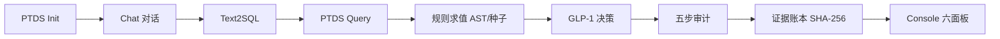
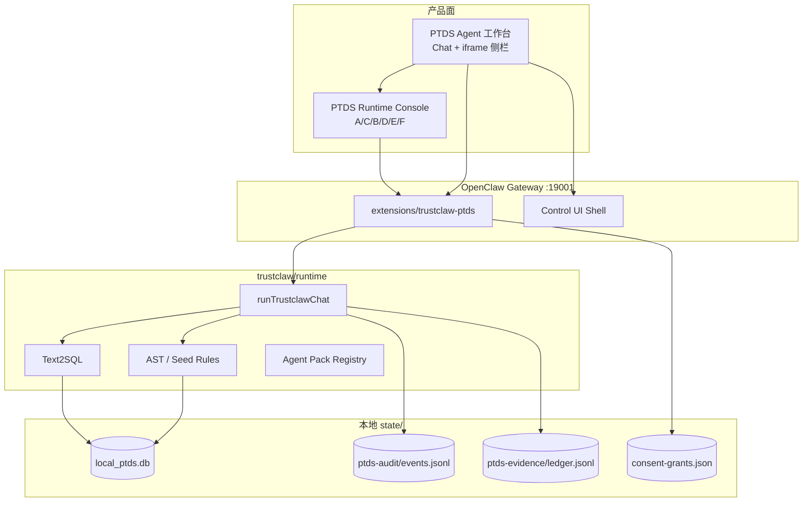

# TrustClaw 产品功能文档

> **版本基线**：V1 冻结闭环（2026-07-05，Loop R1–R26）  
> **定位**：Personal Trusted Data Space Runtime（PTDS Runtime）  
> **技术底座**：OpenClaw Gateway + `trustclaw-ptds` 插件

本文档从近期开发实装梳理产品功能全貌。产品 Loop 执行协议仍以 [`AGENTS.md`](./AGENTS.md) 为唯一权威；本地启动见 [`GETTING_STARTED.md`](./GETTING_STARTED.md)。

---

## 1. 产品定位

TrustClaw 不是单一的 GLP-1 问答应用，而是**个人可信数据空间运行时**——在本地 SQLite 中托管个人健康数据、合规标准与 AI Agent，在**全链路审计**约束下完成可验证的业务决策。

| 维度 | 说明 |
| --- | --- |
| **是什么** | 本地 PTDS Runtime + 领域 Agent 平台 |
| **首个演示** | GLP-1 用药与 NRDL 医保 eligibility（C3-PO 人设） |
| **未来扩展** | 报销咨询、合规审计、设备导入等多领域 Agent，无需重写核心基础设施 |
| **与 OpenClaw 关系** | 继承 Gateway、Control UI、频道/Provider 能力；PTDS 专属能力以插件 + `trustclaw/**` 扩展 |

### 四大产品原则

1. **不出域** — 个人原始数据留在本地 `state/local_ptds.db`，不外发
2. **必有据** — 结论仅来自 SQLite 规则/AST + 握手 JSON，输出 `[Evidence #N]` 引用
3. **必审计** — 每次数据访问、标准导入、Chat 管线步骤写入 JSONL 审计链
4. **Agent 解耦** — Runtime 提供隔离、工具、审计、账本；业务逻辑在上层 Agent Pack

### 四层能力栈（产品北极星）

```text
L4 Loop 自动化循环  ⊃  L3 Harness 安全管控  ⊃  L2 Context 上下文  ⊃  L1 Prompt 提示词
```

| 层级 | 工程 | TrustClaw 落点 |
| --- | --- | --- |
| L1 | Prompt | C3-PO 人设、`starterQuestions`、Text2SQL prompt |
| L2 | Context | PTDS SQLite、NRDL 标准包、Panel B 血缘、Agent Pack `skills` |
| L3 | Harness | Consent 闸门、Panel C 赋权、五步审计、证据账本、fail-closed |
| L4 | Loop | 无限优化闭环、session-pack coordinator、`pnpm trustclaw:smoke` |

---

## 2. 产品双表面

TrustClaw 刻意拆成两个产品面，职责分离：

| 表面 | 访问地址（dev） | 职责 | 面板 |
| --- | --- | --- | --- |
| **PTDS Runtime Console** | `:5174/trustclaw/`（热更）或 `:19001/trustclaw/` | 运维/审计看板，**不含 Chat** | A · Init，C · 领域赋权，B · 数据浏览，D · 运行时审计，E · 证据账本，F · 合规订阅 |
| **PTDS Agent 工作台** | `:19001/` → Control UI **PTDS Console** 标签 | Agent 交互：中心原生 Chat + 左右 iframe 侧栏 | 中心 Chat；侧栏复用 A/C/B 与 D/E/F |

**设计要点**

- `main` workspace = 纯 OpenClaw（官方模板），**不**默认注入 C3-PO
- GLP-1 / C3-PO 仅在会话**显式选择领域 Agent Pack** 时激活
- 侧栏通过 `?embed=left|right` 嵌入，主题/语言与 Control UI 同步

---

## 3. V1 冻结业务闭环



**握手契约（冻结）**

1. Text2SQL → PTDS：`sanitized_sql`、`read_only_verification`、`allowed_tables`
2. PTDS → RuleEval：`biometric_snapshot`、`active_ruleset`
3. RuleEval → GLP-1：`evaluation_matrix`、`original_query`、`evidence_hash_chain`

---

## 4. 功能模块

### 4.1 个人数据空间（PTDS · P0）

**存储**：`state/local_ptds.db`（SQLite v1.1 schema）

| 功能 | 说明 | API / 入口 |
| --- | --- | --- |
| **数据初始化** | 患者档案映射到 v1.1 表（profile、体征、化验、诊断、用药史、处方上下文） | `POST /api/ptds/init` |
| **数据重置** | 清空个人 PTDS 行 + audit + ledger（合规标准保留） | `POST /api/ptds/reset` |
| **只读查询** | SELECT-only + 表 allowlist 守卫 | `trustclaw_ptds_query` 工具 |
| **同意闸门** | 读取私人字段前 `requireApproval`；deny → BLOCKED | `before_tool_call` hook |
| **个人数据写入** | consent-gated 写入（设备导入、随访记录等） | `trustclaw_ptds_write` 工具 |
| **决策快照视图** | `v_glp1_nrdl_check_snapshot` 聚合 eligibility 所需字段 | 规则引擎读路径 |

**Panel A · Init**：全量 camelCase 表单，含处方上下文字段（D20）。

---

### 4.2 合规标准与订阅（P0/P2）

**数据分类 B · 外部合规标准**

| 功能 | 说明 | API |
| --- | --- | --- |
| **标准预览** | zod 校验 NRDL AST handshake JSON，不写 DB | `POST /api/ptds/compliance/preview` |
| **标准导入** | 须 `consentGranted=true` + `sessionId`；同时仅一条 `is_active=1` | `POST /api/ptds/compliance/import` |
| **内置 GLP-1 v2** | 种子包 `glp1-nrdl-ast-handshake-v2.json` | `POST /api/ptds/compliance/import/bundled-glp1-v2` |
| **参考数据同步** | NRDL import 后产生 `REFERENCE_SYNC` 血缘边 | Panel B「已同步」徽标 |
| **设备数据导入** | 可穿戴/设备指标 consent-gated 写入 | `device-import` 模块 |

**Panel F · 合规订阅**：预览 → 勾选同意 → 导入；展示 `publisher_signature` 元数据。

---

### 4.3 领域 Agent 平台（P3）

**Agent Pack 机制**：声明式 `agent.pack.json`，会话级 pack 绑定。

| Pack ID | 显示名 | 领域 |
| --- | --- | --- |
| `glp1-eligibility` | GLP-1 用药与医保 eligibility | 内分泌 / 体重管理 / NRDL |
| `nrdl-reimburse` | NRDL 医保报销咨询 | 报销咨询 |
| `compliance-auditor` | PTDS 合规审计员 | 合规审计 |

**核心能力**

| 功能 | 说明 |
| --- | --- |
| **会话 pack 选择** | Chat 侧栏合并 Agent 选择器；无 pack → `agent_pack_unbound`（403） |
| **Panel C 领域赋权** | `GET/PUT /api/ptds/agent-grants`；按 pack 隔离 consent |
| **最小使用域** | `domain-minimum-use`：pack 仅能访问声明的表/面板 |
| **Starter Questions** | 各 pack 预置中英文开场问题 |
| **C3-PO 人设** | 仅 GLP-1 pack 会话经 `before_prompt_build` 注入 |

---

### 4.4 运行时管线（P1）

**Chat 管线**：`runTrustclawChat` → `POST /api/agent/chat`

| 阶段 | 组件 | 职责 |
| --- | --- | --- |
| 1. Text2SQL | `AgentRuntime.Text2SQL` | NL → SELECT SQL（OpenAI）；schema 摘要入模，非全表 dump |
| 2. DB Query | `PTDS.Query` | 执行守卫后 SQL；结果进 Runtime Context |
| 3. Rule Eval | `AgentRuntime.ExecRule` | **确定性** AST 求值或种子 `nrdl_payment_rules` |
| 4. GLP-1 Decision | `Agent.GLP1Decision` | 基于 `evaluation_matrix` 生成带 `[Evidence #N]` 的回复 |
| 5. Ledger Commit | `EvidenceLedger.Commit` | SHA-256 链式 receipt |

**规则引擎要点**

- 有 active compliance standard → AST 多药品 `drug_id` 路由（27–30）
- 无 active standard → 扁平种子 `GLP1_SEMA`
- **禁止** LLM 判规则；**禁止** TS 硬编码 GLP-1 条款替代 DB 规则（D6/D14）

---

### 4.5 审计与证据账本（P2）

**审计存储**：`state/ptds-audit/events.jsonl`

| 审计步 | component | 触发场景 |
| --- | --- | --- |
| `TEXT2SQL_GEN` | `AgentRuntime.Text2SQL` | 每次 Chat |
| `DB_QUERY` | `PTDS.Query` | 每次 Chat |
| `RULE_EVAL` | `AgentRuntime.ExecRule` | 每次 Chat |
| `AGENT_DECISION` | `Agent.GLP1Decision` | 每次 Chat（含 citations） |
| `LEDGER_COMMIT` | `EvidenceLedger.Commit` | 每次 Chat |
| `DATA_CONSENT` | `PTDS.Consent` | 个人数据 tool 同意 |
| `COMPLIANCE_IMPORT` | `PTDS.ComplianceImport` | 外部标准导入 |
| `AGENT_DOMAIN_GRANT` | — | Panel C 赋权变更 |

**证据账本**：`state/ptds-evidence/ledger.jsonl`

- 每条 receipt 含 `previous_evidence_hash`
- `GET /api/ptds/ledger` 链校验 API
- Panel E 校验徽标（verify 状态）

**Panel D · 运行时审计**

- 上半区：合规事件时间线（consent / import）
- 下半区：Chat 五步管线闸门（SUCCESS/BLOCKED 状态色）
- `[Evidence #N]` 引用卡片 + hover（Chat 正文内联装饰）

---

### 4.6 数据浏览与血缘（P2）

**Panel B · 数据浏览**

| 功能 | 说明 |
| --- | --- |
| **表分类筛选** | 个人数据 / 订阅数据 |
| **血缘卡片** | `table-lineage` 横向流向图 |
| **订阅状态** | `GET /api/ptds/browse/subscriptions`；pharma active + quick_tables |
| **已同步徽标** | NRDL import 后 `REFERENCE_SYNC` 边可见 |
| **无赋权提示** | 未在 Panel C 赋权时引导至赋权面板 |

---

### 4.7 安全守卫（L3 Harness）

| 守卫 | 触发 | 失败行为 |
| --- | --- | --- |
| SELECT-only | 非 SELECT / 危险关键字 | 阻断 + `security_blocked` |
| Table allowlist | 表不在白名单 | 阻断 |
| Import consent | `consentGranted !== true` | 400 |
| Tool consent | 无 grant 且未 approval | `requireApproval` / BLOCKED |
| PTDS mounted | 未 init | block |
| Agent pack bound | 无 `agent_pack_id` | 403 `agent_pack_unbound` |
| Package integrity | zod + hash 校验 | 拒绝非法 JSON |

**Fail-closed**：守卫失败 → 阻断 + 审计 `BLOCKED`，无静默降级。

---

## 5. API 一览

### PTDS 数据平面

| 方法 | 路径 | 功能 |
| --- | --- | --- |
| POST | `/api/ptds/init` | 初始化个人 PTDS |
| POST | `/api/ptds/reset` | 重置个人数据 + audit + ledger |
| GET | `/api/ptds/browse/subscriptions` | 订阅表快照 |
| GET/PUT | `/api/ptds/agent-grants` | 领域 Agent 赋权 |
| GET | `/api/ptds/audit/events` | 审计事件（`?scope=compliance`） |
| GET | `/api/ptds/ledger` | 证据链校验 |
| POST | `/api/ptds/compliance/preview` | 标准包预览 |
| POST | `/api/ptds/compliance/import` | 标准包导入 |
| POST | `/api/ptds/compliance/import/bundled-glp1-v2` | 内置 GLP-1 v2 |

### Agent 运行时

| 方法 | 路径 | 功能 |
| --- | --- | --- |
| POST | `/api/agent/chat` | 端到端 Chat 管线（须绑定 pack） |

### Agent 工具（Gateway）

| 工具 | 功能 |
| --- | --- |
| `trustclaw_ptds_query` | 只读 PTDS 查询（consent-gated） |
| `trustclaw_ptds_write` | consent-gated 个人数据写入 |

---

## 6. 用户旅程（演示脚本）

### 标准双遍演示（DoD）

```bash
pnpm trustclaw:setup && pnpm trustclaw:dev
pnpm trustclaw:smoke:quick   # 自动化窄范围证明
```

1. **Panel A** — Initialize PTDS（填写患者档案）
2. **Panel C** — 为 `glp1-eligibility` 赋权 `panel.browse` 等权限
3. **Panel F** — 勾选同意 → 导入内置 GLP-1 v2
4. **Panel B** — 确认订阅表「已同步」+ 血缘图
5. **Agent 工作台** — 选择 GLP-1 pack → Chat 提问（如出现 consent 卡片 → Allow）
6. **Panel D/E** — 查看五步审计 + 证据链 verify
7. **Reset** — 清空后重复第二遍

### main vs 领域 pack

- **main**：通用 OpenClaw Chat，无 PTDS 管线注入
- **GLP-1 pack**：C3-PO 人设 + 完整 Text2SQL → Rules → Decision 管线

---

## 7. 国际化与主题

| 能力 | 说明 |
| --- | --- |
| **语言** | `en` / `zh-CN`；共享 `openclaw.i18n.locale` |
| **主题** | Control UI Appearance → `openclaw:theme` postMessage 同步至 iframe 侧栏 |
| **Console 顶栏** | 独立语言切换 + Fail-closed 审计契约说明 |

---

## 8. 部署形态

| 形态 | 命令 / 路径 | 状态 |
| --- | --- | --- |
| **本地开发** | `pnpm trustclaw:dev`（Gateway `:19001` + Vite `:5174`） | 已验证 |
| **烟雾测试** | `pnpm trustclaw:smoke` / `trustclaw:smoke:quick` | Loop R24+ |
| **ARM64 Docker 离线包** | `docker/trustclaw-arm64/` | 进行中 |

Docker 包目标：ARM64 离线部署、配置持久化 volume、`pull_policy: never`、healthz 自测。详见 `docker/trustclaw-arm64/README.md`。

---

## 9. V1 完成度（2026-07-05）

| DoD 项 | 状态 | 说明 |
| --- | --- | --- |
| **Runnable** | 通过 | Gateway + 插件 + 本地 SQLite |
| **Demo Ready** | 自动化通过 / 人工待完成 | `dod-reset-demo.test.ts` 绿；Chrome 双遍 UI 待目视 |
| **Auditable** | 通过 | 五步审计 + Panel D 闸门 UI |
| **Evidence Generated** | 通过 | SHA-256 链 + citations |
| **No Blocking** | 通过 | 无 V1 范围外阻断 Bug |

### 已交付任务（ROADMAP）

| 任务 | 内容 | 状态 |
| --- | --- | --- |
| 101–102 | PTDS schema + init/reset API | 完成 |
| 201 | Text2SQL + SELECT 守卫 | 完成 |
| 202 | 确定性规则引擎 | 完成 |
| 203 | Chat 管线 + `/api/agent/chat` | 完成 |
| 301 | 五步审计 JSONL | 完成 |
| 401 | 证据账本 SHA-256 链 | 完成 |
| 501–503 | 六面板 Console + 联调 + Reset | 完成（UI 人工走查待完成） |
| R6 | 合规 import + AST 引擎 | 完成 |
| R14–R18 | 领域赋权 + 血缘 + main/pack 语义 | 完成 |
| R20–R26 | pack 闸门 + setup 幂等 + loop smoke | 完成 |

### V2/V3 明确延期（D5/D15 deferred）

- 频道桥接（Telegram / WhatsApp 等）
- Control UI 完全合并（当前为 iframe 嵌入）
- 多 Agent 意图路由协调器
- CLI 重命名 `openclaw` → `trustclaw`
- Publisher 验签（D21 deferred）

---

## 10. 架构总览



---

## 11. 相关文档

| 文档 | 用途 |
| --- | --- |
| [`AGENTS.md`](./AGENTS.md) | 产品 Loop 唯一权威、合规 Must、当前轮次笔记 |
| [`GETTING_STARTED.md`](./GETTING_STARTED.md) | 启动、端口、DoD 双遍清单 |
| [`DECISIONS.md`](./DECISIONS.md) | 人审闸门（D1–D22） |
| [`ROADMAP.md`](./ROADMAP.md) | 任务 ID 与依赖图 |
| [`OPENCLAW_REUSE.md`](./OPENCLAW_REUSE.md) | Inherit / Extend / Build 映射 |
| [`../VISION.md`](../VISION.md) | 产品愿景与四大原则 |
