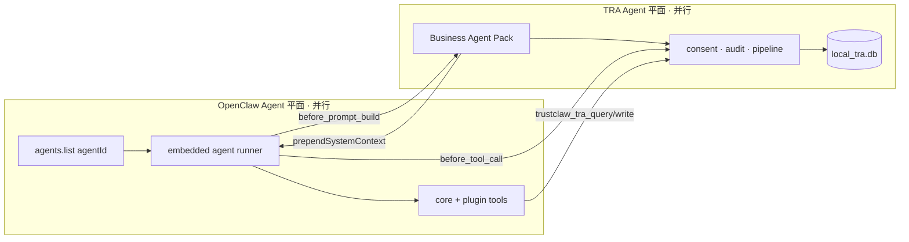
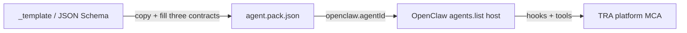
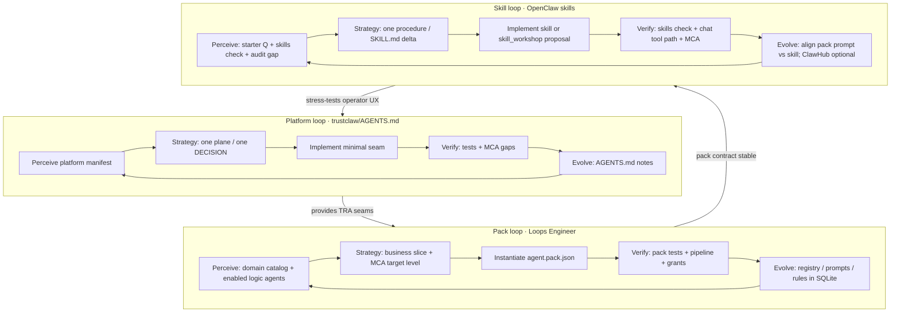
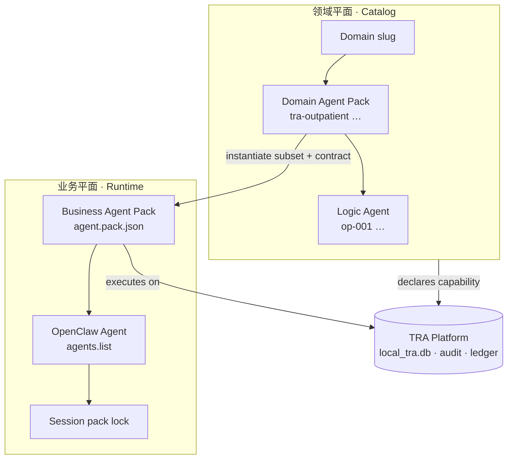
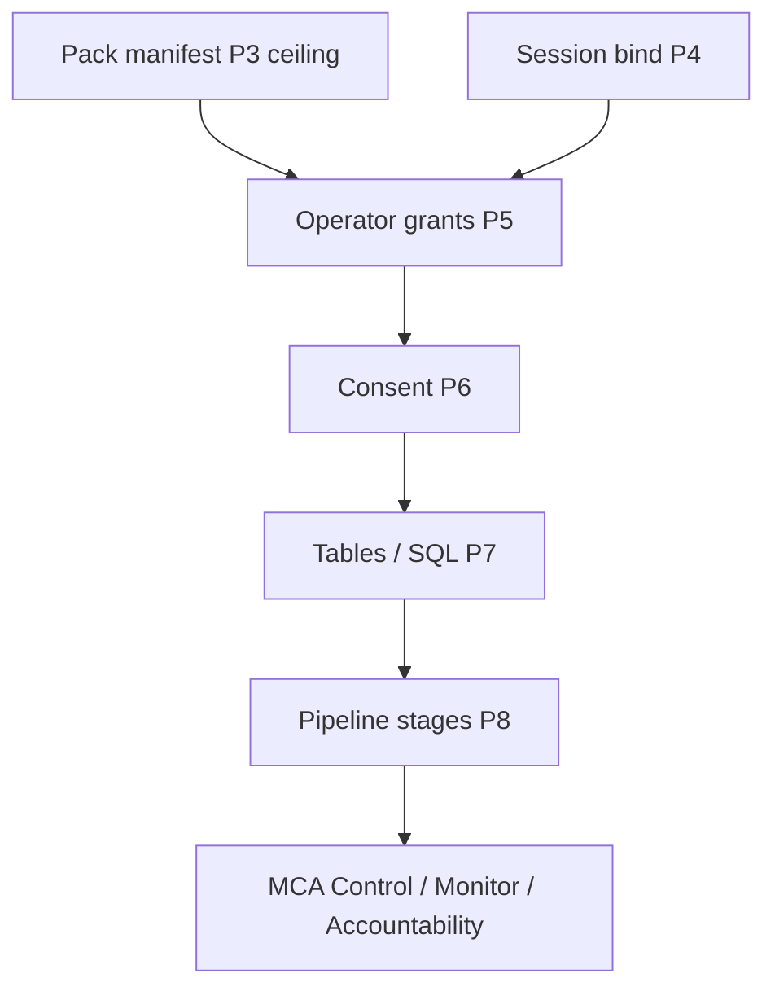

# TrustClaw Business Agent Platform

TrustClaw separates **TRA platform capabilities** from **declarative Business Agent packs**. GLP-1/C3-PO is the first pack; additional医保/健康 agents ship as new directories under `trustclaw/agents/`.

**Agent 模型：** TRA Business Agent 体系 **垂直开放设计** — 医药/医保 bundled packs 是首个严格验证实例，不是平台上限。TRA Agent 与 OpenClaw 默认 Agent（`agents.list`）**并行**；OpenClaw 通过声明式 Pack **自主构建** TRA 抽象（数据 / 模式 / 工作流三契约）。层间 **操作模型与 API** 见 [Layer operations model](#layer-operations-model-single-source-of-truth)。

## Architecture

| Layer                | Owner                                                               | Responsibility                                                          |
| -------------------- | ------------------------------------------------------------------- | ----------------------------------------------------------------------- |
| **TRA platform**     | `trustclaw/tra/`, `trustclaw/runtime/`, `extensions/trustclaw-tra/` | SQLite, Text2SQL guards, consent, audit, ledger, plugin tools           |
| **Agent Pack**       | `trustclaw/agents/<pack>/agent.pack.json`                           | Persona prompts, tool subset, rule engine, consent policy, audit labels |
| **OpenClaw binding** | `openclaw.json` `agents.list` + plugin hooks                        | Maps `agentId` → pack; injects system context per turn                  |

> **Naming:** “Agent Pack” in this table means **Business Agent Pack** (runtime). **Domain Agent Pack** is the catalog layer — see [Domain catalog vs business execution](#domain-catalog-vs-business-execution).

## TRA Agent × OpenClaw Agent（并行与集成）

TrustClaw 的 **TRA Agent** 体系与 OpenClaw **默认 Agent 体系保持并行**：两套抽象各自完整、边界清晰，**不互相替代**。运行时，OpenClaw 的 Agent 循环（session、provider、tools、sandbox、频道出站）**消费** TRA 提供的 Pack、工具与 MCA 守卫 —— TRA 不 fork Gateway，也不重写 `src/agents/` runner。

**决策依据：** D2（`extensions/trustclaw-tra` + `trustclaw/`；不改 OpenClaw core）、D17–D19（Pack 契约与 OpenClaw 绑定）。

### 并行：两套 Agent 平面

| 平面                   | 所有者                          | 回答的问题                                       | 典型产物                                            |
| ---------------------- | ------------------------------- | ------------------------------------------------ | --------------------------------------------------- |
| **OpenClaw Agent**     | OpenClaw core + `openclaw.json` | 谁跑 LLM？用哪个 workspace / provider / 工具面？ | `agents.list[]`、`agentId`、session、Gateway chat   |
| **TRA Business Agent** | `trustclaw/agents/*` + plugin   | 哪个医保/健康场景？读哪些表？规则与审计形状？    | `agent.pack.json`、Panel C grants、coordinator lock |
| **TRA 领域目录**       | `trustclaw/tra/` registry       | 目录里登记了哪些逻辑能力？                       | `domain_agents`（不直接执行）                       |

并行意味着：

- OpenClaw **仍** 负责多 Agent 配置、Provider 路由、频道、Companion Apps、exec/sandbox 策略（见 `trustclaw/OPENCLAW_REUSE.md` **Inherit** 层）。
- TRA **仍** 负责本地数据平面、consent、审计、账本、Pack 管线、Runtime Console —— 即使关闭 `trustclaw-tra` 插件，OpenClaw Gateway 仍可独立运行（只是无 TRA 能力）。
- 新增医保 Pack **不** 要求新增 OpenClaw core 代码；新增 OpenClaw `agentId` **不** 自动等于新 Logic Agent 进程。

### 集成：OpenClaw Agent 如何使用 TRA Agent

OpenClaw 默认 Agent 系统在 **每轮对话** 通过插件接缝 **调用** TRA，而非把 TRA 嵌进 core：



| 集成点                                        | 方向                   | 作用                                                                                |
| --------------------------------------------- | ---------------------- | ----------------------------------------------------------------------------------- |
| `before_prompt_build`                         | OpenClaw → TRA         | 按 session + `openclawAgentId` 解析 Pack，注入 `prompts/system` 与 TRA profile 摘要 |
| `before_tool_call`                            | OpenClaw → TRA         | Pack 级 consent、domain grant（`tra.chat` / `tra.write`）fail-closed                |
| `trustclaw_tra_query` / `trustclaw_tra_write` | OpenClaw tool 面 → TRA | LLM turn 内读/写本地 TRA；守卫与审计在工具实现内                                    |
| `agent.pack.json` → `openclaw.agentId`        | TRA → OpenClaw         | 建议默认 Pack：sidebar 选 `nrdl-reimburse` 时 coordinator 倾向对应 Business Pack    |
| `POST /api/agent/chat`                        | 并行 HTTP 演示面       | 同一 Pack 管线，不经 WS chat runner；仍共享 audit / grants                          |
| Panel C session pack API                      | Operator → 两者        | 固定 **会话级** Business Pack，防止 OpenClaw 换 agent 导致 TRA 权责漂移（D15）      |

**绑定规则（V1）：**

1. 每个可运行的 **Business Agent Pack** 应声明 `openclaw.agentId`（或回落 `defaultAgentPack`）。
2. `openclaw.json` `agents.list` 中 **须** 存在对应 `id` + workspace —— OpenClaw 侧仍是「谁在说话」的入口。
3. 实际 TRA 行为（表、规则、consent、审计组件）由 **Pack** 决定；OpenClaw 只提供 **执行宿主**。
4. 领域 Logic Agent 目录 **不** 注册为 `agents.list` 项；D23 之前由 Business Pack + session 显式绑定。

### 责任分界

| 职责                               | OpenClaw Agent                 | TRA Agent                           |
| ---------------------------------- | ------------------------------ | ----------------------------------- |
| LLM / Provider / failover          | ✓                              | —                                   |
| Workspace、skills 文件布局         | ✓                              | Pack 可指向 `trustclaw/workspace/*` |
| 工具注册与 `before_tool_call` 宿主 | ✓                              | TRA 插件实现 hook 逻辑              |
| 个人健康 SQLite、Text2SQL 守卫     | —                              | ✓                                   |
| Business 规则、pipeline、ledger    | —                              | ✓ Pack + platform                   |
| 频道出站（Telegram 等）            | ✓（D5 deferred 携带 audit id） | 结论经 Pack 工具链产生              |
| Panel A–F、grants、领域目录        | —                              | ✓                                   |

### 反模式

| 反模式                                   | 为何破坏并行                               |
| ---------------------------------------- | ------------------------------------------ |
| 在 `src/agents/` 硬编码 GLP-1 / 医保规则 | 应走 Pack + TRA，违反 D2/D14               |
| 为每个 Logic Agent 建 `agents.list` 行   | 混淆目录与运行时                           |
| 自建第二套 Gateway 跑 TRA                | 应 `openclaw gateway run` + 插件           |
| 绕过 `before_tool_call` 直读 TRA         | 破坏 OpenClaw 工具宿主与 MCA               |
| 认为关掉 OpenClaw agent 即可跑 Panel     | Console 与 Chat 仍依赖 Gateway 与插件 HTTP |

详见：`trustclaw/OPENCLAW_REUSE.md`（三层 Inherit/Extend/Build）、`trustclaw/docs/TRA_GOVERNANCE_ARCHITECTURE.md` §2.4（多层权限）、`trustclaw/DECISIONS.md` D2/D15/D17。

## Open Agent platform (vertical-agnostic design)

TRA **Business Agent** is an **open-designed** abstraction: the platform defines **how** agents bind to OpenClaw, declare data/mode/workflow, and pass MCA — not **which** vertical ships first.

| Layer              | Open?                                | V1 instance                                        |
| ------------------ | ------------------------------------ | -------------------------------------------------- |
| **Platform**       | Vertical-agnostic TRA + plugin hooks | Same for all packs                                 |
| **Pack contract**  | `agent.pack.json` schema + templates | Copy `trustclaw/agents/_template/`                 |
| **Bundled packs**  | Examples / strict proofs             | Healthcare: GLP-1, NRDL, compliance                |
| **Domain catalog** | Taxonomy + Logic Agent rows          | 医保 10×1000 seed (D24) — **one** catalog instance |

**医药首验** means bundled healthcare packs prove MCA end-to-end (consent, pipeline, ledger, grants). New verticals **reuse the same contracts**; they do not fork OpenClaw core or TRA platform code.

### OpenClaw autonomously builds TRA agent structure

OpenClaw (operator, authoring agent, or CI) constructs a TRA Business Agent by **filling templates**, not by editing `src/agents/`:



| Step                  | Owner                             | Artifact                                               |
| --------------------- | --------------------------------- | ------------------------------------------------------ |
| 1 · Data contract     | Pack author + TRA schema          | `data.readTables`, migrations, compliance import       |
| 2 · Mode contract     | Pack author + `openclaw.json`     | `openclaw.agentId`, `consent`, `tools`, Panel C grants |
| 3 · Workflow contract | Pack author + platform registries | `pipeline.stages`, `rules.engine`, `audit.*`, prompts  |
| 4 · Bind & verify     | OpenClaw Gateway + plugin         | Registry load, vitest, coordinator lock                |

Code reservation:

- **Template pack:** `trustclaw/agents/_template/` (skipped at runtime by `_` prefix in `discoverAgentPackFiles`)
- **Workspace + skills template:** `trustclaw/workspace/_template/` — OpenClaw skill loop entry
- **JSON Schema:** `trustclaw/agents/_schema/agent-pack.v1.json`
- **Extension registries:** `trustclaw/runtime/agent-pack/extension-points.ts` — pipeline stages, rule engines, decision builders (enum growth = platform loop item)
- **Skill loop helpers:** `trustclaw/runtime/agent-pack/skill-loop.ts` — verify command list
- **Integration guide:** `trustclaw/agents/_template/INTEGRATION.md`

### Three template-level contracts

| Contract            | 规范                                     | Pack / platform fields                                                    | OpenClaw touchpoint                                           |
| ------------------- | ---------------------------------------- | ------------------------------------------------------------------------- | ------------------------------------------------------------- |
| **数据 Data**       | 表 allowlist、SELECT-only、规则在 SQLite | `data.readTables`, `writeTables`, `snapshotView`; `trustclaw/tra/schema/` | `trustclaw_tra_query` / `write` + Text2SQL `prompts/text2sql` |
| **模式 Mode**       | 宿主、consent、赋权 scope                | `openclaw.agentId`, `consent.*`, `tools.*`                                | `agents.list`, `before_tool_call`, Panel C `agent-grants`     |
| **工作流 Workflow** | MCA 阶段子集、决策形状、审计组件         | `pipeline.stages`, `rules.engine`, `decisionBuilder`, `audit.*`           | `before_prompt_build`, `run-chat` / tool path, Panel D/E      |

**Starter path (any vertical):** copy `_template` → `rules.engine: none` + `decisionBuilder: pass-through` + stages `TEXT2SQL_GEN` → `DB_QUERY` → `AGENT_DECISION`. Add `RULE_EVAL` / `LEDGER_COMMIT` when rules and ledger are ready.

**Strict path (healthcare reference):** copy `glp1-eligibility` or `nrdl-reimburse` patterns — registered engines `ast-compliance`, `nrdl-table`, builder `glp1-decision`.

### Extension points (V1 → V2)

| Seam                       | Today                                               | To add a new vertical engine                                                                           |
| -------------------------- | --------------------------------------------------- | ------------------------------------------------------------------------------------------------------ |
| `rules.engine`             | Closed enum in schema                               | Implement in `trustclaw/runtime/rules/`, wire `run-chat.ts`, extend schema + `extension-points.ts`     |
| `pipeline.decisionBuilder` | `pass-through` \| `glp1-decision`                   | Add builder in `pack-decision.ts`, extend schema                                                       |
| `audit.*Component`         | String per pack; platform enum tightening in flight | Governance §12 — prefer unique pack-local names now                                                    |
| Domain catalog             | Healthcare seed                                     | New `domain[]` slugs + optional `domain_agents` import — not required for first pack in a new vertical |
| D23 routing                | Deferred                                            | NL intent → Logic Agent → Pack without breaking contracts                                              |

OpenClaw-side **authoring agents** should read `listAgentPackExtensionPoints()` and `agent-pack.v1.json` before proposing new pack JSON — do not invent fields outside schema.

### Healthcare vs future verticals

|               | Healthcare (V1 proof)       | Future vertical                           |
| ------------- | --------------------------- | ----------------------------------------- |
| Purpose       | Strict MCA + 医保 tables    | Same MCA, different schema/prompts        |
| Bundled packs | 3 under `trustclaw/agents/` | New dirs, same loader                     |
| Catalog       | `tra-*` Domain Agent Packs  | Optional parallel catalog seed            |
| Core changes  | **None** expected           | Register new rule engine only when needed |

## Loops Engineer methodology

**Loops Engineer** is how TrustClaw ships the Agent Platform: **iterate with evidence**, not big-bang releases. Domain catalog (领域) and Business Pack (业务) evolve in **nested loops** — each turn closes one bottleneck, verifies against MCA, then writes back to docs/tests.

**Authority:** Product loop protocol lives in `trustclaw/AGENTS.md` (Infinite Optimization Loop). This section applies that protocol to **pack authors** and **platform integrators** reading `AGENT_PLATFORM.md`.

### Three nested loops

| Loop              | Owner                       | Question per turn                                                       | Typical artifact                                             |
| ----------------- | --------------------------- | ----------------------------------------------------------------------- | ------------------------------------------------------------ |
| **Platform loop** | Core / plugin / TRA         | Which plane (Data/Policy/Agent/Evidence/Operator) has a production gap? | `trustclaw/AGENTS.md` 当前轮次笔记, platform `*.test.ts`     |
| **Pack loop**     | Business Agent author       | Which domain slice should become a runnable `agent.pack.json` next?     | New/edited pack under `trustclaw/agents/<id>/`               |
| **Skill loop**    | OpenClaw workspace + skills | Which standing procedure is wrong, missing, or untested for this pack?  | `<workspace>/skills/**/SKILL.md`, `skill_workshop` proposals |



Platform loop **must not** be driven from `PLAN.md` / `ROADMAP.md` alone — only from `trustclaw/AGENTS.md` + `DECISIONS.md` (see root `AGENTS.md`).

### Pack vs Skill (what each loop owns)

| Layer                       | Artifact                                       | Loop           | OpenClaw loads                                         |
| --------------------------- | ---------------------------------------------- | -------------- | ------------------------------------------------------ |
| **Pack contract**           | `agent.pack.json`, `prompts/system`, TRA hooks | Pack loop      | `before_prompt_build` (prepend pack context)           |
| **Workspace context**       | `AGENTS.md`, `SOUL.md`                         | Pack + Skill   | Project context in system prompt                       |
| **Skills**                  | `<workspace>/skills/**/SKILL.md`               | **Skill loop** | `resolveSkillsPromptForRun` — tool/how-to playbooks    |
| **Durable skill proposals** | Skill Workshop pending files                   | Skill loop     | `skill_workshop` tool (not raw `write` to live skills) |

**Rule:** Pack loop changes **what** the TRA platform allows (tables, stages, consent). Skill loop changes **how** the OpenClaw agent reliably executes procedures **within** that contract. Neither loop may put clinical rules in TS or SKILL prose (D14 → SQLite).

Template entry points:

- Pack: `trustclaw/agents/_template/`
- Workspace + skills: `trustclaw/workspace/_template/skills/tra-pack-operations/`
- Verify commands: `listSkillLoopVerifyCommands()` in `trustclaw/runtime/agent-pack/skill-loop.ts`

### Skill loop — five phases

Apply **Perceive → Strategy → Implement → Verify → Evolve** to OpenClaw skills for a bound Business Pack:

| Phase             | Skill-loop question                                           | Actions                                                                                                                    | Exit criteria                                                   |
| ----------------- | ------------------------------------------------------------- | -------------------------------------------------------------------------------------------------------------------------- | --------------------------------------------------------------- |
| **1 · Perceive**  | Does chat behavior match pack + panels for starter questions? | Run pack `starterQuestions`; `openclaw skills list`; read Panel D for last trail                                           | Gap note: missing skill, wrong tool name, consent not mentioned |
| **2 · Strategy**  | **One** procedure to fix or add?                              | Pick skill id or new `skills/<name>/SKILL.md`; use `skill_workshop` if durable proposal workflow required                  | Strategy card: skill name, pack id, verify commands             |
| **3 · Implement** | Update playbook only                                          | Edit `SKILL.md` or `skill_workshop` `create`/`update`/`revise` — **not** `agent.pack.json` unless Pack loop owns that turn | Skill describes tools/panels; no rule literals                  |
| **4 · Verify**    | Does OpenClaw + TRA still pass MCA?                           | `openclaw skills check`; `listSkillLoopVerifyCommands()`; deny consent; audit steps for pack stages                        | Skills valid; tool path blocked without grant; audit consistent |
| **5 · Evolve**    | Pack prompt vs skill drift?                                   | Shorten pack system prompt if skill owns procedure; publish skill via ClawHub only when operator approves                  | Handoff notes; optional `openclaw skills update`                |

**Continuous optimization:** Skill loop may run **every Pack loop turn** after Verify (same session) or on its own cadence when operator UX drifts without schema changes.

### Skill-loop anti-patterns

| Anti-pattern                                                             | Why it breaks the loop                         |
| ------------------------------------------------------------------------ | ---------------------------------------------- |
| Encode NRGL/GLP-1 rules inside `SKILL.md`                                | Violates D14; not testable like SQLite rules   |
| `write` / shell to patch live `SKILL.md` when `skill_workshop` available | Bypasses proposal/review contract              |
| Skill says “query DB” without naming `trustclaw_tra_query`               | Tool discovery fails; audit attribution breaks |
| Fix skill wording while grant/consent broken                             | Wrong plane — Platform or Pack loop first      |
| Skip `openclaw skills check` after SKILL edit                            | Verify layer skipped                           |

### Pack loop — five phases (Loops Engineer)

Apply **Perceive → Strategy → Implement → Verify → Evolve** when instantiating Domain Agent Pack intent into a Business Agent Pack:

| Phase             | Pack-loop question                                                           | Actions                                                                                                                                                                                                          | Exit criteria                                                                  |
| ----------------- | ---------------------------------------------------------------------------- | ---------------------------------------------------------------------------------------------------------------------------------------------------------------------------------------------------------------- | ------------------------------------------------------------------------------ |
| **1 · Perceive**  | Which domain gap or `enabled: partial` logic agents matter for this product? | Read `domain_agents` / `pack_id`; check mounted TRA tables; read `REGISTRATION_REPORT.md` priorities                                                                                                             | Short snapshot: domain slug, candidate `agent_id`s, missing tables             |
| **2 · Strategy**  | What is the **one** business slice this pack owns?                           | Answer **四轮自问** (plane / path / benefit / opportunity cost — see `trustclaw/AGENTS.md` §策略); pick MCA target **M1–M3** (`TRA_GOVERNANCE_ARCHITECTURE.md` §8); confirm no `DECISIONS.md` `pending` blockers | Strategy card: pack id, `domain[]`, stages, verify commands                    |
| **3 · Implement** | Minimal `agent.pack.json` + prompts + workspace                              | Declare `pipeline.stages`, `audit.*`, `rules.engine`; map `openclaw.agentId`; **no** TS hardcoded clinical rules (D14)                                                                                           | Schema-valid pack; OpenClaw entry in `agents.list`                             |
| **4 · Verify**    | Does the pack meet its MCA level?                                            | `listSkillLoopVerifyCommands()`; pack-scoped pipeline test; consent deny; `missingChatPipelineSteps` for declared stages                                                                                         | Tests green; `openclaw skills check`; Panel C grant + chat/tool path exercised |
| **5 · Evolve**    | What catalog or platform feedback?                                           | Update pack prompts; seed/migrate SQLite rules; optional registry `enabled` bumps; note gaps in platform backlog                                                                                                 | Documented in PR / handoff; commit grouped                                     |

**One primary item per pack-loop turn** — same discipline as platform loop. Do not bundle unrelated packs or cross-plane refactors in one iteration.

### Loops Engineer principles (pack-facing)

| Principle                        | Meaning for packs                                                                                                   |
| -------------------------------- | ------------------------------------------------------------------------------------------------------------------- |
| **Catalog before code**          | Logic Agent rows describe capability; Business Pack **instantiates** a slice — do not fork 1000 agents as processes |
| **Instantiate, don't duplicate** | Reuse TRA platform tools (`trustclaw_tra_query` / `write`), shared audit steps, coordinator lock (D15)              |
| **Correctness before persona**   | Pipeline handshake + rule matrix + citations before prompt polish                                                   |
| **MCA level explicit**           | Ship with stated M1/M2/M3; no silent skip of consent, audit, or ledger                                              |
| **Fail-closed is a feature**     | `BLOCKED` paths are success criteria for Verify — not bugs to hide                                                  |
| **Evidence write-back**          | Verify pass → update pack README/prompts if needed; platform gap → outer loop, not pack hack                        |
| **Skills follow pack**           | After pack contract changes, run Skill loop to update `workspace/skills` playbooks                                  |

### Domain → business mapping in a pack loop

Typical instantiation path (Loops Engineer checklist):

1. **Pick domain anchor** — e.g. `tra-pharmacy` or cross-domain `nrdl` tables.
2. **Select logic agents** — filter `GET /api/tra/domain-agents?pack_id=…&enabled=partial`.
3. **Define business contract** — `readTables`, `rules.engine`, `pipeline.stages`, `decisionBuilder`.
4. **Bind runtime** — `openclaw.agentId`, session pack API, Panel C grants (D22).
5. **Prove accountability** — audit trail + optional ledger per `TRA_GOVERNANCE_ARCHITECTURE.md`.

D23 (NL routing) is **out of scope** for V1 pack loops — use explicit pack binding until approved.

### Pack-loop anti-patterns

| Anti-pattern                                    | Why it breaks Loops Engineer               |
| ----------------------------------------------- | ------------------------------------------ |
| Ship prompts without pipeline tests             | Verify layer skipped                       |
| Hardcode rules in TS instead of SQLite/AST      | Violates D14; not evolvable                |
| Treat 1000 logic agents as 1000 OpenClaw agents | Confuses catalog with runtime              |
| UI polish while consent/audit gaps remain       | Wrong plane; platform loop item            |
| One PR: new pack + Gateway core refactor        | Violates minimal-change / OpenClaw-first   |
| Skip strategy card “because docs only”          | Loop without Perceive/Strategy is drive-by |

### When to escalate outer (platform) loop

Escalate from pack loop to `trustclaw/AGENTS.md` platform loop when:

- Pack needs a **new** generic seam (tool, audit step, grant scope) — implement in `trustclaw/runtime/` or plugin, not pack-local hack.
- `AuditComponent` or `missingChatPipelineSteps` cannot express pack stages — fix platform (see `TRA_GOVERNANCE_ARCHITECTURE.md` §12).
- Domain registry bootstrap or `pack_id` schema wrong — D24 / `trustclaw/tra/` item, not pack-only.

### Quick reference

| Doc                              | Role in Loops Engineer                                  |
| -------------------------------- | ------------------------------------------------------- |
| `trustclaw/AGENTS.md`            | Platform loop authority + compliance Must               |
| `AGENT_PLATFORM.md` (this file)  | Pack loop + **Skill loop** + domain/business model      |
| `docs/tools/skills.md`           | OpenClaw skill load order, allowlists, `skill_workshop` |
| `trustclaw/workspace/_template/` | Workspace + skills template                             |
| `TRA_GOVERNANCE_ARCHITECTURE.md` | MCA Verify gates + M0–M4 maturity                       |
| `DECISIONS.md`                   | Human approval before Strategy                          |

## Domain catalog vs business execution

TrustClaw uses two related but distinct planes. **领域 (domain)** describes _where_ capability lives in a regulated catalog; **业务 (business)** describes _which product workflow_ runs on the runtime. Confusing the two leads to mixing Panel C grant targets with the 1000-row logic-agent registry.

### 领域 vs 业务

| Term     | English      | Question it answers                                 | Mutable by                               | Primary storage                                                  |
| -------- | ------------ | --------------------------------------------------- | ---------------------------------------- | ---------------------------------------------------------------- |
| **领域** | **Domain**   | “Which医保/健康子域？有哪些逻辑能力？”              | Operator import / registry seed (D24)    | `domain_agents`, `domain_agent_packs` in `local_tra.db`          |
| **业务** | **Business** | “这次对话跑哪个产品场景？用什么 prompt/规则/工具？” | Pack authors + session binding (D15–D19) | `trustclaw/agents/*/agent.pack.json`, `session-agent-packs.json` |

- **领域** is **catalog + policy scope**: stable taxonomy (outpatient, inpatient, pharmacy…), thousands of **Logic Agents** as directory rows, `enabled` / `partial` / `false` driven by mounted TRA tables.
- **业务** is **executable product**: one shipped workflow (e.g. GLP-1 eligibility) with persona, pipeline stages, consent, and audit labels bound to an OpenClaw agent.

领域 answers “what exists and what could be activated.”  
业务 answers “what we run now for this user/session.”

### Catalog hierarchy (领域平面)

Coarse → fine inside the TRA registry:

```
Domain (业务域 slug)
  └── Domain Agent Pack (域协调包, pack_id e.g. tra-outpatient)
        └── Logic Agent (逻辑 Agent, domain_agents.agent_id e.g. op-001)
```

| Level | Name                  | Table / artifact                               | Scale (V1)      | Role                                                                                     |
| ----- | --------------------- | ---------------------------------------------- | --------------- | ---------------------------------------------------------------------------------------- |
| L0    | **Domain**            | `domain_agents.domain`                         | 10 slugs        | Sub-domain taxonomy: outpatient, inpatient, pharmacy…                                    |
| L1    | **Domain Agent Pack** | `domain_agent_packs` + `domain_agents.pack_id` | 10 coordinators | Groups logic agents per医保子域; coordinator metadata in `coordinator_agents_list.json`  |
| L2    | **Logic Agent**       | `domain_agents`                                | 1000 rows       | Finest catalog unit: name, subdomain, `tra_scopes`, `enabled`, region/insurance variants |

API: `GET /api/tra/domain-agents` (Panel C registry).  
Seeds: `trustclaw/tra/seeds/domain-agents/domain_agents_registry.sql`.

Logic Agents are **not** separate OS processes — they are registry + grant + routing metadata until a Business Pack (or D23 router) selects them.

### Business Agent Pack = instantiation of domain catalog

A **Business Agent Pack** (`agent.pack.json`) is the **instantiation** step that turns domain catalog intent into a **runnable** agent on TRA:

| Catalog (领域)                                                | Instantiation (业务)                                                                           |
| ------------------------------------------------------------- | ---------------------------------------------------------------------------------------------- |
| Domain Agent Pack declares _domain_ + coordinator scope       | Business Pack picks **which domain(s)** and **which TRA tables/rules** implement the scenario  |
| Logic Agents declare _capabilities_ (`enabled`, `tra_scopes`) | Business Pack declares **tools**, **prompts**, **pipeline**, **consent**, **audit components** |
| Registry is vertical-wide (1000 agents)                       | Pack is product-narrow (e.g. GLP-1 NRDL eligibility)                                           |
| Operator browses / grants in Panel C                          | Operator chats via OpenClaw agent + session pack lock                                          |

Instantiation adds everything the catalog **deliberately omits**:

- `prompts/*` and persona (`openclaw.persona`)
- `tools.read` / `tools.write` → `trustclaw_tra_query` / `trustclaw_tra_write`
- `rules.engine` + SQLite/AST rule sets (D6, D14)
- `pipeline.stages` + `decisionBuilder`
- `consent` + `audit` labels
- `openclaw.agentId` + workspace under `trustclaw/workspace/`



**Relationship:** one Domain Agent Pack maps to **many** Logic Agents; one Business Agent Pack **materializes** a **business slice** — often spanning one or more domains — into a single executable contract. It is not always 1:1 with a single `tra-*` pack.

### V1 examples (domain grounding)

| Business Agent Pack  | `agent.pack.json` `domain[]`             | Related Domain Agent Pack(s)                                        | Notes                         |
| -------------------- | ---------------------------------------- | ------------------------------------------------------------------- | ----------------------------- |
| `glp1-eligibility`   | `endocrine`, `weight-management`, `nrdl` | Cross-cuts pharmacy/outpatient logic; uses NRDL + compliance tables | Default pack; C3-PO persona   |
| `nrdl-reimburse`     | NRDL-focused tables                      | `tra-pharmacy`, `tra-outpatient` (catalog)                          | Read-only reimburse path      |
| `compliance-auditor` | `compliance`                             | `tra-audit` (catalog)                                               | Strict consent; no write tool |

Bundled Business Packs today: 3. Domain catalog today: 10 Domain Agent Packs × 1000 Logic Agents (after D24 seed/bootstrap).

### Operator surfaces (same Panel, two layers)

Panel C intentionally shows both planes:

1. **Top — Business grants:** per **Business Agent Pack** scope (`GET/PUT /api/tra/agent-grants`) — 业务赋权, fail-closed for Panel B/D/E/F and chat tools (D22).
2. **C2 — Pack authoring (Phase 4):** `trustclaw/ui` Panel `agent-pack-authoring` — list/load/validate/save `agent.pack.json` via `/api/tra/agent-packs/*` (save requires `agentPacksDir`).
3. **Bottom — Logic Agent registry:** rows from `domain_agents` — 领域目录, filter by `pack_id` / `enabled`.

UI copy: registry subtitle states logic agents are **not** the same layer as the Business Agent Pack list above.

### Roadmap seam (D23)

Natural-language routing from user intent → Logic Agent → Business Agent Pack is **deferred** (D23). V1:

- Catalog is browsable and seeded independently.
- Business Packs run via explicit session/default pack binding (D15).
- Future: coordinator or router resolves “which logic agent” then “which business pack instance” without breaking domain/business separation.

## Agent Pack contract

Schema: `trustclaw/agents/_schema/agent-pack.v1.json` (**Business Agent Pack**)  
Template: `trustclaw/agents/_template/` + `INTEGRATION.md` (vertical-agnostic starter)  
Extension registries: `trustclaw/runtime/agent-pack/extension-points.ts`  
Loader: `trustclaw/runtime/agent-pack/`  
Registry: `AgentPackRegistry.load()` / `GET /api/tra/agent-packs`

### Minimal pack layout

```
trustclaw/agents/my-agent/
  agent.pack.json
  prompts/
    my-agent-system.v1.md
```

### Bundled packs (V1)

| Pack id              | OpenClaw `agentId`   | Read | Write | Rule engine      |
| -------------------- | -------------------- | ---- | ----- | ---------------- |
| `glp1-eligibility`   | `main` (default)     | ✓    | ✓     | `ast-compliance` |
| `nrdl-reimburse`     | `nrdl-reimburse`     | ✓    | —     | `nrdl-table`     |
| `compliance-auditor` | `compliance-auditor` | ✓    | —     | `none`           |

## Platform tools (shared)

| Tool                  | Purpose                                    |
| --------------------- | ------------------------------------------ |
| `trustclaw_tra_query` | SELECT Text2SQL + GLP-1 pipeline read path |
| `trustclaw_tra_write` | INSERT Text2SQL personal/device writes     |

Packs declare which tools are exposed. Consent policy is pack-scoped (`consent.read.allowAlways`, `consent.write.allowAlways`).

## OpenClaw configuration

OpenClaw `agents.list` 与 TRA Pack **并行配置、运行时集成**：list 定义 OpenClaw Agent 宿主；`trustclaw-tra` 插件把 TRA Pack 挂到该宿主的 prompt/tool 路径上（见 [TRA Agent × OpenClaw Agent](#tra-agent--openclaw-agent并行与集成)）。

```json
{
  "agents": {
    "list": [
      { "id": "main", "workspace": "trustclaw/workspace/dev" },
      { "id": "nrdl-reimburse", "workspace": "trustclaw/workspace/nrdl-reimburse" },
      { "id": "compliance-auditor", "workspace": "trustclaw/workspace/compliance-auditor" }
    ]
  },
  "plugins": {
    "entries": {
      "trustclaw-tra": {
        "enabled": true,
        "config": {
          "defaultAgentPack": "glp1-eligibility"
        }
      }
    }
  }
}
```

Plugin hooks:

- `before_prompt_build` → `buildTrustclawTraAgentGuidance({ sessionKey, openclawAgentId })`
- `before_tool_call` → consent gates per pack policy

## Pipeline Coordinator (D15)

`trustclaw/runtime/coordinator/session-pack-coordinator.ts` binds one **agent pack per chat session** so tool calls, consent, Text2SQL, and prompts do not drift when the OpenClaw sidebar agent changes mid-session.

### Resolution priority

1. **session** — explicit Panel C `PUT /api/tra/session/agent-pack`
2. **lock** — coordinator lock from the first `bindLock` resolve (prompt/tool)
3. **openclaw_agent** / **default** — only before a lock exists
4. **request** — `POST /api/agent/chat` with `agent_pack_id` (also binds when `bindLock`)

### Session key canonicalization (multi-workspace)

`resolveCoordinatorSessionKey` (`trustclaw/runtime/coordinator/session-key.ts`) normalizes coordinator storage:

- Keys already prefixed with `agent:` pass through unchanged (Control UI / OpenClaw tool `sessionKey`).
- Bare `session_id` + `openclaw_agent_id` → `agent:<agentId>:<session>` so HTTP chat and WS tools share the same pack binding.

`POST /api/agent/chat` body (optional fields in **bold**):

```json
{
  "session_id": "thread-1",
  "message": "…",
  "agent_pack_id": "glp1-eligibility",
  "openclaw_agent_id": "main"
}
```

### Runtime Context coordinator fields

Chat responses and `trustclaw_tra_query` tool `details.trustclaw.runtime_context` may include:

| Field                        | Meaning                                                                         |
| ---------------------------- | ------------------------------------------------------------------------------- |
| `agent_pack_id`              | Effective pack for this run                                                     |
| `agent_pack_source`          | `session` \| `lock` \| `openclaw_agent` \| `default` \| `request`               |
| `agent_pack_locked`          | Coordinator lock active                                                         |
| `agent_pack_mismatch`        | OpenClaw sidebar agent suggests a different pack than the locked/effective pack |
| `openclaw_suggested_pack_id` | Pack implied by current `openclawAgentId` mapping                               |
| `declared_pipeline_steps`    | Pack `pipeline.stages` subset for Panel D gates                                 |

Storage: `state/tra-audit/session-agent-packs.json` with `sessions` (UI override) and `locks` (coordinator).

| Endpoint                                          | Purpose                                       |
| ------------------------------------------------- | --------------------------------------------- |
| `GET /api/tra/session/agent-pack?session_id=…`    | Preview effective pack (`bindLock: false`)    |
| `PUT /api/tra/session/agent-pack`                 | User selects pack; sets override **and** lock |
| `DELETE /api/tra/session/agent-pack?session_id=…` | Clear override + lock (e.g. after `/new`)     |

Hot paths (`before_prompt_build`, `before_tool_call`, TRA tools) call `resolveBoundAgentPack()` (`bindLock: true`).

## Layer operations model (single source of truth)

TRA **does not use symmetric CRUD on every layer**. Each layer has an **operation model** — how Create / Read / Update / Delete (or equivalents) are allowed — and **upper layers constrain lower ones** via Pack ceiling (P3), grants (P5), consent (P6), and MCA invariants.

**Authority for gaps:** normative behavior in `trustclaw/docs/TRA_GOVERNANCE_ARCHITECTURE.md` §12; this table describes **intended** contracts + V1 surfaces.

### Three operation models

| Model             | Meaning                                                       | Examples                                              |
| ----------------- | ------------------------------------------------------------- | ----------------------------------------------------- |
| **Declarative**   | Author edits files; Gateway reload / restart picks up changes | `agent.pack.json`, `workspace/`, `skills/**/SKILL.md` |
| **Operational**   | Runtime or operator APIs with audit                           | grants, session pack bind, init, compliance import    |
| **Append-only**   | Create + Read only; no in-place Update/Delete (integrity)     | `events.jsonl`, evidence ledger chain                 |
| **Tool-mediated** | Writes go through guarded tools, not arbitrary REST           | `trustclaw_tra_write`, Text2SQL INSERT path           |

### Abstract layer × operations × API × verify

| Layer                  | Entity                 | Model                  | C                                                                      | R                                            | U                                   | D                                 | Primary API / channel             | Guarded by                            | Verify (loop)                    |
| ---------------------- | ---------------------- | ---------------------- | ---------------------------------------------------------------------- | -------------------------------------------- | ----------------------------------- | --------------------------------- | --------------------------------- | ------------------------------------- | -------------------------------- |
| **OpenClaw Agent**     | `agents.list[]`        | Declarative            | onboard / config add                                                   | `agents.list`, dashboard                     | `openclaw config set`               | remove list entry                 | `openclaw.json`                   | OpenClaw core                         | gateway smoke                    |
| **Business Pack P3**   | `agent.pack.json`      | Declarative            | copy `_template`                                                       | `GET /api/tra/agent-packs`                   | edit pack dir + **restart Gateway** | remove pack dir                   | filesystem + registry             | zod schema; P3 ceiling                | Pack loop vitest                 |
| **Workspace**          | `AGENTS.md`, `SOUL.md` | Declarative            | copy `workspace/_template`                                             | runner project context                       | edit files                          | delete files                      | `trustclaw/workspace/<id>/`       | supplements Pack                      | Skill loop chat                  |
| **Skill**              | `SKILL.md`             | Declarative + workshop | new skill dir / `skill_workshop` create                                | `openclaw skills list`                       | edit / `skill_workshop` update      | workshop reject; delete file      | `<workspace>/skills/`             | no D14 rules in prose                 | `openclaw skills check`          |
| **Session bind P4**    | pack per `session_id`  | Operational            | `PUT /api/tra/session/agent-pack`                                      | `GET …/session/agent-pack`                   | `PUT` (rebind + lock)               | `DELETE …/session/agent-pack`     | HTTP                              | D15 coordinator                       | D15 manual + tests               |
| **Operator grants P5** | per-pack scopes        | Operational            | `PUT /api/tra/agent-grants`                                            | `GET /api/tra/agent-grants`                  | `PUT` replaces scope set            | `PUT` with `scopes: []`           | HTTP → `agent-domain-grants.json` | ⊆ `deriveAgentDomainScopes(pack)`     | deny `tra.chat` → 403/block      |
| **Data consent P6**    | session × pack         | Operational            | `allow-once` / `allow-always` via hook                                 | `hasTraDataAccessGrant`                      | persist `allow-always`              | reset; deny; session end          | `before_tool_call`                | after P5                              | consent deny test                |
| **Domain catalog P1**  | `domain_agents` rows   | Operational (batch)    | seed; `POST /api/tra/domain-agents`; `POST …/import/bundled-migration` | `GET /api/tra/domain-agents`                 | **no row-level API**                | replace via import / reset        | SQLite + import SQL               | **catalog only**; not execution       | registry count / filters         |
| **Domain pack P2**     | `domain_agent_packs`   | Operational (batch)    | migration SQL                                                          | via `pack_id` on agents                      | import / migration                  | reset                             | SQLite                            | taxonomy metadata                     | bootstrap tests                  |
| **TRA personal data**  | SQLite rows            | Tool + operational     | `POST /api/tra/init`; `trustclaw_tra_write`                            | `trustclaw_tra_query`; `GET /api/tra/browse` | `tra_write` (allowlisted tables)    | `POST /api/tra/reset`             | API + tools                       | P5/P6/P7; SELECT-only reads           | tra query/write tests            |
| **Compliance rules**   | AST / standards        | Operational            | `POST /api/tra/compliance/import` (+ bundled)                          | `GET …/standards`, `GET …/rules`             | re-import                           | reset                             | HTTP                              | `panel.compliance`; import consent    | compliance-import tests          |
| **Reference / NRDL**   | subscribed tables      | Operational            | `POST /api/tra/reference/sync` (+ bundled)                             | `GET …/reference/status`                     | re-sync                             | reset                             | HTTP                              | compliance grant                      | reference routes tests           |
| **Device import**      | device payloads        | Operational            | `POST /api/tra/device/import`                                          | `POST …/device/preview`                      | —                                   | reset                             | HTTP                              | compliance grant                      | device routes tests              |
| **Audit**              | `events.jsonl`         | Append-only            | runtime `audit.record`                                                 | `GET /api/tra/audit/events`                  | —                                   | `POST /api/tra/reset` clears file | JSONL                             | no PHI full rows in output            | audit tests                      |
| **Ledger**             | evidence receipts      | Append-only            | `LEDGER_COMMIT` / tool path                                            | `GET /api/tra/ledger`                        | —                                   | reset                             | `state/tra-evidence/`             | only after SUCCESS pipeline           | ledger + verify chain            |
| **HTTP chat pipeline** | Runtime Context        | Operational            | `POST /api/agent/chat`                                                 | response `pipeline_stages`                   | —                                   | —                                 | HTTP                              | P5 `tra.chat`; full MCA in `run-chat` | `run-chat.test.ts`               |
| **WS chat + tools**    | OpenClaw turn          | Tool-mediated          | tool calls                                                             | chat transcript                              | —                                   | —                                 | Gateway WS + hooks                | P4–P8 chain                           | `extensions/trustclaw-tra` tests |

**Notes:**

- **Pack authoring over HTTP** — Bundled packs ship with the runtime; **operator-owned** packs live under configured `agentPacksDir` and may be created (`POST /api/tra/agent-packs`), updated (`PUT …/<id>`), or deleted (`DELETE …/<id>`, non-default only) after `POST …/validate`.
- **Logic Agent `enabled` / `tra_scopes`** — Read in catalog; **runtime ignores** for execution (P5 is source of truth); D23 may connect later.
- **Grant PUT** validates scopes against pack manifest; **direct edit** of `agent-domain-grants.json` is unsupported — see governance §12.

### Five planes × operation summary

| Plane        | Primary operations                                   | Intentional non-goals                    |
| ------------ | ---------------------------------------------------- | ---------------------------------------- |
| **Data**     | Init, guarded read (browse/query), tool write, reset | Arbitrary SQL UPDATE REST; cloud egress  |
| **Policy**   | Grants CRUD-via-PUT, consent, import gates           | Pack-expanding grants; bypass hooks      |
| **Agent**    | Pack/session/skill declarative CRUD; chat invoke     | 1000 OS processes; core fork             |
| **Evidence** | Append audit + ledger; read for replay               | Edit/delete audit events in steady state |
| **Operator** | Panels A–F map to rows above                         | Panel actions without grant checks       |

### Constraint chain (who limits whom)



| Child operation  | Must not exceed                                |
| ---------------- | ---------------------------------------------- |
| P5 granted scope | `deriveAgentDomainScopes(pack)`                |
| P6 data access   | granted scopes + pack `consent` policy         |
| P7 table touch   | `readTables` / `writeTables`                   |
| P8 stage outcome | `pipeline.stages` + Outcome Contract           |
| Skill playbook   | Pack + P5/P6 (no clinical rules in SKILL, D14) |
| P1 catalog row   | **no** direct DB execution                     |

### Verify commands by loop

| Loop         | Commands                                                                                                                    |
| ------------ | --------------------------------------------------------------------------------------------------------------------------- |
| **Platform** | `node scripts/run-vitest.mjs trustclaw/audit/`; `trustclaw/ledger/`; `extensions/trustclaw-tra`; governance §11 checklist   |
| **Pack**     | `node scripts/run-vitest.mjs extensions/trustclaw-tra`; `trustclaw/runtime/pipeline/run-chat.test.ts`; grant + consent deny |
| **Skill**    | `listSkillLoopVerifyCommands()` → `openclaw skills check`, `openclaw skills list`, pack vitest                              |

### Related governance

- Permission layers P0–P8: `TRA_GOVERNANCE_ARCHITECTURE.md` §2.4
- Normative vs implementation: `TRA_GOVERNANCE_ARCHITECTURE.md` §12
- REST route index: [REST API](#rest-api) below

## REST API

Full route index (subset of [layer table](#abstract-layer--operations--api--verify)); all under Gateway plugin auth unless noted.

| Endpoint                                               | Methods          | Layer / purpose                            |
| ------------------------------------------------------ | ---------------- | ------------------------------------------ |
| `POST /api/tra/init`                                   | POST             | Data — mount personal store                |
| `POST /api/tra/reset`                                  | POST             | Data — clear TRA state (operator)          |
| `GET /api/tra/status`                                  | GET              | Data — mount status                        |
| `GET /api/tra/profile-summary`                         | GET              | Data — profile snapshot                    |
| `GET /api/tra/tables`                                  | GET              | Data — browse allowlist (grant)            |
| `GET /api/tra/browse`                                  | GET              | Data — table rows (grant)                  |
| `GET /api/tra/browse/subscriptions`                    | GET              | Data — subscription snapshot               |
| `GET /api/tra/domain-agents`                           | GET              | P1 catalog                                 |
| `POST /api/tra/domain-agents`                          | POST             | P1 catalog import                          |
| `POST /api/tra/domain-agents/import/bundled-migration` | POST             | P1 bundled migration                       |
| `GET /api/tra/agent-packs`                             | GET (prefix)     | P3 pack registry list + `extension_points` |
| `GET /api/tra/agent-packs/<packId>`                    | GET (prefix)     | P3 pack detail manifest (Phase 4 read)     |
| `GET /api/tra/agent-packs/extension-points`            | GET (prefix)     | Closed enums for pack authoring            |
| `POST /api/tra/agent-packs/validate`                   | POST (prefix)    | Validate `agent.pack.json` without write   |
| `POST /api/tra/agent-packs`                            | POST (prefix)    | Create pack under `agentPacksDir`          |
| `PUT /api/tra/agent-packs/<packId>`                    | PUT (prefix)     | Upsert manifest under `agentPacksDir`      |
| `DELETE /api/tra/agent-packs/<packId>`                 | DELETE (prefix)  | Remove pack dir (not default pack)         |
| `GET/PUT /api/tra/agent-grants`                        | GET, PUT         | P5 operator grants                         |
| `GET/PUT/DELETE /api/tra/session/agent-pack`           | GET, PUT, DELETE | P4 session bind                            |
| `GET /api/tra/audit/events`                            | GET              | Evidence — audit read                      |
| `GET /api/tra/ledger`                                  | GET              | Evidence — ledger read                     |
| `POST /api/tra/compliance/*`                           | POST, GET        | Policy — compliance import/read            |
| `POST/GET /api/tra/reference/*`                        | POST, GET        | Data — reference sync                      |
| `POST /api/tra/device/*`                               | POST             | Data — device import                       |
| `POST /api/agent/chat`                                 | POST             | Agent — HTTP pipeline demo                 |

### Chat and tools (non-REST)

| Surface               | Methods     | Layer                   |
| --------------------- | ----------- | ----------------------- |
| `trustclaw_tra_query` | tool invoke | P6/P7 read              |
| `trustclaw_tra_write` | tool invoke | P6/P7 write             |
| `before_prompt_build` | hook        | P3/P4 pack context      |
| `before_tool_call`    | hook        | P5/P6                   |
| OpenClaw WS chat      | gateway     | P4–P8 via tools + hooks |

`POST /api/agent/chat` responses include Runtime Context: `agent_pack_id`, `pipeline_stages`, and coordinator fields (`agent_pack_source`, `agent_pack_mismatch`, …).

## Adding a new healthcare agent (Loops Engineer checklist)

Follow the [Pack loop](#pack-loop--five-phases-loops-engineer); do not skip Strategy or Verify.

1. **Perceive** — Identify domain anchor + partial logic agents; list required TRA tables.
2. **Strategy** — Name pack id, MCA target (M2+ for production), `pipeline.stages`; confirm DECISIONS open items.
3. Create `trustclaw/agents/<id>/agent.pack.json` (validate against schema).
4. Add `prompts/*-system.v1.md` persona (no hardcoded clinical rules — rules live in SQLite/AST).
5. Map `openclaw.agentId` to an OpenClaw agent profile + workspace template.
6. Choose `rules.engine` and `pipeline.decisionBuilder`.
7. **Verify** — `listSkillLoopVerifyCommands()`; consent deny; audit steps for declared stages.
8. **Evolve** — Document domain↔business mapping; sync `workspace/skills` via Skill loop; restart Gateway.

## Phase roadmap

| Phase          | Scope                                                                                                                    |
| -------------- | ------------------------------------------------------------------------------------------------------------------------ |
| **2.5 (done)** | Pack schema, registry, GLP-1 migration, 3 template packs, API list, §12 G1–G5                                            |
| **3 (done)**   | Panel C selector; session-bound pack + lock; coordinator attribution; pack-scoped Text2SQL; multi-workspace session keys |
| **4**          | Pack authoring CLI/UI; signed external packs (D21)                                                                       |

## Compliance notes

- Packs must not bypass `before_tool_call` consent.
- `compliance-auditor` sets `consent.read.allowAlways: false` — every read requires approval.
- Write tools are blocked when omitted from `tools` in the pack.

See also: [Layer operations model](#layer-operations-model-single-source-of-truth), [Open Agent platform](#open-agent-platform-vertical-agnostic-design), [TRA Agent × OpenClaw Agent](#tra-agent--openclaw-agent并行与集成), `trustclaw/agents/_template/INTEGRATION.md`, `trustclaw/OPENCLAW_REUSE.md`, `trustclaw/AGENTS.md` (Infinite Optimization Loop + compliance), [Loops Engineer](#loops-engineer-methodology) (pack iteration), `trustclaw/DECISIONS.md` (D17–D19, D22, D24), `trustclaw/docs/TRA_GOVERNANCE_ARCHITECTURE.md` (monitor · control · accountability).
