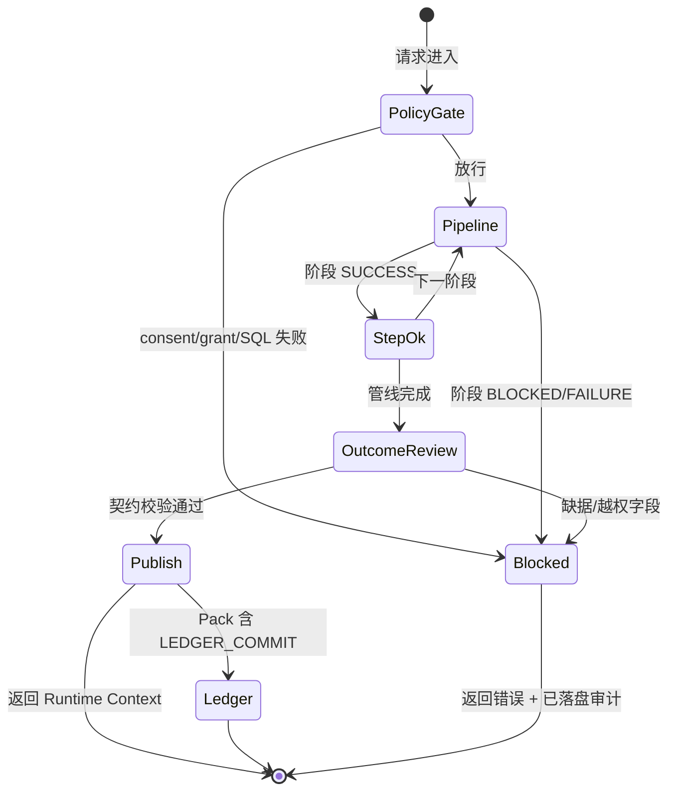
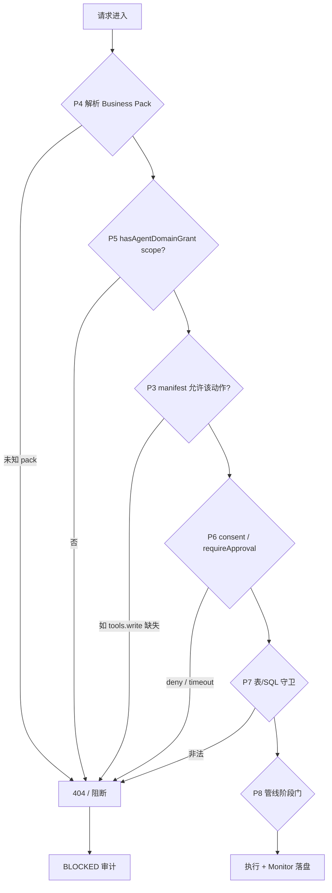

# TRA 通用治理架构（监控 · 把控 · 问责）

Trust Runtime for Agent (TRA) 的通用架构不是「能跑 Chat」，而是 **对每一次 Agent 结果严格可监控、可阻断、可追责**。本文定义平台级 **MCA 三元环**（Monitor · Control · Accountability），与 `VISION.md` 五平面、`trustclaw/AGENTS.md` 合规 Must、以及 Business Agent Pack 实例化模型对齐。

**文档性质：** 本节为 **规范（Normative）** 架构；§12 列出与当前代码的 **已知差距**，避免设计与实现混读。

相关文档：

- 领域 vs 业务、Pack 实例化：`trustclaw/docs/AGENT_PLATFORM.md`
- **层操作模型（CRUD / API / 验证）**：`trustclaw/docs/AGENT_PLATFORM.md` § Layer operations model
- 合规实现细则与验收命令：`trustclaw/AGENTS.md`（合规审查、Audit steps）
- 人审闸门：`trustclaw/DECISIONS.md`

---

## 1. 设计目标

| 目标         | 含义                                      | 不达标表现                          |
| ------------ | ----------------------------------------- | ----------------------------------- |
| **严格实现** | 守卫、审计、账本由平台强制，Pack 不能绕过 | 静默 fallback、缺步、PHI 写入 audit |
| **监控**     | 运营者可看见管线状态、缺口与异常          | 只有最终自然语言，无逐步状态        |
| **把控**     | 不合格中间态不得进入用户可见层            | LLM 自造结论、未授权读库仍回答      |
| **问责**     | 每个结论可追溯到主体、客体、证据链        | 无法回答「谁、何时、依据什么」      |

四大产品原则（`VISION.md`）在 MCA 中的落点：

| 原则       | MCA 落点                                                  |
| ---------- | --------------------------------------------------------- |
| 不出域     | Policy + Data 控制层；审计 output 不含 PHI 全行           |
| 必有据     | Control 规则门 + Pack decision 契约；禁止无矩阵的合规结论 |
| 必审计     | Monitor 全量落盘；Accountability 链接 trail 与 ledger     |
| Agent 解耦 | 平台管 MCA 机制；Pack 只声明决策形状与 pipeline 阶段      |

---

## 2. MCA 三元环

### 2.1 定义

| 环       | 英文           | 回答的问题                   | 主要产物                                                     |
| -------- | -------------- | ---------------------------- | ------------------------------------------------------------ |
| **监控** | Monitor        | 发生了什么？缺哪一步？       | `events.jsonl`、Panel D 五步闸门、`missingChatPipelineSteps` |
| **把控** | Control        | 能否继续？能否发布？         | `BLOCKED` / `security_blocked`、下游阶段不执行               |
| **问责** | Accountability | 谁负责？依据什么？可否验真？ | `audit_trail_id`、`component`、Ledger `proof_hash`           |

**不变量（Invariant）：**

1. Control 失败 → 必须写 Monitor（`status: BLOCKED` 或 `FAILURE`），且 **不得** 写 Ledger。
2. Monitor 记录失败 → 不得向用户层暗示「已成功查询/已合规通过」。
3. Accountability 收据必须能回指 Monitor 中同一 `audit_trail_id` 的事件序列。

### 2.2 生命周期（优于单向箭头）



### 2.3 控制层级（由外到内）

| 层级        | 内容         | 典型守卫                                  |
| ----------- | ------------ | ----------------------------------------- |
| **L0 边界** | 数据不出域   | 本地 SQLite；无静默外发；prompt 仅摘要    |
| **L1 策略** | 谁有权做什么 | consent、domain grants、`requireApproval` |
| **L2 数据** | 读写什么     | SELECT-only、表 allowlist、写表 allowlist |
| **L3 推理** | 模型做什么   | Text2SQL 握手；规则 **非 LLM**（D6）      |
| **L4 发布** | 用户看见什么 | Outcome Contract（§7）；`[Evidence #N]`   |

Pack 不得削弱 L0–L3；L4 由 Pack prompt 在平台边界内填充。

### 2.4 Agent 多层权限与权责体系

TRA 须在 **各抽象层级** 设置权限，限定 Agent **可执行的动作** 与 **须承担的问责范围**。权限不是单一开关，而是 **由外到内、逐层收窄** 的 fail-closed 链：任一层拒绝 → 不得进入下一层，且须落盘 Monitor +（若适用）Accountability。

**决策依据：** D22（领域 Agent scope 赋权、按 pack 隔离 consent）、D15（会话 Pack 绑定）、D17（Pack 契约上限）。

#### 2.4.1 抽象层级 × 权限载体

| 层级                       | 抽象对象             | 权限载体                                                                 | 控制什么（执行权责范围）                                   | 问责锚点                                          |
| -------------------------- | -------------------- | ------------------------------------------------------------------------ | ---------------------------------------------------------- | ------------------------------------------------- |
| **P0 Operator**            | 人 / 运营者          | Panel C `PUT /api/tra/agent-grants`                                      | 是否允许某 **Business Pack** 在指定 **scope** 下活动       | `AGENT_DOMAIN_GRANT` · `TRA.AgentDomainGrant`     |
| **P1 领域目录**            | Logic Agent（~1000） | `domain_agents.enabled`、`tra_scopes`、`tra_write`                       | **能力登记**与成熟度（M0）；**不**直接放行执行             | 目录元数据；D23 路由预留                          |
| **P2 Domain Agent Pack**   | 10 个 `tra-*` 包     | `domain_agent_packs` + `pack_id`                                         | 领域划分、版本；目录浏览与 Pack 设计锚点                   | 注册表行                                          |
| **P3 Business Agent Pack** | `agent.pack.json`    | `tools`、`data.readTables` / `writeTables`、`consent`、`pipeline.stages` | Pack **能力上限（ceiling）**；声明可声明的 scope 集合      | `agent_pack_id` + `audit.*Component`              |
| **P4 会话绑定**            | Chat / 工具会话      | `session-agent-packs.json` + coordinator（D15）                          | **本会话**由哪个 Pack 代言；防侧边栏换 agent 导致权责漂移  | `session_id` + `CoordinatorPackResolution.source` |
| **P5 用户赋权**            | 每 Pack 运营授权     | `state/tra-audit/agent-domain-grants.json`                               | Panel B/D/E/F、HTTP Chat、`tra.*` 工具路径 **fail-closed** | `hasAgentDomainGrant(packId, scope)`              |
| **P6 数据同意**            | 每 session × 每 pack | `consent-grants.json` + `before_tool_call` `requireApproval`             | A/B 类 PHI **读/写** 逐次或 `allow-always`                 | `DATA_CONSENT` · `TRA.Consent`                    |
| **P7 数据平面**            | SQL / 表             | `assertReadOnlySelectSql`、`readTables` / `writeTables` 过滤             | 实际触达哪些表、何种 SQL 形态                              | `TEXT2SQL_GEN` / `DB_QUERY`                       |
| **P8 管线阶段**            | MCA 五步子集         | `pipeline.stages`                                                        | 可走哪些 Control 阶段、可否产出规则/账本结论               | 逐步 `step` / `status`                            |

**权责分界（规范）：**

| 角色                       | 能声明                                              | 不能声明                          |
| -------------------------- | --------------------------------------------------- | --------------------------------- |
| **Logic Agent 目录**       | 领域能力、推荐 scope 文案                           | 绕过 P5/P6 执行读库               |
| **Business Pack manifest** | 能力上限、consent 策略、审计组件名                  | 扩大 Operator 未授予的 scope      |
| **Operator**               | 在 `deriveAgentDomainScopes(pack)` 子集内勾选 scope | 授予 Pack manifest 未声明的 scope |
| **平台**                   | 强制执行评估链；Pack 不可关闭 hook                  | 替 Pack 承担临床结论责任          |

**实现入口：** `trustclaw/tra/agent-domain-scopes.ts`、`agent-domain-grants.ts`、`consent-store.ts`；`extensions/trustclaw-tra/src/agent-grant-guard.ts`、`data-consent-hook.ts`；`trustclaw/runtime/coordinator/session-pack-coordinator.ts`。

#### 2.4.2 可授予 Scope（P5 · D22）

运营者在 Panel C 勾选的 scope 由 Pack manifest **推导上限**（`deriveAgentDomainScopes`），不得超出：

| Scope              | 守卫面                                        | 典型 Pack 条件                                   |
| ------------------ | --------------------------------------------- | ------------------------------------------------ |
| `panel.browse`     | Panel B 表列表/浏览 API                       | `data.readTables.length > 0`                     |
| `tra.chat`         | `POST /api/agent/chat`、`trustclaw_tra_query` | 有读表                                           |
| `tra.write`        | `trustclaw_tra_write`                         | `tools.write` 已声明                             |
| `panel.audit`      | Panel D 审计 API                              | 所有已安装 Pack（默认可审计）                    |
| `panel.ledger`     | Panel E 账本 API                              | `pipeline.stages` 含 `LEDGER_COMMIT`             |
| `panel.compliance` | Panel F 合规/订阅/设备导入                    | `compliance-auditor` 或 `domain` 含 `compliance` |

未授予 scope → **403**（HTTP）或 `before_tool_call` **block**（工具），文案指向 Panel C 赋权。

#### 2.4.3 权限评估链（执行前必过）

规范顺序（**短路**：前序失败则后续不得执行）：



| 路径                  | P5 scope           | P6                         | P7 附加            |
| --------------------- | ------------------ | -------------------------- | ------------------ |
| Panel B browse        | `panel.browse`     | —                          | 表 ∈ `readTables`  |
| Panel D audit         | `panel.audit`      | —                          | —                  |
| Panel E ledger        | `panel.ledger`     | —                          | —                  |
| Panel F compliance    | `panel.compliance` | import 时 `consentGranted` | zod schema         |
| HTTP Chat             | `tra.chat`         | 管线内 consent 策略        | Text2SQL allowlist |
| `trustclaw_tra_query` | `tra.chat`         | read consent               | SELECT-only        |
| `trustclaw_tra_write` | `tra.write`        | write `requireApproval`    | `writeTables`      |

**P4 与 P5 正交：** 会话已绑定 Pack 只回答「**谁**在本会话代言」；是否允许该 Pack **查库/写库/开 Panel** 仍由 P5/P6 决定。

#### 2.4.4 与 L0–L4 控制层对照

| 控制层      | 主要权限层                                 | MCA                      |
| ----------- | ------------------------------------------ | ------------------------ |
| **L0 边界** | 全层默认本地；无 scope 即无执行            | Control                  |
| **L1 策略** | P0、P5、P6                                 | Control + Accountability |
| **L2 数据** | P3 `readTables`/`writeTables`、P7          | Control                  |
| **L3 推理** | P3 `rules.engine`、`pipeline.stages`（P8） | Control                  |
| **L4 发布** | P8 完成后 Outcome Contract                 | Control                  |

Pack **不得**在 manifest 或 prompt 中削弱 L1–L3；Operator **不得**授予超出 manifest 推导的 scope。

#### 2.4.5 问责与权限的一致性

权限链通过时，Accountability **主体**须与评估链一致：

| 字段                 | 来源层级          |
| -------------------- | ----------------- |
| `agent_pack_id`      | P3 + P4 解析结果  |
| `session_id`         | P4 会话           |
| `component`          | P3 `audit.*` 声明 |
| scope / consent 决策 | P5 / P6 审计步    |

**不变量：** 审计中的 `agent_pack_id` 必须等于 `resolveCoordinatorAgentPack({ bindLock: true })` 在工具热路径上的 pack；若 `agent_pack_mismatch`，运维须能追溯 coordinator `source`（`session` | `lock` | `openclaw_agent` | `default` | `request`）。

#### 2.4.6 目录层 vs 执行层（常见误用）

| 误用                                            | 规范                                                                              |
| ----------------------------------------------- | --------------------------------------------------------------------------------- |
| 认为 Logic Agent `enabled: full` 即可读库       | 仅 P1 目录；执行仍须 P3–P7                                                        |
| 仅换 OpenClaw sidebar agent 不检查 session lock | 须 P4 `bindLock` 固定问责主体                                                     |
| 授予 `tra.chat` 但 Pack 无 `readTables`         | `deriveAgentDomainScopes` 不应出现该 scope；若手工篡改 grants 文件，P7 仍无表可访 |
| 用注册表 `tra_scopes` 代替 Panel C              | **规范：** P1 为设计/路由提示；**运行时**以 P5 为准（§12）                        |

---

## 3. 五平面 × MCA 责任矩阵

| 平面         | Monitor                          | Control                                                          | Accountability                                                |
| ------------ | -------------------------------- | ---------------------------------------------------------------- | ------------------------------------------------------------- |
| **Data**     | 血缘、`row_count`/`columns` 摘要 | SELECT-only、allowlist、Init/Import schema                       | `DB_QUERY` output 仅维度元数据                                |
| **Policy**   | Consent/Grant 独立 trail         | fail-closed grants、import `consentGranted`、**§2.4 多层权限链** | `TRA.Consent`、`TRA.ComplianceImport`、`TRA.AgentDomainGrant` |
| **Agent**    | Pack 声明阶段的 step 状态        | Text2SQL 握手、pipeline 阶段门                                   | `AgentRuntime.*`、`pack.audit.*Component`                     |
| **Evidence** | Panel E、链验证 API              | Ledger 仅 SUCCESS 管线后                                         | `EvidenceLedger.Commit`、`verifyEvidenceChain`                |
| **Operator** | Console A–F                      | Reset/赋权/导入确认                                              | 人操作同样写审计                                              |

**分界：**

- **平台** — 强制执行 MCA 机制与封闭 `step`/`status` 枚举（`trustclaw/audit/types.ts`）。
- **Business Agent Pack** — 声明 `pipeline.stages`、`audit.*`、`rules.engine`；**不能**关闭审计或跳过 L1/L2。
- **领域目录（Logic Agent）** — capability 元数据；**不**替代 Policy 或 Evidence。

---

## 4. 双执行面（同等 MCA，不同入口）

| 执行面              | 入口                                          | 管线                     | 问责锚点                                              |
| ------------------- | --------------------------------------------- | ------------------------ | ----------------------------------------------------- |
| **HTTP Chat**       | `POST /api/agent/chat`                        | `runTrustclawChat` 五步  | 单次 `aud_*` trail + 可选 ledger                      |
| **OpenClaw 工具链** | `trustclaw_tra_query` / `trustclaw_tra_write` | Gateway hooks + 工具实现 | `DATA_CONSENT` + 工具级审计；session pack lock（D15） |

规范要求：**同一 `session_id` 下**，OpenClaw 侧须通过 `resolveCoordinatorAgentPack({ bindLock: true })` 固定 Business Pack，避免侧边栏换 agent 导致 **问责主体漂移**（`trustclaw/runtime/coordinator/session-pack-coordinator.ts`）。

Chat HTTP 与 Tool 路径的审计 **可共用** `events.jsonl`，但 trail 前缀/步集可能不同；运营回放时须按 `audit_trail_id` 聚合，不能只看 Chat 五步。

---

## 5. 严格结果管线（Pack 可变阶段）

平台枚举（`AGENT_PACK_PIPELINE_STAGES`）：

```
TEXT2SQL_GEN → DB_QUERY → RULE_EVAL → AGENT_DECISION → LEDGER_COMMIT
```

**规范：** 每个 Pack 在 `agent.pack.json` → `pipeline.stages` 声明 **子集**；未声明的阶段 **跳过**，但不得伪造该阶段的结论。

| Pack 示例            | 典型 stages          | 最低审计步数（规范）                                     |
| -------------------- | -------------------- | -------------------------------------------------------- |
| `glp1-eligibility`   | 五步全开             | TEXT2SQL → DB → RULE → DECISION → LEDGER                 |
| `nrdl-reimburse`     | 常无 RULE/LEDGER     | TEXT2SQL → DB → DECISION（+ 跳过的阶段不得产出规则结论） |
| `compliance-auditor` | `rules.engine: none` | 无 RULE 语义；不得输出 AST PASS/FAIL                     |

### 5.1 阶段门（Control — 规范）

| 阶段           | 把控点                                           | 失败时（规范）                                                                | 审计 step                |
| -------------- | ------------------------------------------------ | ----------------------------------------------------------------------------- | ------------------------ |
| TEXT2SQL_GEN   | SELECT-only、allowlist、`read_only_verification` | `security_blocked`；不执行 SQL                                                | `TEXT2SQL_GEN` `BLOCKED` |
| DB_QUERY       | `queryTra` 守卫；禁止 audit 全行 PHI             | 阻断；记 `BLOCKED`                                                            | `DB_QUERY`               |
| RULE_EVAL      | 确定性引擎（D6）                                 | `overall_status: FAIL` → **阻断发布或** 仅允许带引用的「不满足」决策（见 §7） | `RULE_EVAL`              |
| AGENT_DECISION | `decisionBuilder` 契约                           | 缺 citations/矩阵 → 不发布                                                    | `AGENT.*Decision`        |
| LEDGER_COMMIT  | 仅前述 SUCCESS；Pack 含 stage                    | 无收据须可解释（Pack 未声明）                                                 | `EvidenceLedger.Commit`  |

**Fail-closed（规范）：** 任一步 `BLOCKED` → 禁止后续阶段；禁止用模型幻觉补齐（UI：`auditRuleFailClosed`）。

实现入口：`trustclaw/runtime/pipeline/run-chat.ts`。

### 5.2 监控（Monitor）

| 信号            | 存储 / UI                                     | 用途                                        |
| --------------- | --------------------------------------------- | ------------------------------------------- |
| 逐步状态        | Panel D 五步闸门                              | 运营扫视                                    |
| 原始事件        | `state/tra-audit/events.jsonl`                | 回放、取证                                  |
| 缺口探测        | `missingChatPipelineSteps(auditDir, trailId)` | CI/DoD；**须按 Pack stages 过滤**（见 §12） |
| Runtime Context | `/api/agent/chat` 响应                        | 结构化 `pipeline_stages`                    |

### 5.3 问责（Accountability）— 三元组

每条可发布结果须填满：

| 维度             | 字段                                                | 说明                                             |
| ---------------- | --------------------------------------------------- | ------------------------------------------------ |
| **主体 Subject** | `agent_pack_id` + `component` + `session_id`        | 哪个 Business Pack、哪个平台/Pack 组件、哪次会话 |
| **客体 Object**  | `pipeline_stages` / `evaluation_matrix` / citations | 结构化结论载荷，非自由文本                       |
| **证明 Proof**   | `audit_trail_id` + 可选 `evidence_ledger_receipt`   | 审计链 + 哈希链（`verifyEvidenceChain`）         |

Pack 须在 `agent.pack.json` → `audit` 声明 `businessComponent`、`decisionComponent`、可选 `ruleEvalComponent`，与写入 `events.jsonl` 的 `component` 一致。

**Coordinator 归因：** `CoordinatorPackResolution` 的 `source`（`session` | `lock` | `openclaw_agent` | `default` | `request`）与 `agent_pack_mismatch` 应在运维排查时可查（当前存于 session 绑定存储，见 §12）。

---

## 6. 非 Chat 路径

| 路径                  | Control                             | Monitor                   | Accountability          |
| --------------------- | ----------------------------------- | ------------------------- | ----------------------- |
| `trustclaw_tra_query` | `before_tool_call` consent + grants | `DATA_CONSENT`            | session + pack          |
| `trustclaw_tra_write` | 写表 allowlist + consent            | 工具审计                  | pack_id in input        |
| Compliance import     | zod + `consentGranted`              | `COMPLIANCE_IMPORT`       | standard id / publisher |
| Device import         | schema + `agentPackId`              | `DEVICE_IMPORT`           | pack 归因               |
| Domain grants         | scope fail-closed                   | `AGENT_DOMAIN_GRANT`      | `TRA.AgentDomainGrant`  |
| Reference sync        | 订阅策略                            | `REFERENCE_SYNC`          | sync state 表           |
| `POST /api/tra/reset` | Operator 确认                       | **规范：须记 reset 审计** | 数据清除边界文档化      |

统一要求：`BLOCKED` 与 `SUCCESS` 均落盘；禁止 swallow（`trustclaw/audit/record.ts`）。

---

## 7. 结果发布契约（Outcome Contract）

### 7.1 允许进入用户可见层

1. **Runtime Context** — `pipeline_stages` + 可选 `evidence_ledger_receipt`
2. **Pack 决策载荷** — 如 `evaluation_matrix`（来自 RULE_EVAL，非模型编造）
3. **自然语言** — `[Evidence #N]` 且 N 映射到矩阵行或握手 JSON（Pack prompt）

### 7.2 两种合规相关的「失败」

| 类型       | 含义                                | 规范行为                                                     |
| ---------- | ----------------------------------- | ------------------------------------------------------------ |
| **硬阻断** | 未授权、SQL 非法、守卫失败          | 无用户可见结论；`BLOCKED`                                    |
| **软结论** | 规则评估 FAIL 但决策已引用 Evidence | 允许「不满足」类回复，**必须**含 citations；仍记 `RULE_EVAL` |

软结论 **不是** 把控失效；把控体现在「结论形状受契约约束」，而非禁止所有否定性答案。

### 7.3 禁止发布

- 未经 `DB_QUERY` 的个人指标数值
- 未经 `RULE_EVAL`（且 Pack 声明了该阶段）的 PASS/FAIL/合规判定
- 未经 consent 的 A/B 类数据引用
- `BLOCKED` 后的猜测性安抚

### 7.4 平台 vs Pack

| 项           | 平台               | Pack                     |
| ------------ | ------------------ | ------------------------ |
| 阶段门与审计 | 强制写 step/status | 声明 `pipeline.stages`   |
| 规则语义     | 确定性框架         | `rules.engine` + DB 数据 |
| 决策 JSON    | 校验 component 名  | `decisionBuilder`        |
| 话术         | consent 模板       | `prompts/system`         |

---

## 8. Pack MCA 成熟度（建议分级）

用于评审 Pack 是否达到生产问责要求：

| 级别          | 要求                                                                 |
| ------------- | -------------------------------------------------------------------- |
| **M0 目录**   | 仅在领域注册表出现；不可执行                                         |
| **M1 可执行** | `agent.pack.json` + OpenClaw 绑定；consent 生效                      |
| **M2 可审计** | Chat 或 Tool 路径全步落盘；`missingChatPipelineSteps` 对声明阶段为空 |
| **M3 可验真** | 含 `LEDGER_COMMIT`；`verifyEvidenceChain` 通过                       |
| **M4 可运营** | Panel C grants 对齐；domain/business 映射文档化                      |

V1 bundled packs：`glp1-eligibility` 目标 **M3**；`nrdl-reimburse` / `compliance-auditor` 目标 **M2**（可无 ledger）。

---

## 9. 实现地图

```
Operator (Panel D/E, A–F)
        ↑ read
state/tra-audit/events.jsonl     ← AuditRecorder
state/tra-audit/session-agent-packs.json  ← coordinator (D15)
state/tra-evidence/              ← commitEvidenceReceipt
state/local_tra.db
        ↑ write
extensions/trustclaw-tra/        ← routes + hooks
trustclaw/runtime/pipeline/      ← runTrustclawChat
trustclaw/runtime/coordinator/   ← session pack lock
trustclaw/runtime/agent-pack/    ← Pack 契约
```

| 能力 ID                          | MCA                                    |
| -------------------------------- | -------------------------------------- |
| `audit_five_steps`               | Monitor + Accountability               |
| `data_consent` / `domain_grants` | Control + Accountability（§2.4 P5–P6） |
| `tra_query_guard`                | Control                                |
| `rule_eval_handshake`            | Control                                |
| `ledger_chain`                   | Accountability                         |
| `ui_six_panels`                  | Monitor                                |

---

## 10. 反模式（禁止）

| 反模式                                       | 违反                  |
| -------------------------------------------- | --------------------- |
| Pack 内关闭 `before_tool_call`               | L1 策略               |
| 审计 output 写入查询结果单元格               | 不出域 + Monitor      |
| LLM 输出规则 PASS/FAIL                       | L3 + 必有据           |
| `BLOCKED` 后仍返回 fabricated 指标           | L4 发布               |
| 跳过 audit 直接 `commitEvidenceReceipt`      | Accountability 不变量 |
| 侧边栏换 agent 但不换 session pack lock      | 问责主体漂移          |
| 用 Logic Agent 注册行代替 Business Pack 执行 | 领域/业务混层         |
| 仅目录 `enabled` / `tra_scopes` 即放行读库   | 跳过 P5/P6（§2.4）    |
| 手工编辑 grants 扩大超出 manifest 的 scope   | 破坏 ceiling 不变量   |

---

## 11. 运营验收（严格模式）

```bash
node scripts/run-vitest.mjs trustclaw/runtime/pipeline/run-chat.test.ts
node scripts/run-vitest.mjs extensions/trustclaw-tra/index.test.ts
node scripts/run-vitest.mjs trustclaw/audit/
node scripts/run-vitest.mjs trustclaw/ledger/
```

人工抽检：

- [ ] GLP-1 Chat 成功 → 同一 `audit_trail_id` 下声明阶段均有事件；ledger 可验链
- [ ] Deny consent → 工具不执行 + `DATA_CONSENT` `BLOCKED`
- [ ] 非法 SQL → `TEXT2SQL_GEN` `BLOCKED`，无 DB_QUERY
- [ ] Panel D 与 Runtime Context 状态一致
- [ ] Pack 切换后 session lock 行为符合 D15
- [ ] 撤销 Panel C `tra.chat` → Chat 与 query 工具 403/block + 无 DB_QUERY
- [ ] `compliance-auditor` 未授 `panel.compliance` → Panel F API 403

---

## 12. 规范 vs 当前实现（已知差距）

审查代码后须在架构层显式标注，避免「文档严格、运行宽松」：

| 项                                   | 规范                                    | 当前实现（`main`）                                                                                     | 建议修复                                 |
| ------------------------------------ | --------------------------------------- | ------------------------------------------------------------------------------------------------------ | ---------------------------------------- |
| `tra_not_initialized`                | 记审计 `BLOCKED`                        | **已修复** — `run-chat` 首阶段 `BLOCKED` + `audit_trail_id`                                            | —                                        |
| `RULE_EVAL` FAIL                     | 硬阻断或仅软结论+ citations             | **已修复** — `RULE_EVAL` `FAILURE` + `AGENT_DECISION` `rule_outcome: soft_fail`；见 `AGENTS.md` §3 G6  | —                                        |
| `missingChatPipelineSteps`           | 按 Pack `pipeline.stages` 检查          | **已修复** — `expectedSteps` 可选参数                                                                  | 调用方传 pack stages                     |
| `AuditComponent` 类型                | Pack 声明的 component 均可写入          | **已修复** — `string` + `PLATFORM_AUDIT_COMPONENTS`                                                    | —                                        |
| `POST /api/tra/reset`                | Operator 审计                           | **已修复** — 清空后写入 `TRA_RESET` / `TRA.Reset`                                                      | —                                        |
| OpenClaw Chat 路径                   | 与 HTTP 相同 MCA                        | **已修复** — `trustclaw_tra_query` → `runTrustclawChat`；`mca-parity.test.ts`                          | D5 频道出站 `audit_trail_id` 仍 deferred |
| Logic Agent → Pack 路由              | 路由决策可审计                          | D23 deferred                                                                                           | 路由 step 预留（**G8 open**）            |
| Logic Agent `tra_scopes` / `enabled` | P1 仅目录；执行以 P5 为准               | 目录字段 UI 可见；**运行时未读** `tra_scopes`                                                          | D23 路由或 Pack 实例化映射时接入         |
| Grants 文件篡改                      | scope ⊆ `deriveAgentDomainScopes(pack)` | **已修复** — 读/写 filter 非法 scope                                                                   | `agent-domain-grants.test.ts`            |
| Panel D pack 可变阶段                | 按 `pipeline.stages` 渲染闸门与完成判定 | **已修复** — `declared_pipeline_steps` + grants API `pipeline.stages`；`audit-pipeline.test.ts`（G10） | —                                        |

**结论：** V1 对 **HTTP + WS tool Chat + consent + ledger** 路径 MCA 较完整；**G8–G9** 为下一迭代入口（D23/D21 deferred）— 排期见 `trustclaw/AGENTS.md` § Agent Platform 迭代目标。

---

## 13. 演进接缝（不削弱 MCA）

| 项                     | 状态       | MCA 要求                                                 |
| ---------------------- | ---------- | -------------------------------------------------------- |
| D23 多 Agent 路由      | deferred   | 路由本身 `audit`；**须重评估 §2.4 全链**；不得绕过 L1/L2 |
| D21 合规包验签         | deferred   | 验签失败 = import `BLOCKED`                              |
| D5 频道出站            | deferred   | 出站携带 `audit_trail_id`                                |
| Domain ↔ Business 绑定 | 目录已就绪 | grants 仍走 Business Pack                                |

---

## 14. 术语对照

| 中文       | 英文                 | MCA                                |
| ---------- | -------------------- | ---------------------------------- |
| 监控       | Monitor              | 看见全过程与缺口                   |
| 把控       | Control              | 阻断不合格中间态                   |
| 问责       | Accountability       | 主体-客体-证明三元组               |
| 领域目录   | Domain catalog       | 不替代 Control                     |
| 业务 Pack  | Business Agent Pack  | 实例化 + 审计组件声明              |
| 逻辑 Agent | Logic Agent          | 目录叶子；P1 权限元数据；D23 路由  |
| 领域赋权   | Domain grant / scope | P5；`AGENT_DOMAIN_SCOPES`          |
| 数据同意   | Data consent         | P6；session × pack                 |
| 权责范围   | Authority scope      | §2.4 各层可执行动作 + MCA 问责主体 |

---

**Summary：** TRA 治理 = **五平面** + **MCA 三元环** + **L0–L4 控制层** + **§2.4 Agent 多层权限与权责** + **Pack 可变管线** + **Outcome Contract**。Business Agent Pack 是领域能力的业务实例化，但监控、把控、问责与 **逐层权限收窄** 由平台统一强制执行；§12 差距表是落地迭代的唯一排期入口，避免设计与实现脱节。
